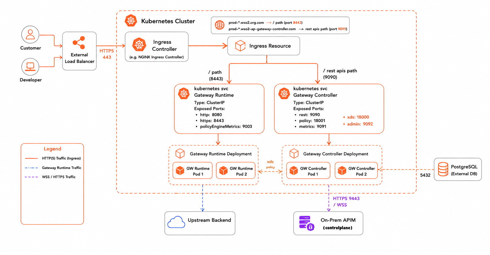
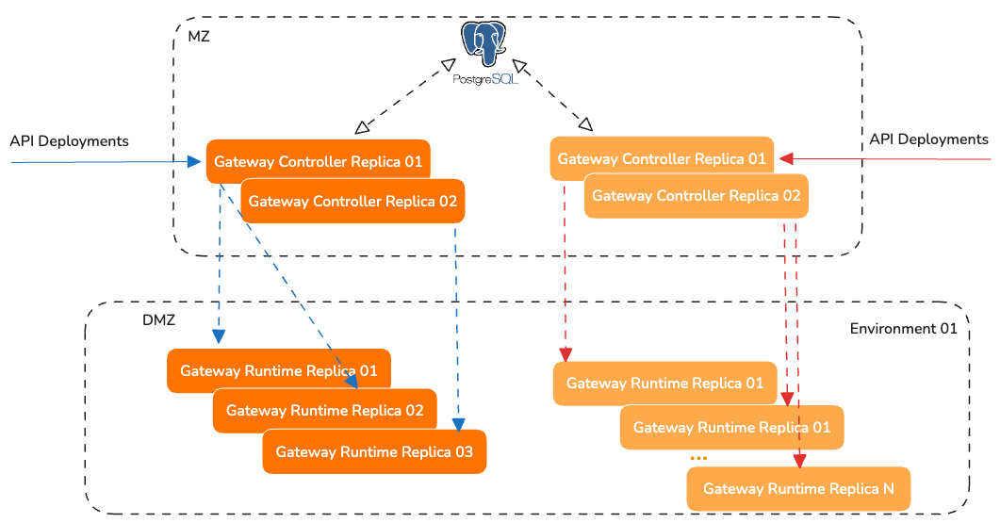

# High-Availability Production Deployment

This guide covers deploying the API Platform Gateway in a production-grade, highly available configuration using Helm on Kubernetes. Development mode is disabled, security is hardened, an external database (PostgreSQL or SQL Server) backs the deployment state, and workloads are replicated across nodes.

## Prerequisites

!!! warning "Disable development mode"
    All production deployments must set `gateway.developmentMode: false` in your Helm values. Development mode disables encryption key requirements, uses default credentials, and skips several security checks. It must never be enabled in production.

    ```yaml
    gateway:
      developmentMode: false
    ```

Ensure the following tools are installed and configured before starting:

| Tool | Requirement |
|------|-------------|
| `kubectl` | Configured against your target cluster |
| `helm` | Version 3+ |
| `openssl` | Available in your local shell |

Verify your environment:

```bash
kubectl cluster-info
kubectl get nodes
helm version
```

## Cluster Topology

Use at least two worker nodes for high availability. The recommended minimum production topology separates system and gateway workloads into dedicated node pools:

| Node Pool | Purpose | Recommended Size |
|-----------|---------|-----------------|
| `systempool` | Kubernetes system workloads | 1–2 nodes |
| `gatewaypool` | Gateway runtime + controller | Minimum 2 nodes |

This separation provides:

- No single-node failure causes a full outage
- Safer autoscaling without disrupting system pods
- Improved workload isolation and resource predictability

## Architecture

The self-hosted gateway can be deployed in a highly available manner by running multiple **Gateway Controller** replicas and multiple **Gateway Runtime** replicas across different network zones or environments.

In this deployment model, API deployments are received by one of the Gateway Controller replicas. The controller persists the API deployment information in the shared database. Other Gateway Controller replicas then read the updated deployment state from the database and synchronize the relevant configuration with the Gateway Runtime instances connected to them.

This ensures that all Gateway Controller replicas operate with a consistent deployment state and that each runtime environment receives the latest API configuration.



### Architecture Overview

The deployment consists of the following main components:

| Component | Description |
| ----- | ----- |
| **Gateway Controller** | Receives API deployment requests, stores deployment state in the database, and synchronizes runtime configuration with connected Gateway Runtime instances. |
| **Database (PostgreSQL / SQL Server)** | Acts as the shared source of truth for API metadata, deployment state, and gateway configuration. |
| **Gateway Runtime** | Receives configuration from its connected Gateway Controller and enforces API gateway policies at runtime. |

### Deployment Synchronization Flow

When an API deployment request is received, it is handled by one of the available Gateway Controller replicas.

The controller that receives the request validates the deployment and stores the API metadata and deployment state in the shared database. This database acts as the common source of truth for all Gateway Controller replicas.

Other Gateway Controller replicas continuously read or synchronize the latest deployment state from the database. Once a controller detects a new or updated API deployment, it generates the required runtime configuration and synchronizes it with the Gateway Runtime instances connected to that controller.

Each Gateway Runtime then applies the received configuration and starts serving the deployed APIs.

Each Gateway Controller replica can manage one or more Gateway Runtime replicas.

### High Availability Behavior

High availability is achieved by removing dependency on a single controller instance.

If an API deployment request is received by **Gateway Controller Replica 01**, that replica stores the deployment state in the shared database. **Gateway Controller Replica 02** can then read the same deployment state from the database and synchronize it with the Gateway Runtime replicas connected to it.



If one Gateway Controller replica becomes unavailable, another replica can continue to process deployment requests and synchronize runtime configuration based on the state stored in the database.

Similarly, multiple Gateway Runtime replicas can be deployed in each environment to ensure API traffic continues to be served even if one runtime replica becomes unavailable.

### Configuration Synchronization

The shared database is the central synchronization point between Gateway Controller replicas. It maintains the latest API deployment state and allows all controller replicas to operate consistently.

Gateway Runtime replicas do not directly read from the database. Instead, they receive the required runtime configuration from their connected Gateway Controller. This keeps the runtime layer lightweight and allows the controller layer to manage configuration generation and synchronization.

### Ingress Configuration

The Helm chart deploys Kubernetes `Service` objects for the Gateway Runtime and the Controller REST API, but does not provision an Ingress Controller or Ingress resources. You are responsible for configuring external access to these services using the ingress solution of your choice.

At a minimum, expose the Gateway Runtime service on port **8443** (HTTPS) to route inbound API traffic.

If you are using the [bottom-up deployment](./deploying-apis/bottom-up-api-deployment.md) approach or running the gateway in standalone mode, also expose the Controller REST API service on port **9090** so that developers can deploy APIs directly to the gateway.

## Before You Begin

### Start with the Base Values File

Download the default `values.yaml` for the gateway Helm chart and use it as the starting point for your production configuration. All steps in this guide reference fields within this file.

```bash
curl -o values.yaml https://raw.githubusercontent.com/wso2/api-platform/refs/tags/gateway/v1.1.0/kubernetes/helm/gateway-helm-chart/values.yaml
```

### Pin the Image Versions

Before making any other changes, set the controller and runtime image tags to the release you want to deploy. The latest stable release is **1.1.0**.

```yaml
gateway:
  controller:
    image:
      tag: "1.1.0"
  gatewayRuntime:
    image:
      tag: "1.1.0"
```

!!! tip
    Check the [gateway releases](https://github.com/wso2/api-platform/releases) page for the latest available version. Always ensure that the major version of the image tag matches the major version of the Helm chart used during installation.

!!! note
    It is strongly recommended to use the same version tag for both the controller and runtime components to ensure compatibility and avoid unexpected behavior.

!!! note "WSO2 Subscription Users"
    If you have a WSO2 subscription, use image tags that include the **U2 update version (4th digit)**, for example `1.1.0.1`, instead of the base release `1.1.0`.

    The 4th digit represents **patch-level (U2) updates**, which include the latest fixes and security updates delivered through the WSO2 private registry. See [WSO2 Subscription Users](#wso2-subscription-users) below for registry configuration.

### WSO2 Subscription Users

If you have a WSO2 Subscription, images are pulled from the WSO2 private registry (`registry.wso2.com`) instead of the public GHCR registry. A single Helm field activates this mode end-to-end.

**Step 1 — Create the image pull secret**

Create a `docker-registry` Secret in the namespace where the chart will be installed (replace `<namespace>`, `<wso2-email>`, and `<wso2-password-or-token>` with your values):

```bash
kubectl create secret docker-registry wso2-subscription-creds \
  --namespace <namespace> \
  --docker-server=registry.wso2.com \
  --docker-username=<wso2-email> \
  --docker-password=<wso2-password-or-token>
```

!!! note
    Credentials are intentionally kept out of Helm release state. The chart only stores the **name** of the Secret.

**Step 2 — Set `wso2.subscription.imagePullSecret` in `values.yaml`**

```yaml
wso2:
  subscription:
    imagePullSecret: wso2-subscription-creds
```

Setting this field causes the chart to:

- Rewrite all default image repositories from `ghcr.io/wso2/api-platform/` to `registry.wso2.com/wso2-api-platform/` automatically.
- Inject the named Secret into the `imagePullSecrets` block of every component.

Any explicit `image.repository` override (for example, pointing to an internal mirror) is passed through unchanged, so the rewrite only applies to default images.

When `wso2.subscription.imagePullSecret` is empty (the default), the chart renders identically to a non-subscription install and pulls from the public GHCR registry with no `imagePullSecrets` block.

## Setup Steps

Complete the following steps to configure a production-ready deployment:

1. [Security Hardening](./production-deployment/security-hardening.md) — encryption keys, TLS, and authentication
2. [Database Configuration](./production-deployment/database-configuration.md)
3. [Resources & Scaling](./production-deployment/resources-and-scaling.md)
4. [Deploy & Verify](./production-deployment/deploy-and-verify.md)
5. [Control Plane Connection](./production-deployment/control-plane-connection.md) *(optional)*