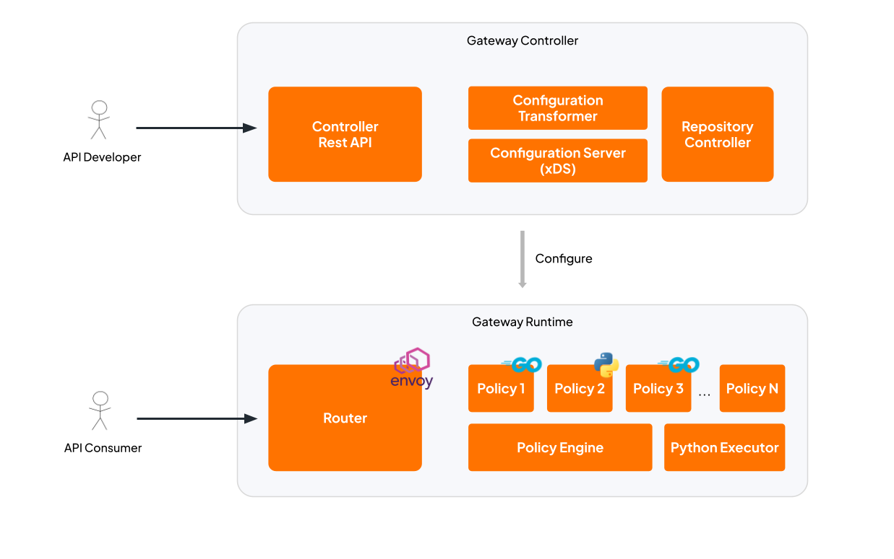

# API Platform Gateway Overview

API Platform Gateway is the complete API gateway system for managing, securing, and routing API traffic to your backend services.

## Components

| Component | Purpose |
|-----------|---------|
| **Gateway-Controller** | Control plane that manages API configurations and dynamically configures the Router |
| **Gateway-Runtime** | Data plane (Envoy Proxy) that routes HTTP/HTTPS traffic to backend services and Processes requests/responses through configurable policies (authentication, rate limiting, etc.)|
| **Policy Builder** | Build-time tooling for compiling custom policy implementations |

### CLI Tool (ap)

The `ap` CLI provides a command-line interface for managing gateways, APIs, and MCP proxies. Key capabilities include:

- Gateway management (add, list, remove, health check)
- API lifecycle management (apply, list, get, delete)
- MCP proxy management (generate, list, get, delete)

For the complete list of CLI commands and usage examples, see the [CLI Reference](../../tools/cli/reference.md).

## Default Ports

| Port | Service | Description |
|------|---------|-------------|
| 8080 | Router | HTTP traffic |
| 8443 | Router | HTTPS traffic |
| 9090 | Gateway-Controller | REST API |
| 9094 | Gateway-Controller Admin | Health and admin endpoints |

## Architecture

<!-- image source: https://docs.google.com/drawings/d/1pgADdQNpNcvLrLVvV1fx2hxQOb3syoU0DEBhJd2N6Aw/edit?usp=sharing -->

The API Gateway consists of two main components: **Gateway Controller** and **Gateway Runtime**.

- **Gateway Controller** is the control plane that manages API configurations and pushes them to the Gateway Runtime via the xDS protocol.
- **Gateway Runtime** is the data plane that processes API traffic. It contains three sub-components:
  - **Router** (Envoy proxy) — handles traffic routing, load balancing, and TLS termination.
  - **Policy Engine** — an ext_proc filter that executes request/response policies. **Go-based** policies are compiled into the Policy Engine binary at image build time by the Gateway Builder.
  - **Python Executor** — a dedicated runtime component that dynamically evaluates Python-based policies, allowing developers to leverage the extensive Python ecosystem for custom logic.

The Gateway Controller configures the Gateway Runtime by pushing API and route configurations through xDS. When a request arrives, the Router forwards it to the Policy Engine for policy evaluation, then routes it to the upstream backend.

### How it works

1. User verifies the Gateway-Controller admin health endpoint
2. User submits API configuration (YAML/JSON) to the Gateway-Controller REST API
3. Gateway-Controller validates and persists the configuration
4. Router receives the updated configuration and starts routing traffic

### Policies

Policies allow you to intercept and transform API traffic at the Gateway-Runtime (Envoy Proxy). The Gateway offers a flexible, dual-language approach to policy development, empowering teams to build custom API logic tailored to their performance and ecosystem needs.

- **Go:** Compiled directly into the Policy Engine binary, Go provides maximum execution performance, strict type safety, and minimal latency for critical path operations.
- **Python:** Executed dynamically by the integrated Python Executor, Python is particularly ideal for AI/ML use cases and complex data transformations due to its extensive ecosystem support and specialized libraries.

Policies can be applied to request and response flows to handle concerns like authentication, rate limiting, header manipulation, and more.

The complete and up-to-date policy catalogue — with configuration references and examples — is maintained in the gateway-controllers repository: https://github.com/wso2/gateway-controllers/blob/main/docs/README.md

You can extend the gateway with your own policies or include specific policies from the catalogue by building a custom gateway image using the `ap` CLI. See [Building the Gateway with Custom Policies](./policies/custom-policies/building-gateway-with-custom-policies.md).

## High Availability Setup

In a production HA deployment:

- **Gateway Controller** instances connect to a shared external database (**PostgreSQL** or **SQL Server**) for persistent storage of API configurations, subscriptions, and other metadata.
- **Gateway Runtime** instances connect to a shared **Redis** instance used for distributed rate limiting, ensuring rate limit counters are synchronized across all runtime instances.

<!-- image source: https://docs.google.com/drawings/d/1CIH3V8Uc2YxCWEGS7yUz3qyBfSpdLK1VpWK0NgmP4OQ/edit?usp=sharing -->