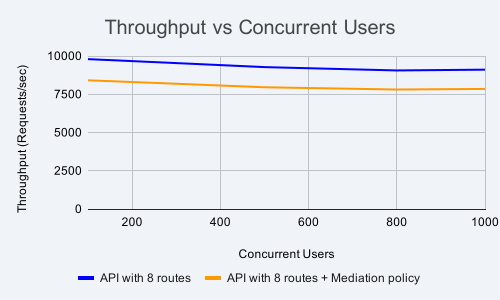
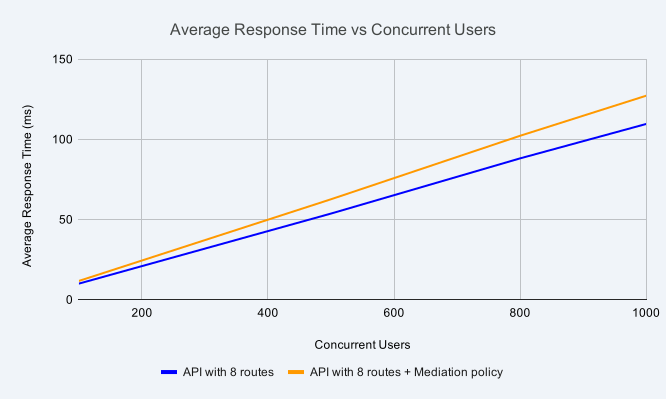
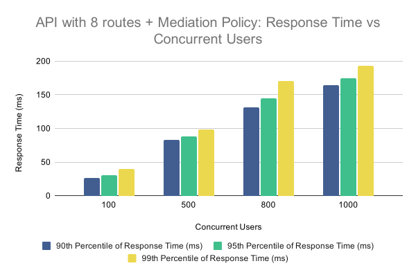

# Gateway runtime with four CPUs

The table below displays the resource allocations for the gateway-related components used in the performance tests.

| Component          | CPU | Memory | Router Concurrency | GOMAXPROCS |
| ------------------ | --- | ------ | ------------------ | ---------- |
| Gateway Controller | 1   | 2 GB   | —                  | —          |
| Gateway Runtime    | 4   | 2 GB   | 4                  | 4          |

## Throughput (requests/sec) vs. concurrent users

The graph below shows how gateway throughput changes as concurrent users increase for the API without policies and the API with mediation policies.

{ width="900" }

**Key observations:**

- Maximum throughput for both APIs occurs at 100 concurrent users on this four-CPU configuration.
- Throughput decreases slightly as concurrent users increase beyond 100 due to resource contention.
- Both APIs sustain strong throughput from 100 through 1000 concurrent users on the four-CPU gateway runtime.

## Average response time (ms) vs. concurrent users

The graph below shows how average response time changes for both APIs as concurrent users increase. The backend delay was configured to 0 ms for these tests.

{ width="900" }

**Key observations:**

- Average response time increases as concurrent users grow.
- The four-CPU configuration improves response times compared with the two-CPU results under comparable load.

## Response time percentiles vs. concurrent users

The graphs below show the 90th, 95th, and 99th percentile response times at 0 ms backend delay. Percentile values indicate the response time below which that percentage of requests completed, for example, the 99th percentile is the response time exceeded by only 1% of requests.

{ width="900" }

**Key observations:**

- 90th, 95th, and 99th percentile response times increase as concurrent users grow.
- The four-CPU configuration yields lower percentile values at high concurrency than the two-CPU configuration.

{ width="900" }

**Key observations:**

- Percentile trends follow the same pattern as concurrent users increase across the test range.

Test scenario results in CSV format are available [here](https://raw.githubusercontent.com/wso2/api-platform/refs/heads/main/gateway/perf/api-gateway-1.1.0-perf-test-results/four-core-results-summary.csv).