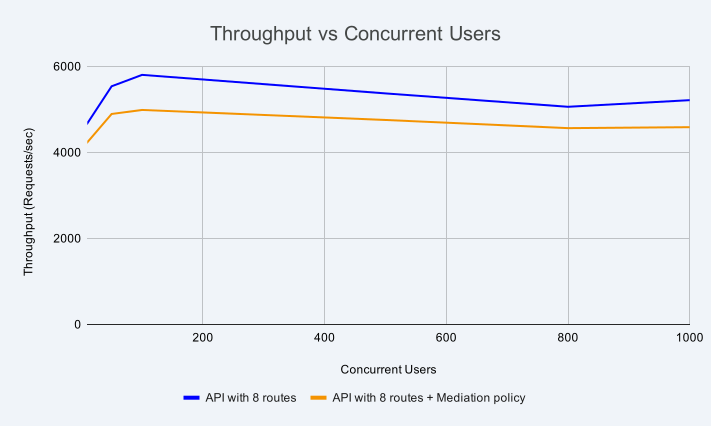
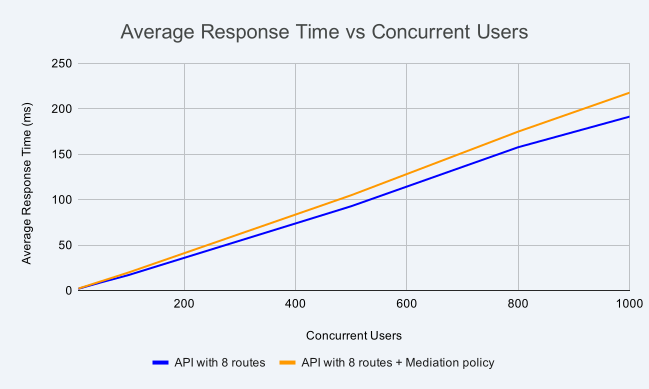
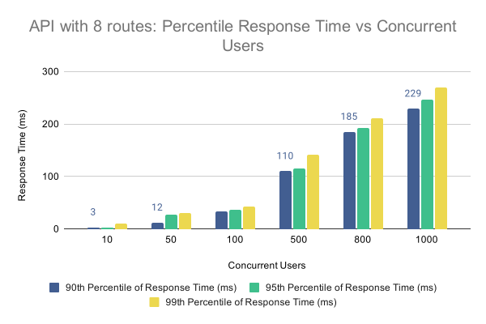
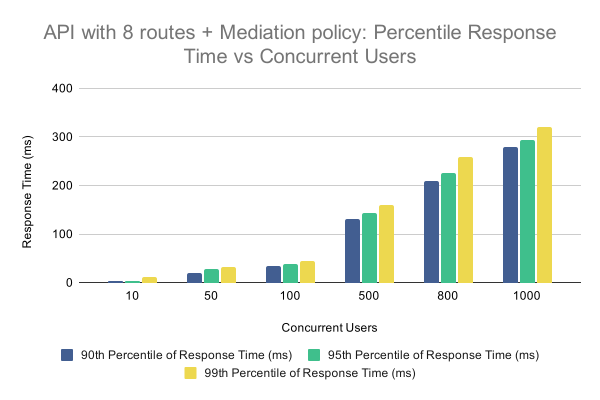
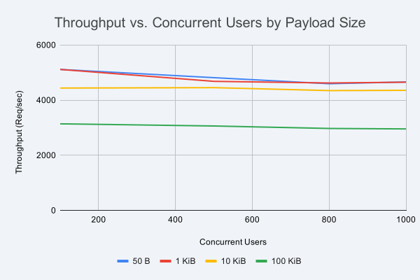

# Gateway runtime with two CPUs

The table below displays the resource allocations for the gateway-related components used in the performance tests.

| Component          | CPU | Memory | Router Concurrency | GOMAXPROCS |
| ------------------ | --- | ------ | ------------------ | ---------- |
| Gateway Controller | 1   | 2 GB   | —                  | —          |
| Gateway Runtime    | 2   | 2 GB   | 2                  | 2          |

## Throughput (requests/sec) vs. concurrent users

The graph below shows how gateway throughput changes as concurrent users increase for the API without policies and the API with mediation policies.

{ width="900" }

**Key observations:**

- Maximum throughput for both APIs occurs at 100 concurrent users on this two-CPU configuration.
- Throughput decreases as concurrent users increase beyond 100 due to resource contention on the gateway runtime.

## Average response time (ms) vs. concurrent users

The graph below shows how average response time changes for both APIs as concurrent users increase. The backend delay was configured to 0 ms for these tests.

{ width="900" }

**Key observations:**

- Average response time increases as concurrent users grow due to resource contention on the gateway runtime.

## Response time percentiles vs. concurrent users

The graphs below show the 90th, 95th, and 99th percentile response times at 0 ms backend delay. Percentile values indicate the response time below which that percentage of requests completed, for example, the 99th percentile is the response time exceeded by only 1% of requests.

{ width="900" }

**Key observations:**

- 90th, 95th, and 99th percentile response times increase as concurrent users grow.
- Percentile values represent the response time below which that percentage of requests completed.
- Higher concurrency widens the spread between lower and upper percentiles.

{ width="900" }

**Key observations:**

- Percentile measurements include Set Header policy execution on each request and response.
- Percentile trends follow the same pattern as concurrent users increase across the test range.

## Throughput (requests/sec) vs. concurrent users for varying payloads

The graph below shows how throughput changes with concurrent users for payload sizes of 50 B, 1 KiB, 10 KiB, and 100 KiB.

{ width="900" }

**Key observations:**

- Throughput varies with payload size; smaller payloads support higher request rates.
- For each payload size, throughput decreases as concurrent users increase.

Test scenario results in CSV format are available [here](https://raw.githubusercontent.com/wso2/api-platform/refs/heads/main/gateway/perf/api-gateway-1.1.0-perf-test-results/two-core-results-summary.csv).