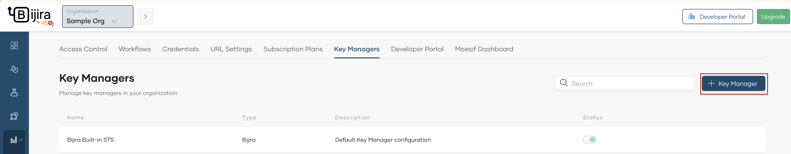
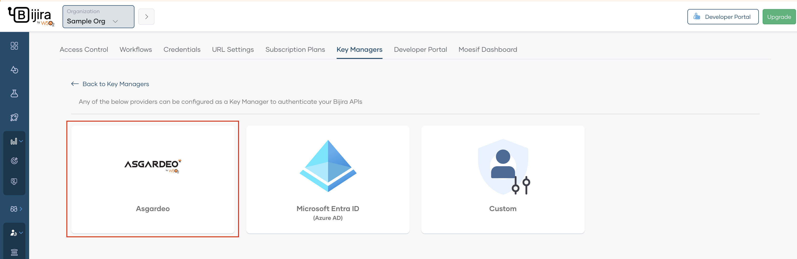
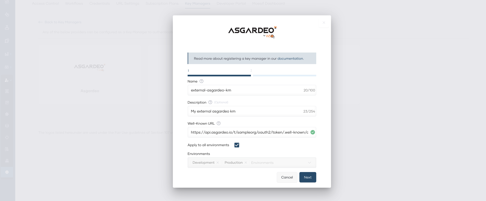
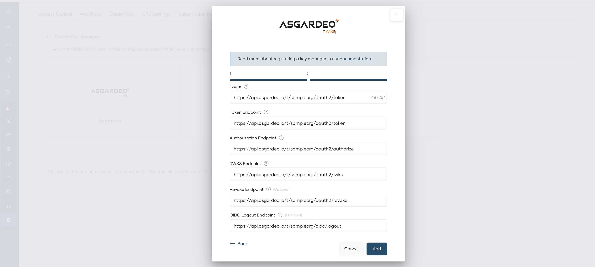
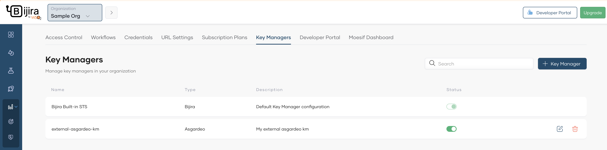
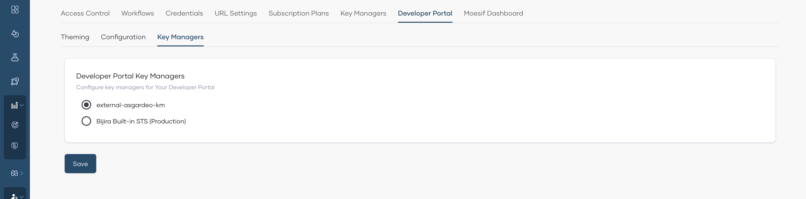

# Configure Asgardeo as an External Key Manager

Asgardeo is an identity-as-a-service (IDaaS) solution designed to create seamless login experiences for your applications. Asgardeo seamlessly integrates with API Platform, providing powerful API access control through the use of API scopes. This enables restricting API access to designated user groups. By configuring Asgardeo as an external key manager in API Platform, you can leverage your Asgardeo user stores to manage API access control effectively. This guide walks you through the steps to set up Asgardeo as your external key manager.

## Prerequisites

Before you proceed, be sure to complete the following:

- Create an Asgardeo application. You can follow the Asgardeo guide to [register a standard-based application](https://wso2.com/asgardeo/docs/guides/applications/register-standard-based-app/#register-an-application).

- Find the well-known URL:
  Go to the **info** tab of the Asgardeo application to view the endpoints and copy the **Discovery** endpoint.

- Find the Client ID:
  Go to the **Protocol** tab of the Asgardeo application and copy the **Client ID**.

## Step 1: Add Asgardeo as an external key manager in API Platform

Follow the steps below to add Asgardeo as an external key manager in API Platform:

1. Sign in to the API Platform Console at [https://console.bijira.dev/](https://console.bijira.dev).
2. In the left navigation menu, click **Admin** and then click **Settings**.
3. In the header, click the **Organization** list. This opens the organization-level settings page.
4. Click the **Key Managers** tab.
5. To add a key manager, click **+ Key Manager**.

    

6. Click **Asgardeo**.

    

7. In the Asgardeo dialog that opens, specify a name and a description for the key manager.
8. In the **Well-Known URL** field, paste the well-known URL that you copied from your Asgardeo instance by following the prerequisites.
9. Leave the **Apply to all environments** checkbox selected. This allows you to use the tokens generated via this key manager to invoke APIs across all environments.

    

<!-- !!! note
     If you want to restrict the use of tokens generated via this key manager to invoke APIs in specific environments, clear the **Apply to all environments** checkbox and select the necessary environments from the **Environments** list. -->

10. Click **Next**. This displays the server endpoints that are useful to implement and configure authentication for your application.

    

11. Click **Add**.

Now you have configured Asgardeo as an external key manager in API Platform.

## Step 2: Add Asgardeo as an external key manager in API Platform Developer Portal

Once the Asgardeo is configured as an external key manager in API Platform, it is necessary to configure it in the API Platform Developer Portal as well. For that, follow the steps below.

1. In the left navigation menu of the API Platform Console, click **Admin** and then click **Settings**.
2. Click the **Developer Portal** tab, then click the **Key Managers** tab. This page will list all the key managers available in API Platform.
3. Select the key manager you configured at [Step 1](#step-1-add-asgardeo-as-an-external-key-manager-in-api-platform).
4. Click **Save**.

Now you have configured Asgardeo as an external key manager in API Platform Developer Portal as well.

## What Next?

To secure API access with the above-configured Asgardeo as key manager, follow the steps mentioned [here](../../develop-api-proxy/authentication-and-authorization/secure-api-access-with-asgardeo.md).