# Getting Started with Self-Hosted Gateway

This guide walks you through setting up an API Platform Self-Hosted Gateway in your environment. Follow these quick steps to get your gateway running and connected to API Platform's control plane.

!!! note
    This feature is currently available in the **US region** only.

## Overview

The Self-Hosted Gateway enables you to run the API Platform API Gateway in your own infrastructure while maintaining centralized management through API Platform's control plane. This guide covers the fastest way to get started.


## Prerequisites

Before you begin, ensure you have:

- **cURL** installed
- **unzip** installed
- **Docker** installed and running (for Quick Start)
- **Docker Compose** installed

## Create a Self-Hosted Gateway in API Platform Console

1. Sign in to [API Platform Console](https://console.bijira.dev).
2. Go to **Organization Level** in API Platform.
3. From the left navigation, select **Admin** → **Gateways**.

    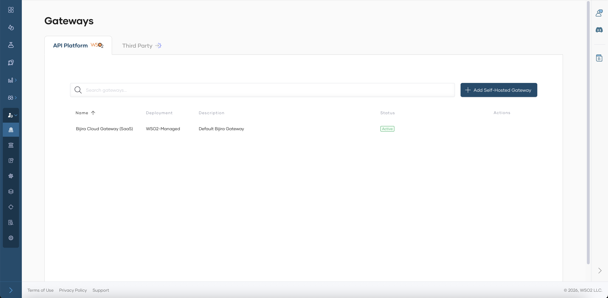

4. Select the **API Platform** tab.
5. Click **+ Add Self-Hosted Gateway**.
6. Provide the following details:

    - **Name**: A unique name for your gateway
    - **Description**: Optional description
    - **URL**: The URL where your gateway will be accessible (e.g., `https://localhost:8443`)
    - **Associated Environment**: Select the environment for this gateway

    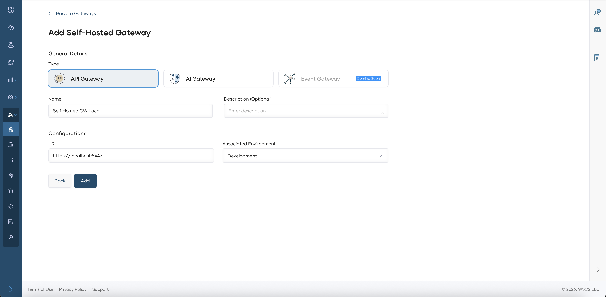

7. Click **Add** and you will be navigated to the Gateway View Page.

## Setup Gateway

1. Next, download, set up, and start the gateway on your machine by following the steps in the **Quick Start** section or the detailed instructions below (Steps 1–4).

    !!! note
        Be sure to copy the commands from the Quick Start section, since the keys are auto-generated for you.

    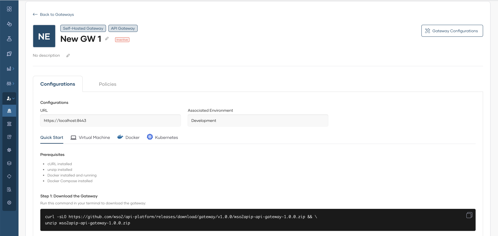
    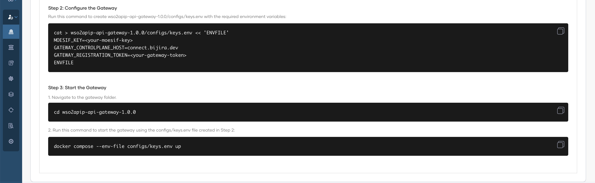


    ### Step 1: Download the Gateway

    Run this command in your terminal to download the gateway:

    ```bash
    curl -sLO https://github.com/wso2/api-platform/releases/download/gateway/v1.0.0/wso2apip-api-gateway-1.0.0.zip && \
    unzip wso2apip-api-gateway-1.0.0.zip
    ```

    ### Step 2: Configure the Gateway

    Run this command to create the gateway configuration with your environment variables:

    ```bash
    cat > wso2apip-api-gateway-1.0.0/configs/keys.env << 'ENVFILE'
    MOESIF_KEY=<your-moesif-key>
    GATEWAY_CONTROLPLANE_HOST=connect.bijira.dev
    GATEWAY_REGISTRATION_TOKEN=<your-gateway-token>
    ENVFILE
    ```

    Once you copy the above command from the screen, the `<your-moesif-key>` and `<your-gateway-token>` placeholders will be populated and the `wso2apip-api-gateway-1.0.0/configs/keys.env` file will be created with these environment variables.

    ### Step 3: Start the Gateway

    Navigate to the gateway directory and start it using Docker Compose:

    ```bash
    cd wso2apip-api-gateway-1.0.0
    docker compose --env-file configs/keys.env up
    ```

    ### Step 4: Verify the Gateway

    Check that the gateway is running and connected:

    ```bash
    # Check container status
    docker compose ps

    # Check gateway health
    curl http://localhost:9002/health
    ```

    The gateway should show as **Active** in the API Platform Console under **Gateways**.

## Add API and Invoke

!!! note
    This feature is currently available only for **REST API** proxies that are created from **scratch**, by **importing from OpenAPI**, or by specifying an **endpoint**.

    This feature is not currently available for **REST API** proxies created by importing an API contract from **GitHub**, or for **WebSocket**, **GraphQL**, **MCP**, or **Egress** APIs.

### Step 1: Create an API Proxy.

In this guide, you will specify a URL to an OpenAPI definition of a sample API to create an API proxy.

1. Navigate to **projects**.


    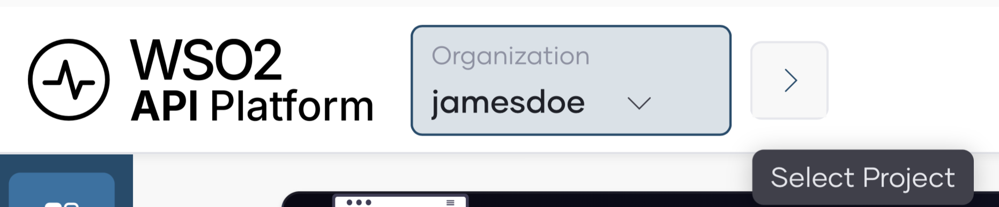


2. To create a new project for your APIs, click **+ Create Project** and follow the setup steps. Otherwise, select **Default** to continue with the default project.

    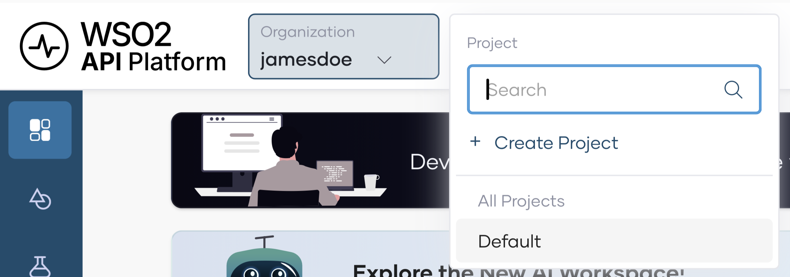

3. Select **Import API Contract**.

    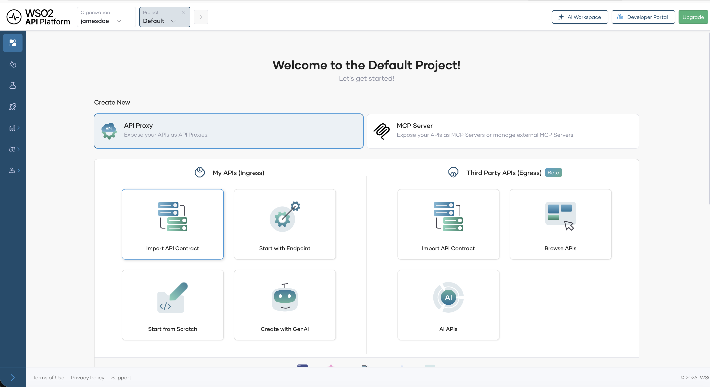

4. Select **URL** option and provide the following URL to import the API contract:

    ```text
    https://raw.githubusercontent.com/wso2/bijira-samples/refs/heads/main/reading-list-api/openapi.yaml   
    ```

5. Click **Next** and edit pre-defined values as needed. You can keep the default values for this sample.

    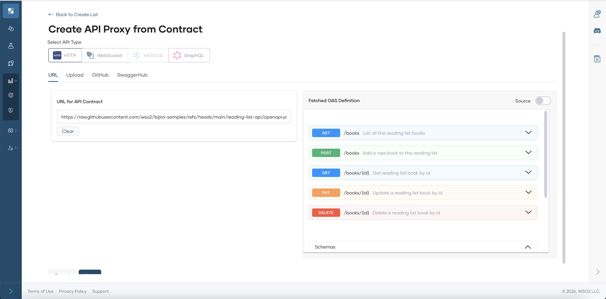

6. Select the **Gateway Type** as the **Self-Hosted Gateway**

    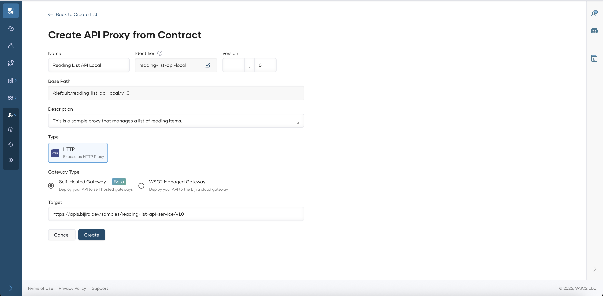

6. Click **Create** to create the API Proxy. Wait for the setup to complete and you will be navigated to the API Overview Page.

    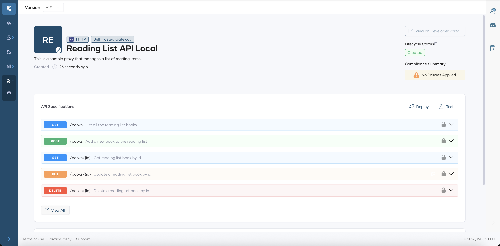

### Step 2: Deploy the API Proxy (Optional)

!!! note
    This step is **optional** at this stage, as the API is deployed to the gateway by default. However, if you make any changes to the API, you must redeploy it.
    
    To redeploy, navigate to the **Deploy page** of the API Proxy and click **Deploy**.

1. Navigate to the **Deploy** page of the API Proxy. 

    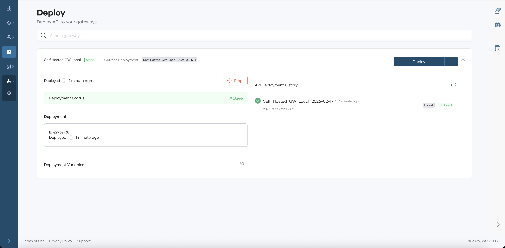

2. Click **Deploy**.

## Test the API Proxy

1. Navigate to the **Test --> cURL** page of the API Proxy.

    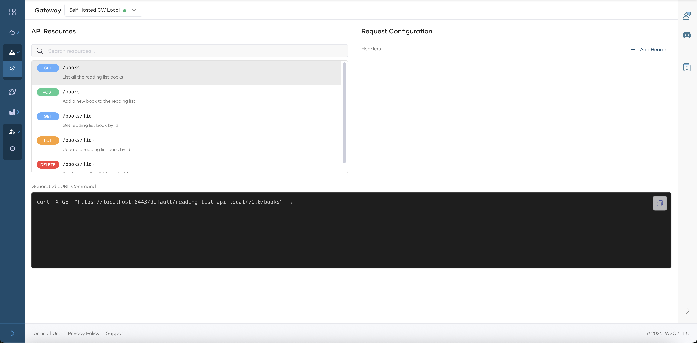

2. Use the **cURL** for relevant resource to test the API Proxy.

## Next Steps

Your Self-Hosted Gateway is now running! Here's what to do next:

- **Configure Policies**: Apply policies through the [Adding and Managing Policies](manage-policies.md) guide
- **Monitor**: View gateway health and metrics using [Analytics](analytics.md)

## Alternative Deployment Options

For production environments or specific infrastructure requirements, see the detailed configuration guide:

- [Setting Up](setting-up.md): Configure on Virtual Machine, Docker, or Kubernetes with tabs for each infrastructure option

## Troubleshooting

If the gateway doesn't connect:

1. **Verify the token**: Ensure the gateway token is correctly set in `keys.env`
2. **Check network connectivity**: The gateway needs outbound HTTPS access to `*.bijira.dev`
3. **View logs**: Run `docker compose logs -f` to see gateway logs
4. **Check firewall**: Ensure port 8443 is accessible

For more troubleshooting help, see [Troubleshooting](troubleshooting.md).