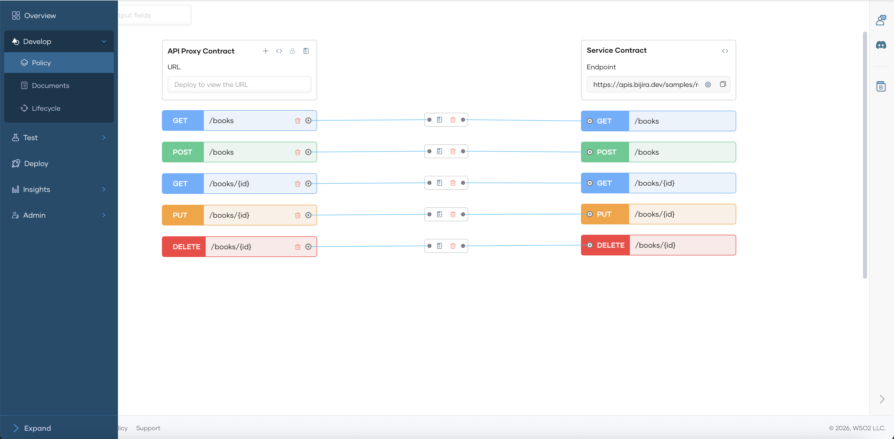
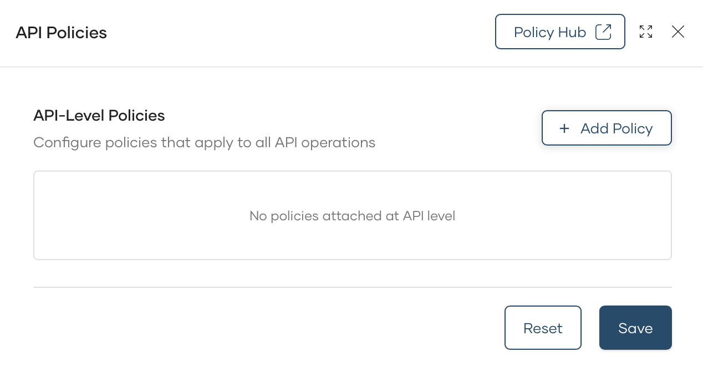
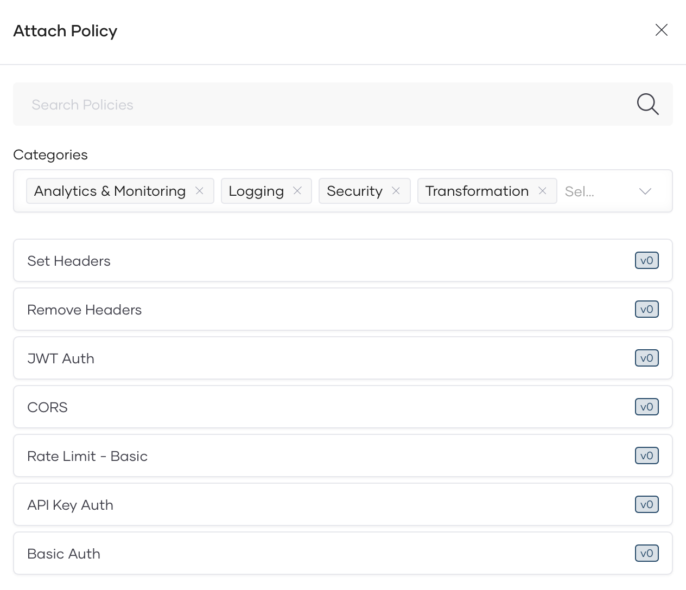
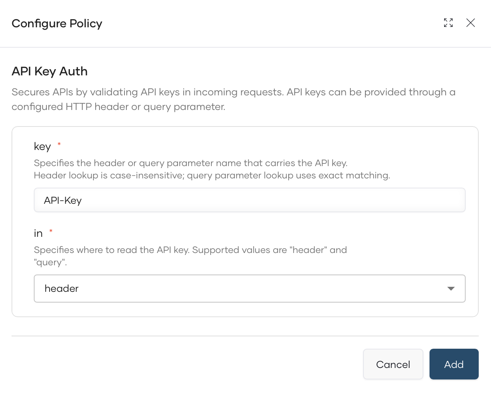

# Adding and Managing Policies

This guide explains how to add and manage policies for your Self-Hosted Gateway using API Platform's unified control plane.

## Overview

Policies allow you to enforce security, rate limiting, transformation, and other governance requirements on your APIs. With the Self-Hosted Gateway, you manage policies centrally through API Platform's Policy Hub, and they are automatically synchronized to your gateway.

## Adding Policies to an API

To add policies to an API deployed on your Self-Hosted Gateway:

1. Sign in to the [API Platform Console](https://console.bijira.dev).
2. Select your organization and project.
3. Navigate to the API proxy you want to configure.
4. Click **Develop** in the left navigation, then select **Policies**.

    

5. Choose the policy flow for API level or Resource Level:

    

6. Click **+ Add Policy** and select the policy type.

    

7. Configure the policy parameters.

    

8. Click **Add** to apply the policy.
9. Then **Save** the API.
10. Deploy the API changes to the Gateway.

## Available Policy Types

Navigate to [API Platform Policy Hub](https://wso2.com/api-platform/policy-hub/) to discover available policies.

## What's Next?

- [Writing a Custom Policy](writing-a-custom-policy.md): Learn how to build a custom policy using the gateway SDK
- [Writing an AI Policy](../ai-workspace/policies/writing-an-ai-policy.md): Learn how to write policies for LLM traffic
- [Analytics](analytics.md): Monitor API traffic and performance
- [Troubleshooting](troubleshooting.md): Common issues and solutions