# Subscription-based APIs

A **subscription-based** API is a published API proxy that has one or more **subscription plans** assigned. Subscription plans define quotas, rate limits, and related controls at the organization level. When consumers use the API Platform Developer Portal, they choose an API, subscribe to the API with a plan, and generate Subscription Token according to your plan rules.

This model fits APIs where you need tiered access, usage limits, or clear commercial separation between consumer applications.

## Before you begin

- Organization administrators have created subscription plans. See [Create API Subscription Plans](../../administer/settings/create-api-subscription-plans.md).
- The API proxy is deployed to your **Self-Hosted Gateway** and behaves correctly. See [Getting Started with Self-Hosted Gateway](../getting-started.md).

## Assign subscription plans to the API

1. Sign in to the [API Platform Console](https://console.bijira.dev/).
2. Select the project and the API proxy.
3. Go to **Manage** → **Monetize**.
4. Enable the **Subscription Plan Status** toggle for each plan you want to offer for this API by toggling **Enabled** field.

    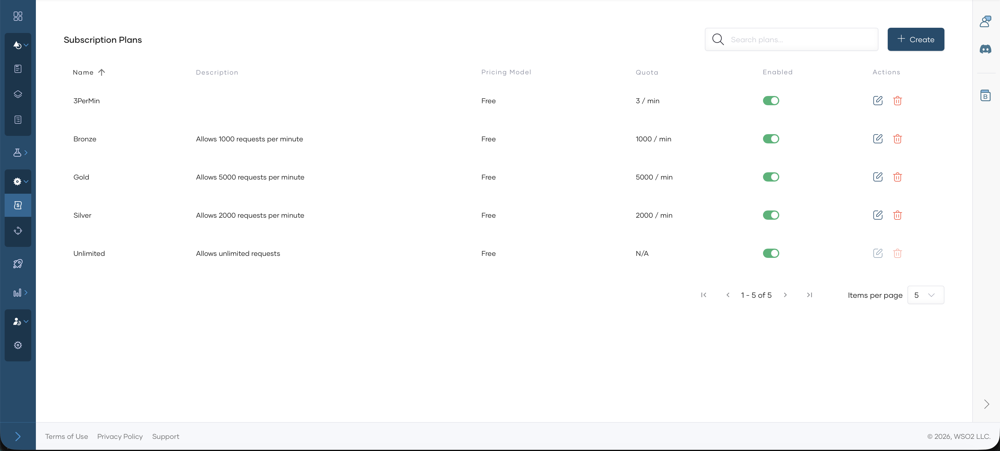

For detailed steps and field behavior, see [Assign Subscription Plans to APIs](../../develop-api-proxy/subscription-plans.md).

## Assign Subscription Validation Policy to the API

1. Go to **Develop** → **Policies**.

    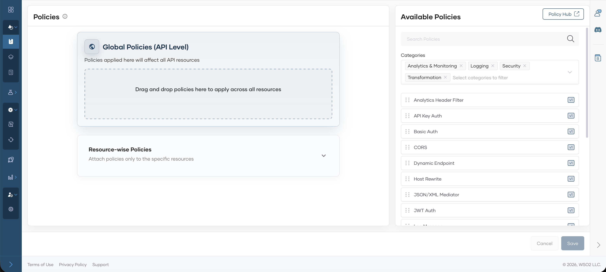

2. Select **Subscription Validation** policy.

    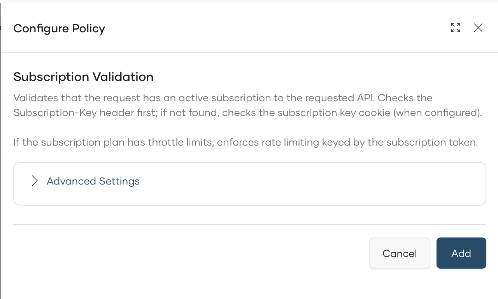

3. (Optional) Configure Subscription Header/Cookie value in the policy Advanced Section.

    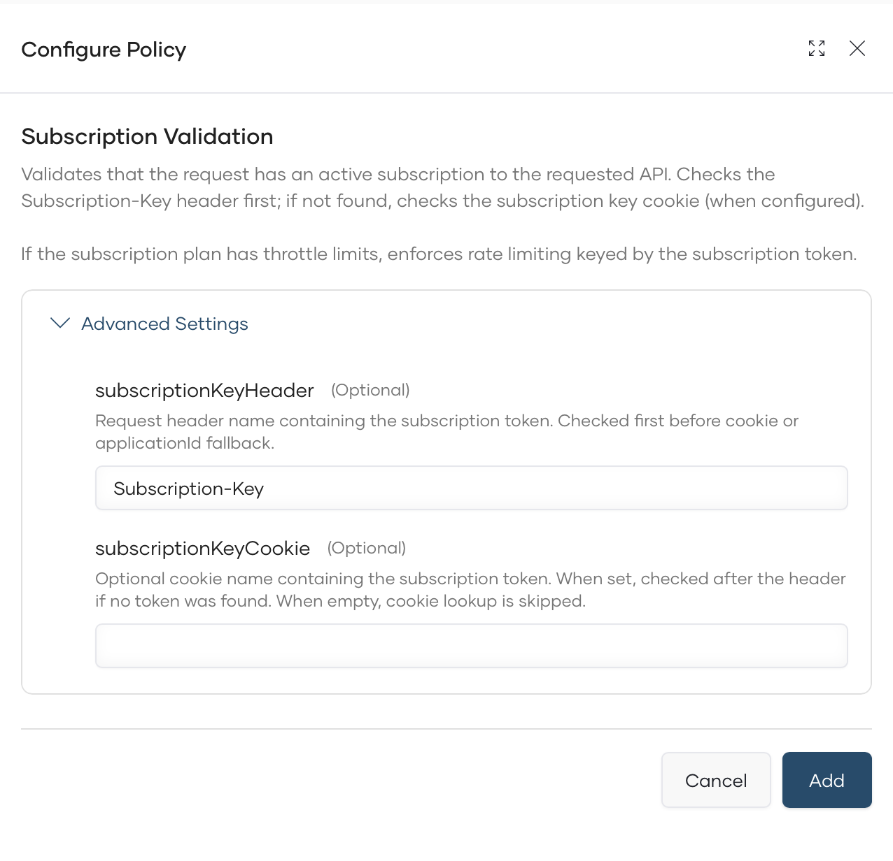

4. Click **Add** to attach the policy to API level policy.

5. Click **Save** to save the API.

    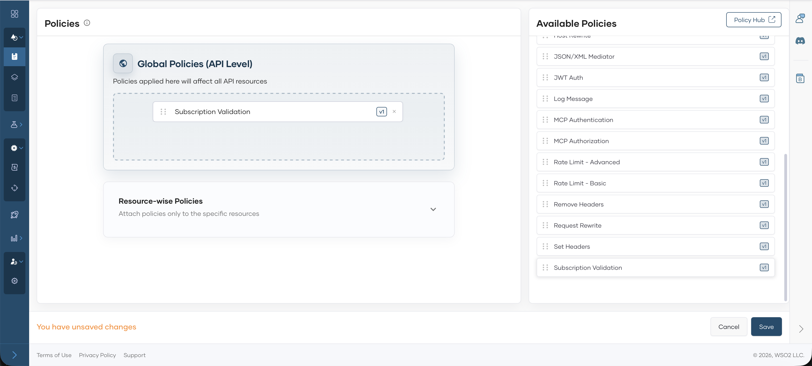

## Deploy the API

1. Go to **Deploy** and click **Deploy**.

    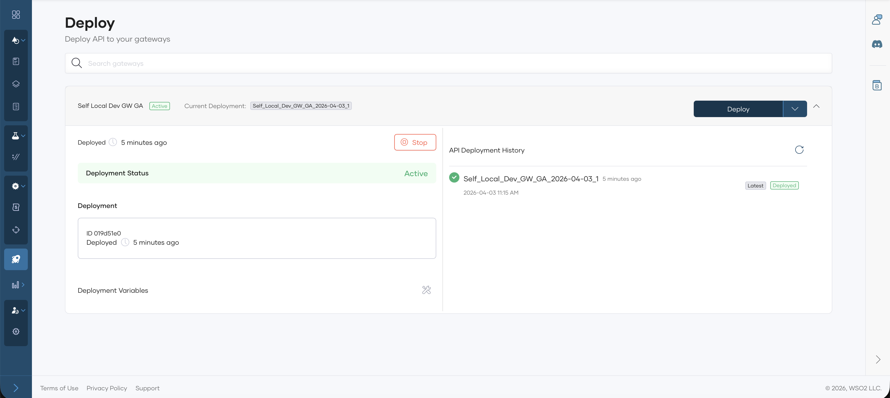

## Publish the API

1. Go to **Manage** → **Lifecycle**.

    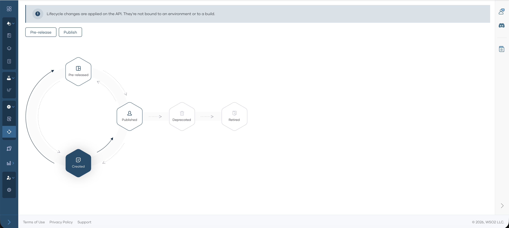

2. Click **Publish**.
3. In the publish dialog, confirm the display name and production endpoint and click **Confirm**. The lifecycle state becomes **Published**.

    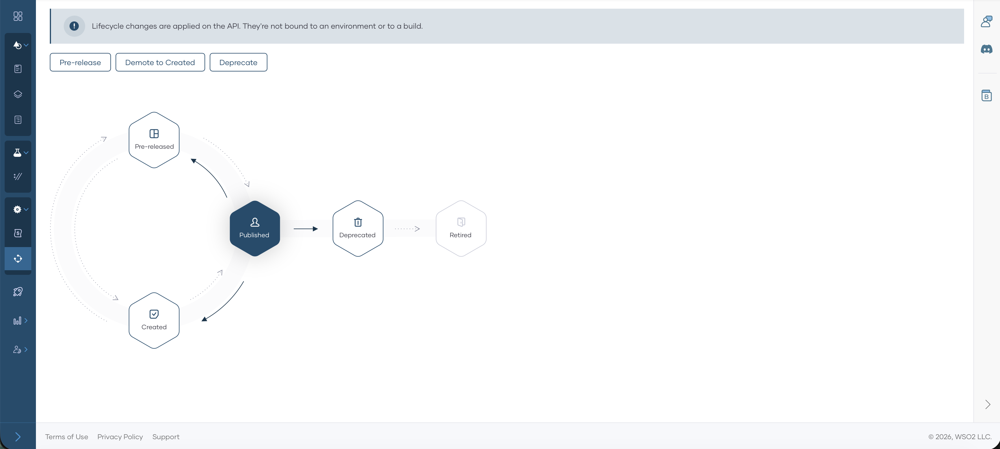

## Subscribe to the API

1. Navigate to Developer Portal by clicking **Developer Portal**.

    

2. Consumers can find the API in the Developer Portal by going to **APIs**.
3. Select the API and click **Subscribe**.

    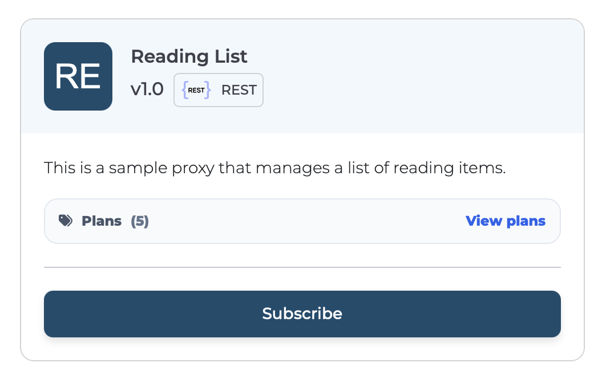

4. Pick a Subscription plan and click **Subscribe**.

    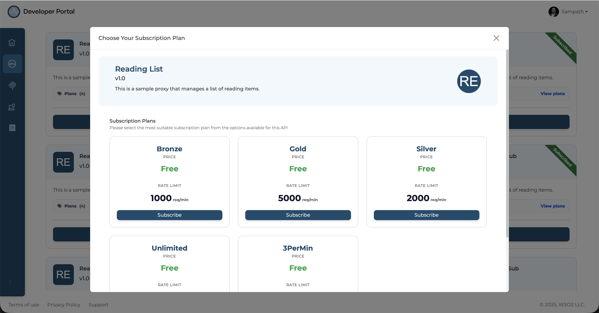

5. You will receive a Subscription Token.

    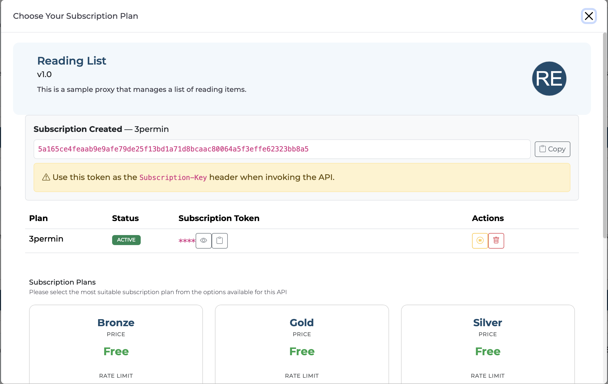

## Invoke the API

1. Receive the **cURL** to invoke the API using the Subscription Token by navigating to the **Documentation**.

    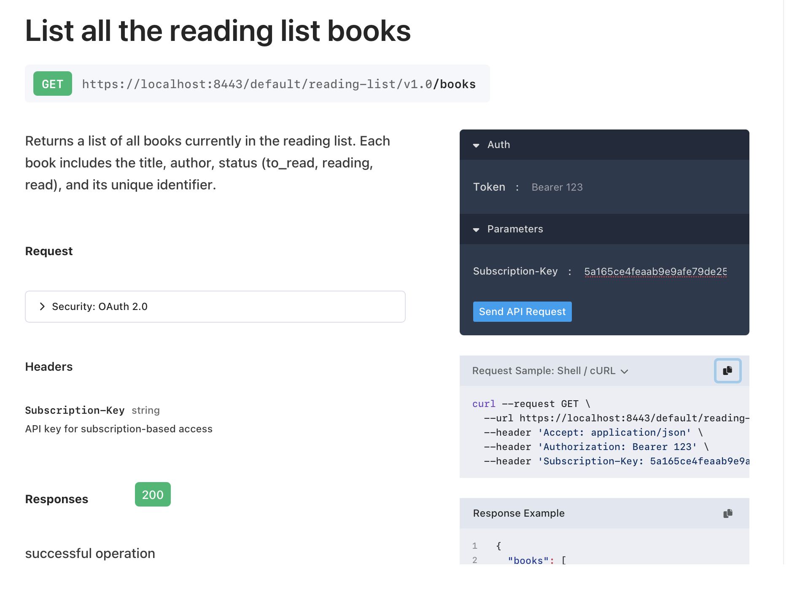

2. Invoke the API.

    #### Sample Request

    ```bash
    curl --request GET \
    --url <api-invocation-url> \
    --header 'Accept: application/json' \
    --header 'Subscription-Key: <subscription-token>' -k
    ```

    #### Sample Response

    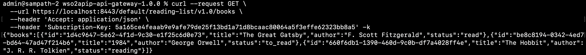


## Related documentation

- [Publish APIs overview](overview.md)
- [Subscription-less APIs](subscription-less-apis.md)
- [Create API Subscription Plans](../../administer/settings/create-api-subscription-plans.md)
- [Assign Subscription Plans to APIs](../../develop-api-proxy/subscription-plans.md)