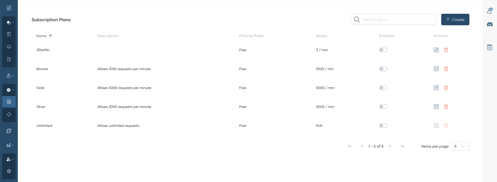
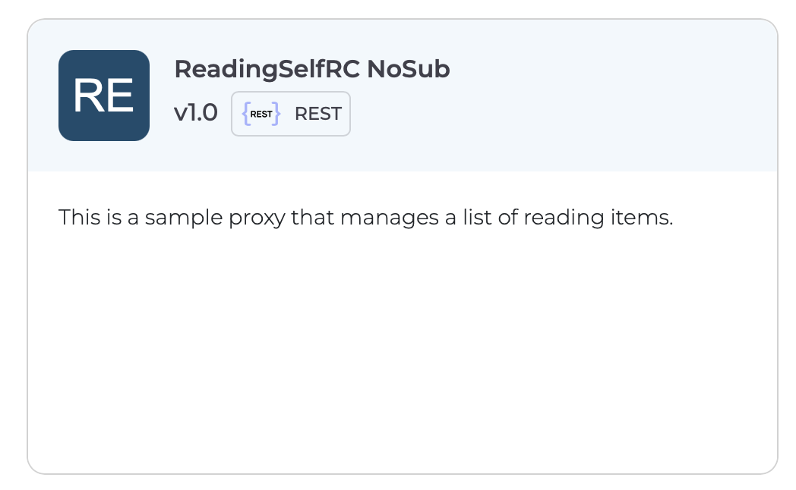
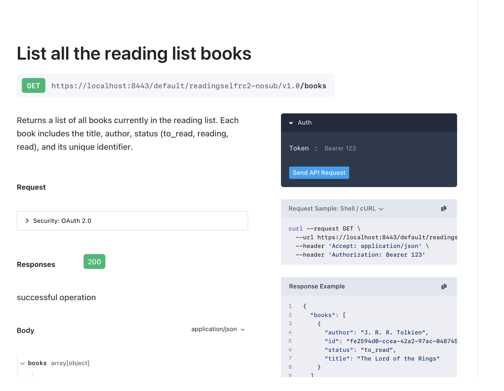

# Subscription-less APIs

A **subscription-less** API is a published API proxy that is **not** tied to subscription plans in the Developer Portal. API consumers do not need to select a subscription plan or subscribe through the standard subscription flow to consume the API, though you may still secure the API using other mechanisms (for example, API keys or OAuth configured on the API).

Use subscription-less publishing when you want the API to be discoverable in the Developer Portal without enforcing plan-based quotas and rules that come from Subscription plans.

## Before you begin

- The API proxy is deployed to your **Self-Hosted Gateway** and works as expected in your environments. See [Getting Started with Self-Hosted Gateway](../getting-started.md).
- You have permission to change the API lifecycle (typically **API publisher** or equivalent).

## Do not assign subscription plans

Subscription-less behavior applies when no subscription plans are active for the API:

1. Sign in to the [API Platform Console](https://console.bijira.dev/).
2. Open the project and select the API proxy.
3. In the left navigation menu, click **Manage** and then **Monetize**.
4. Ensure **Subscription Plan Status** is **disabled** (off) for all plans. For background on plans, see [Assign Subscription Plans to APIs](../../develop-api-proxy/subscription-plans.md).

    

If any plan is enabled for the API, consumers may be guided through subscription and plan selection for that API; that pattern is described in [Subscription-based APIs](subscription-based-apis.md).

## Publish the API

1. In the left navigation menu, click **Manage** and then **Lifecycle**.

    

2. When the API is ready for external consumers, click **Publish**.
3. In the publish dialog, confirm the display name and click **Confirm**. The lifecycle state becomes **Published**.

    

## Invoke the API

1. Navigate to Developer Portal by clicking **Developer Portal**.

    

2. Consumers can find the API in the Developer Portal by going to **APIs**.

    

3. Receive the **cURL** to invoke the API by navigating to the **Documentation**.

    

4. Invoke API.

    ```bash
    curl --request GET \
    --url <api-invocation-url> \
    --header 'Accept: application/json' -k
    ```

## Related documentation

- [Publish APIs overview](overview.md)
- [Subscription-based APIs](subscription-based-apis.md)
- [Getting Started with Self-Hosted Gateway](../getting-started.md)