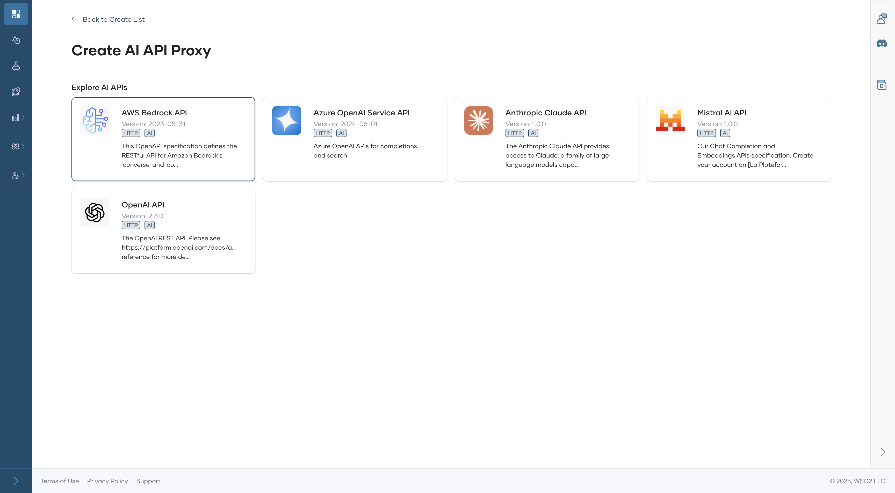
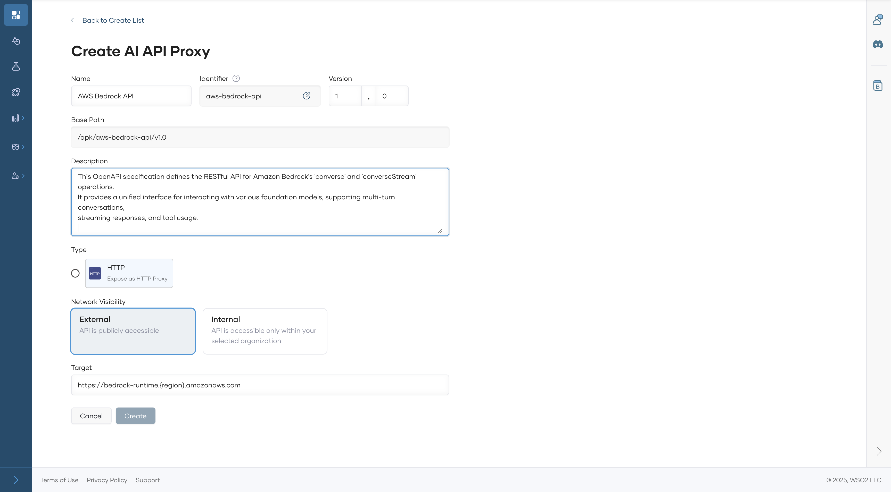
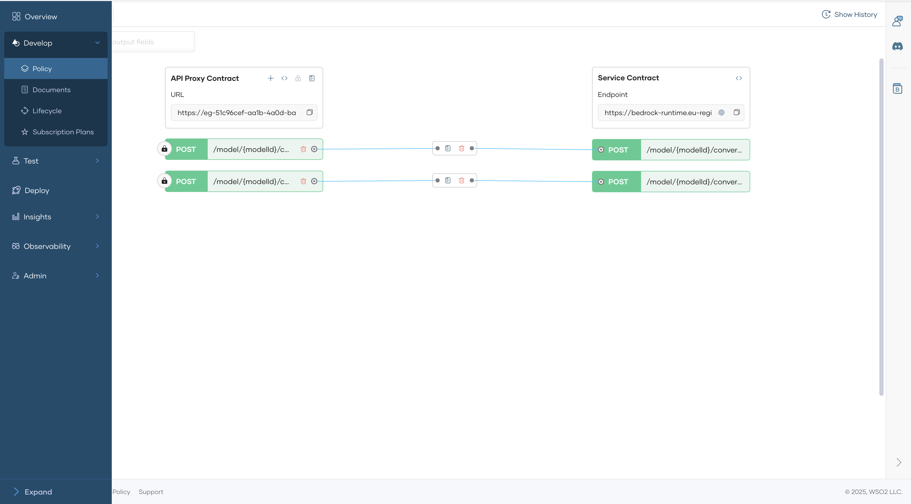
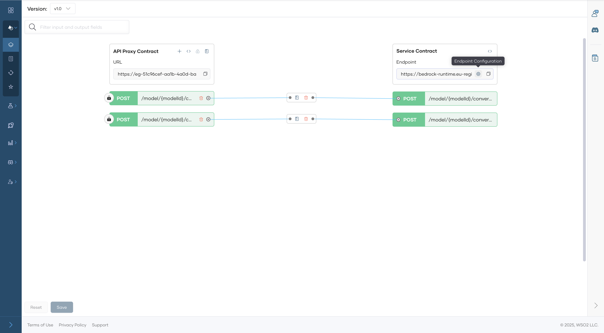
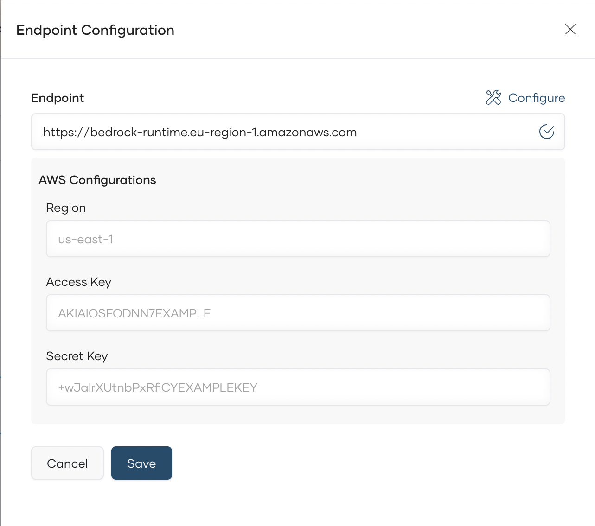
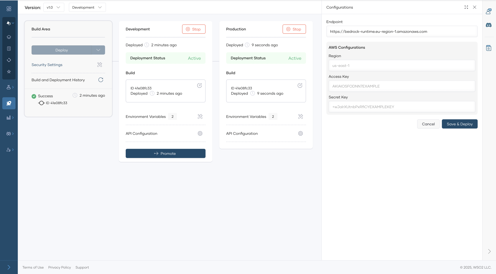

# Create an API Proxy for an AWS Bedrock AI API  

Follow the steps below to create an AI API:  

---

## 1. Access the API Platform Console

1. Sign in to the [API Platform Console](https://console.bijira.dev/) and select your project.  

---

## 2. Create an AWS Bedrock AI API

1. Click **+Create**.
2. Navigate to **Create an API Proxy for Third-Party APIs (Egress)** and click **AI APIs**.  
3. Select the **AWS Bedrock Provider**. 

      

4. Configure the AI API details, such as:  
    - API Name  
    - Identifier  
    - Version  
    - AI Provider  
    - Target Endpoint  

      

5. Click **Create** to finalize the AI API creation.  

   Once created, the overview page of the new API appears.  

---

## 3. Configure Backend Settings

1. In the left navigation menu, click **Develop**, then select **Policy**. 

      

2. Click endpoint **Endpoint Configurations**
    

3. Configure **Endpoint Configurations** to handle backend security authentication and authorization. 

     | **API Key Header**        | **API Key**         |
    | ---------------- | ----------------- |
    | Authorization |  Bearer xxxxxxxxxxxxxxxxx    |
   

    

## 4. Deploy to development and Production Environments

1. In the left navigation menu, click **Deploy**, Deploy to Development environment

    

2. Once it is deployed to development, you can test it from Test Console.

3. When you need to promote to production environment you have to provide endponit credentials for production setup.

    

---

## Next Steps

- **Test the AI API** to ensure it correctly forwards requests to the AI service. See [Test REST Endpoints via the OpenAPI Console](../../test-api-proxy/openapi-console.md).  

- **Publish the API for consumers** to enable integration into applications. See [Lifecycle Management](../../develop-api-proxy/lifecycle-management.md).  

By following these steps, you can efficiently integrate Open AI services into your API Platform environment and manage them with ease.  