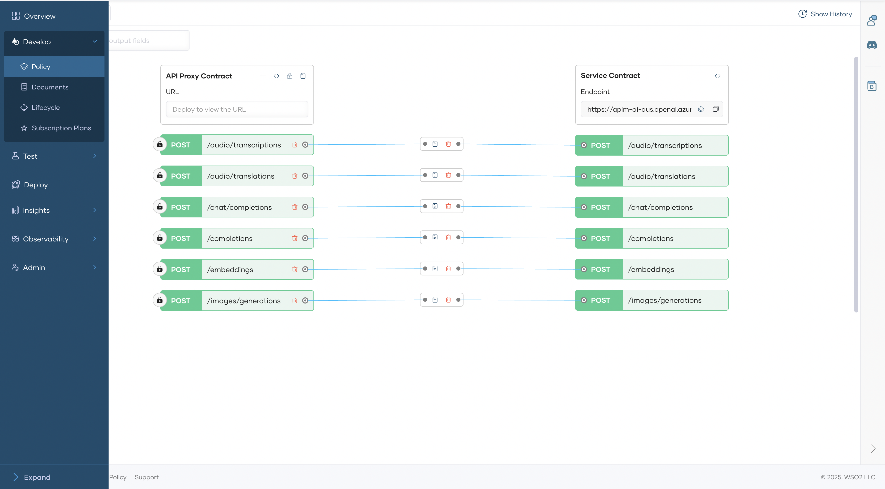
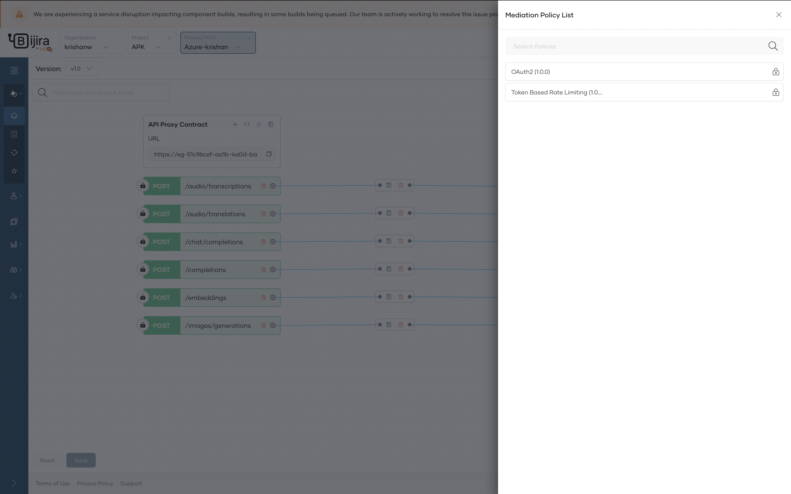
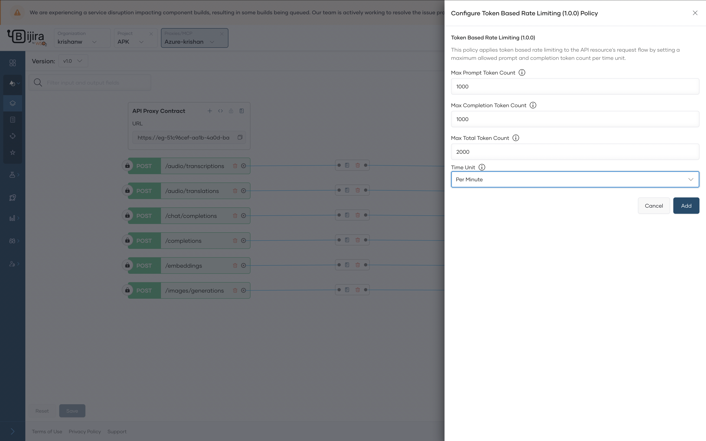

# Token-based rate limiting

AI services often incur costs on a per-token basis, making usage control critical.
API Platform’s AI Gateway introduces token-based rate limiting that can be applied at the API level.

## Configure Token Based Ratelimit Policy

1. In the left navigation menu, click **Develop**, then select **Policy**. 

      

2. Click a Add API Level Policy --> Request flow --> Attached mediation policy

      

3. Add the ratelimit information and click save.

       