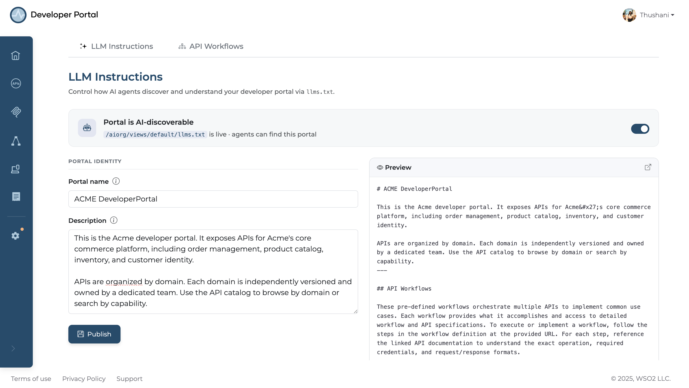
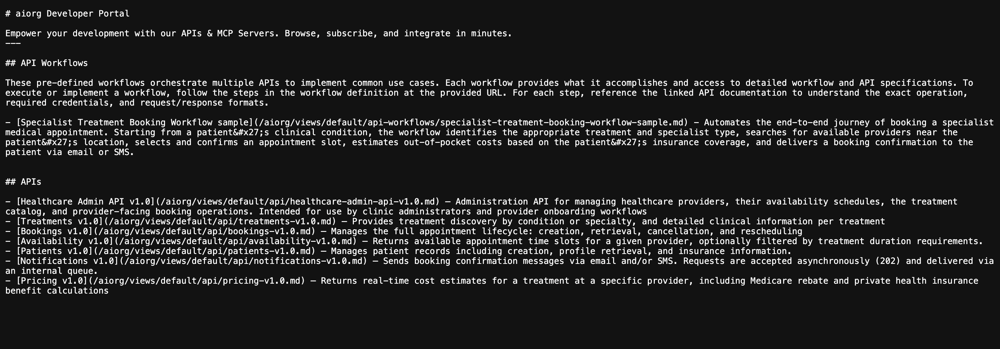

# LLM Instructions

LLM Instructions allow portal admins to provide AI agents with high level context about the developer portal, what APIs are available, how the portal is organized, and any conventions or constraints agents should follow when interacting with it.

These instructions are published as part of the portal's `llms.txt` file, which is the primary entry point for AI agents discovering the portal's capabilities.

## What Are LLM Instructions?

LLM Instructions are free form natural language text written by the portal admin. They appear at the top of `llms.txt` and are read by agents before they navigate the rest of the portal's content.

Use this space to tell agents:

- What the portal covers and what kind of APIs it exposes
- How APIs are organized (by product area, team, lifecycle stage, etc.)
- Any authentication conventions agents should be aware of
- Which workflows are the recommended starting points for common tasks
- Any limitations or usage policies agents should respect

Well written LLM instructions reduce agent errors and improve the quality of AI-assisted integrations by giving agents the orientation they need upfront, rather than leaving them to infer context from individual API specs.


## Configuring LLM Instructions

LLM Instructions are configured at the portal (view) level in the admin settings.

1. Log in to the Developer Portal as an admin and navigate to **Admin Settings**.
2. Select **LLM Instructions** tab.
3. Enter your instructions in the text editor.
4. Click **Publish**.



Changes take effect immediately, the updated instructions are reflected in `llms.txt` as soon as you save.

## Previewing the Output

To verify how your instructions appear to agents, fetch the portal's `llms.txt` directly:

```text
GET /{orgName}/views/{viewName}/llms.txt
```

Your LLM Instructions will appear at the top of the file, followed by the portal's API and workflow index.

