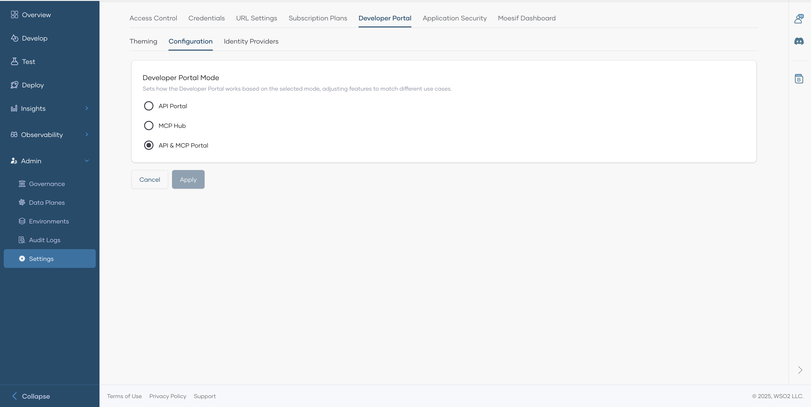

# Developer Portal Mode

API Platform's developer portal can be configured in different modes based on your requirements.

You can find this under the **Configuration** tab in the **Developer Portal** section in your organization's settings pane.

Devportal configuration has 3 modes.

1. **API Portal** - In this mode, only API Proxies will be shown in the Devportal. Suitable if you have nothing to do with MCP.
2. **MCP Hub** - In this mode, only MCP Servers will be shown in the Devportal. Suitable if you are using API Platform for MCP related use cases.
3. **API & MCP Portal** - This is the **default** mode. Both API Proxies and MCP Servers will be shown in the Devportal