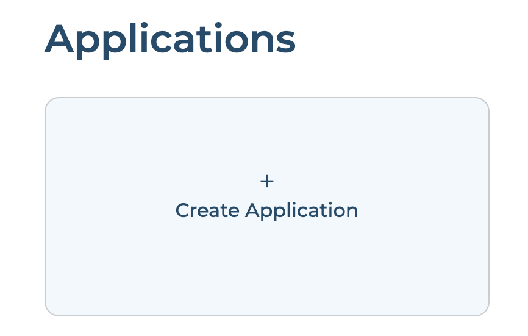
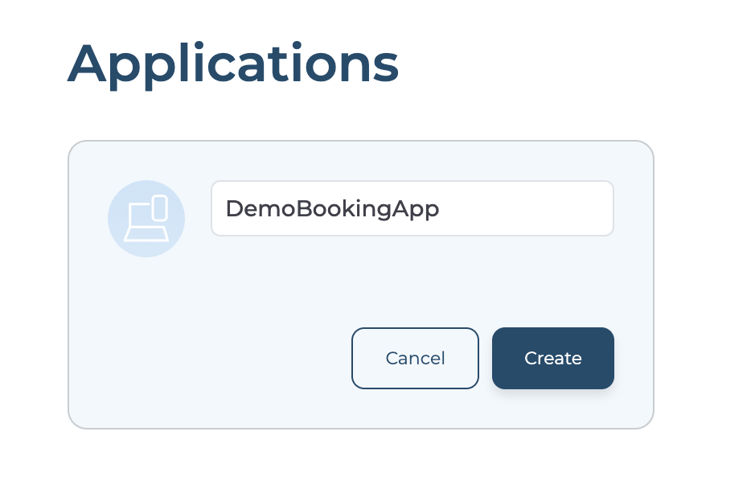
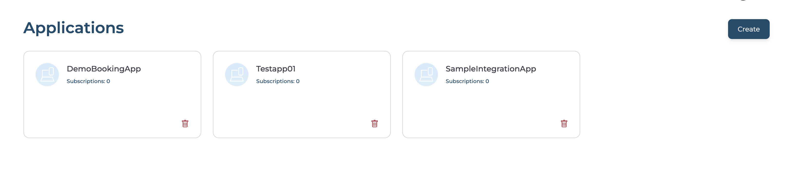
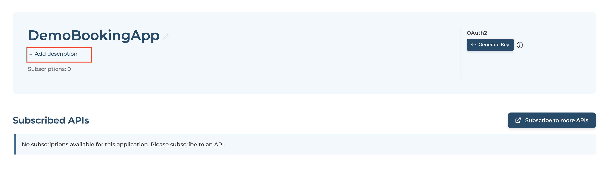
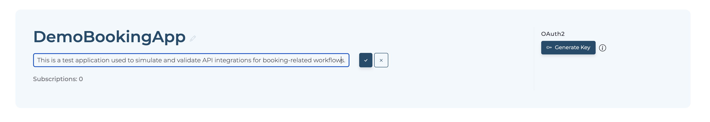

# Create Applications

An application is a logical representation of a physical application such as a mobile app, webapp, device, etc. If an application needs to consume an API, it should subscribe to the required API over a selected business plan, which determines the usage quota the application is allowed. A single application can have multiple API subscriptions.

## Prerequisites

- If you're signing in to the Developer portal for the first time, go to API Platform and create an organization:
    1. Go to [API Platform Console](https://console.bijira.dev/) and sign in using your preferred method.
    2. Enter a unique organization name. For example, `TestingOrg`.
    3. Read and accept the privacy policy and terms of use.
    4. Click **Create**.

This creates the organization and opens the **Project Home** page of the default project created for you.

## Create a new application

1. Replace `<organization name>` in the following URL with your actual organization name to access your Developer Portal.

    ```url
    https://devportal.bijira.dev/<organization name>/views/default
    ```

2. Sign in to Developer Portal using your preferred method.
3. Click **Applications** from the sidebar.
4. Click **Create Application** card. If you already have one or more applications click **+ Create** button.

    {style="max-width:500px;"}

5. Enter application name and click **Create**.

    {style="max-width:500px;"}

6. You will find the created applications list.

   

## Add Application Description

1. Selected application.
2. Click **+ Add description** to add the application's description.

    

3. Click **✔** to save the description.

    