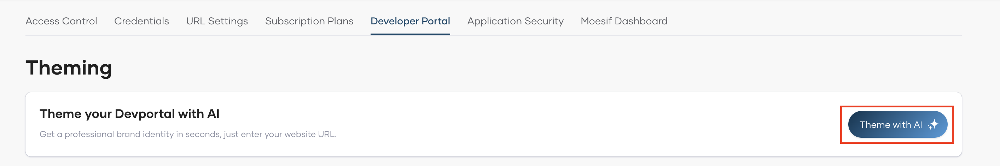
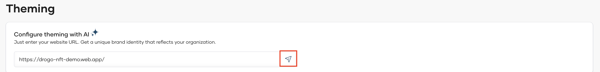
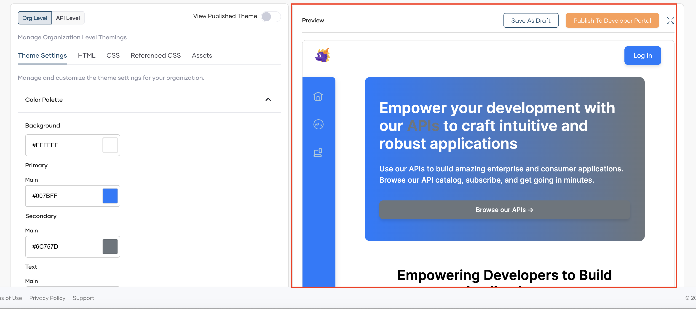
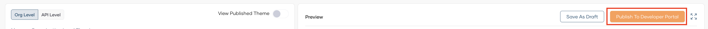
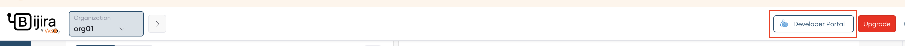
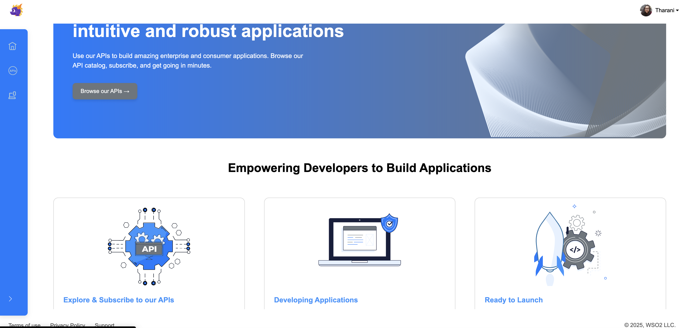

# Theming Developer Portal with AI for your Organization

AI-powered branding simplifies the process of customizing your organization's Developer portal. By leveraging AI Branding, you can ensure that your pages not only look great but also align perfectly with your brand's identity.

## Prerequisites

- If you're signing in to the API Platform Console for the first time, create an organization:
    1. Go to [API Platform Console](https://console.bijira.dev/) and sign in using your preferred method.
    2. Enter a unique organization name. For example, `TestingOrg`.
    3. Read and accept the privacy policy and terms of use.
    4. Click **Create**.

This creates the organization and opens the **Project Home** page of the default project created for you.

## Get into `Developer Portal` tab

Go through the below steps to get the `Developer Portal` tab.

- Close the project tab selected by default. Then the `Organization` tab will be selected.
- In the left navigation menu, click `Admin` and then click `Settings`.
- Select `Developer Portal` tab.

## Theme your Devportal with AI

Go through the following steps to customize the theme of the Devportal with AI.

1. Click on `Theme with AI`.

    

2. Enter the website URL  you'd like to use as the basis for branding.

    

3. Click enter to automate branding for your organization based on the website you provided. The system will then process the website and start generating the branding theme. You can see the result in the preview section.

    

4. If you want to save those changes as a draft you can select `Save As Draft`.
5. If it perfectly aligns with your organization's unique identity, you can click `Publish to Devportal`.

    

6. Go to `Developer portal` to see the changes.

    

    The finalized view will be as follows:

    