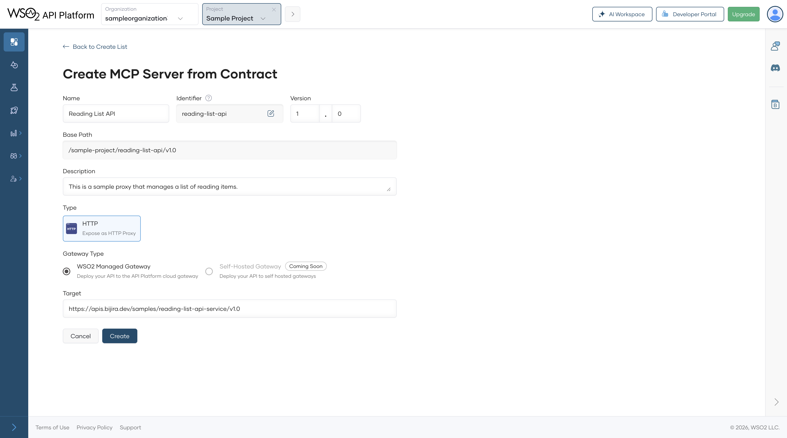
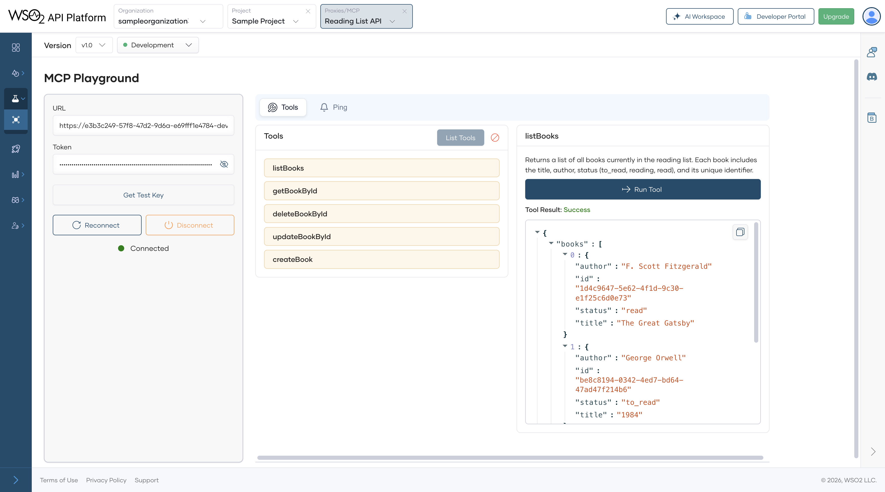
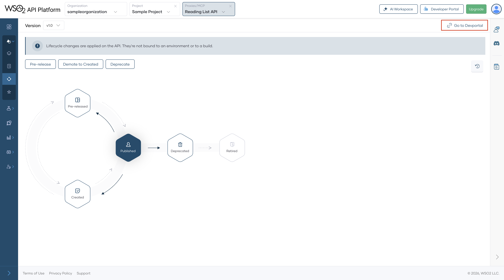
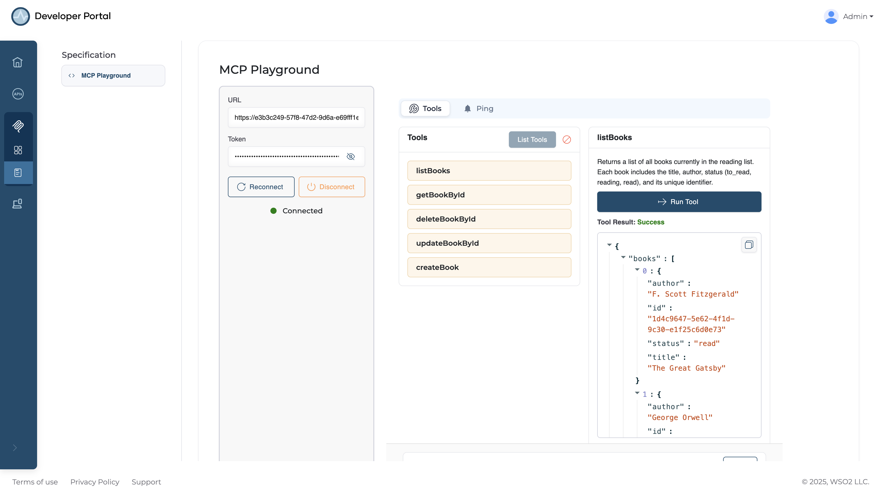

# Quick Start Guide - MCP Server

API Platform provides a complete solution for transforming existing APIs into intelligent, AI-ready tools using the Model Context Protocol (MCP). With a centralized control plane, API Platform simplifies the entire lifecycle of MCP server management from creation to discovery delivering a seamless experience for both API developers and AI agent builders.

In this tutorial, you will use API Platform to create an MCP Server from an HTTP backend, test it using the MCP Playground, publish it, and connect it with an MCP client.

!!! info "Watch the video walkthrough"
    [Check out this quick start on YouTube](https://youtu.be/xwa-7ZUfxRc?rel=0) or watch below.

<iframe 
  width="100%" 
  src="https://www.youtube.com/embed/xwa-7ZUfxRc?rel=0" 
  title="YouTube video player" 
  style="border: 0; display: block; aspect-ratio: 16 / 9;" 
  loading="lazy" 
  allow="accelerometer; autoplay; clipboard-write; encrypted-media; gyroscope; picture-in-picture; web-share" referrerpolicy="strict-origin-when-cross-origin" 
  allowfullscreen>
</iframe>


## Prerequisites

1. If you're signing in to the API Platform Console for the first time, create an organization:
    1. Go to [API Platform Console](https://console.bijira.dev/) and sign in using your Google, GitHub, or Microsoft account.
    2. Enter a unique organization name.
    3. Read and accept the privacy policy and terms of use.
    4. Click **Create**.

    This creates the organization and opens the organization home page.

## Step 1: Create a Project

1. Go to [API Platform Console](https://console.bijira.dev/) and sign in. This opens the organization home page.
2. On the organization home page, click **+ Create Project**.
3. Enter the following details:

    !!! info
        The **Name** field must be unique and cannot be changed after creation.

    | **Field**        | **Value**         |
    | ---------------- | ----------------- |
    | **Display Name** | Sample Project    |
    | **Identifier**   | sample-project    |
    | **Description**  | My sample project |

4. Click **Create**. This creates the project and takes you to the project home page.

## Step 2: Create an MCP Server

1. On the project home page, select **MCP Server** and click **Import API Contract** under **Expose APIs as MCP Servers**.
2. Click **URL for API Contract**, enter the following URL, and then click **Next**:
   ```http
   https://raw.githubusercontent.com/wso2/bijira-samples/refs/heads/main/reading-list-api/openapi.yaml
   ```
3. The **Create MCP Server from Contract** page will be opened. Click **Create** to complete the MCP Server creation process.

    

## Step 3: Test the MCP Server

API Platform automatically generates tool schemas based on the information available in your API contract.

You can test the MCP Server in the development environment using the **MCP Playground** before promoting it to production.

In this guide, you will use the MCP Playground.

1. In the left navigation menu, click **Test** and then click **MCP Playground**.
2. Select **Development** from the environment drop-down list.
3. Click **Get Test Key** if the test key is not yet populated.
4. Click **Connect** to connect with your deployed MCP Server.

    !!! info
        This sends an **Initialize** call to the MCP Server deployed in the gateway and establishes a connection.

5. Click **List Tools**, select a tool, and click **Run Tool**

    

## Step 4: Promote and Publish the MCP Server

Once you verify the MCP Server is working as expected in development, promote it to production and publish it for consumers.

1. In the left navigation menu, click **Deploy**.
2. In the **Development** card, click **Promote**.
3. In the **Configuration Types** pane, select the option **Use Development endpoint configuration** and click **Next**.

    !!! tip
        If you want to specify a different endpoint for your production environment, you can make the change in the **Configuration Types** pane.

    The **Production** card indicates the **Deployment Status** as **Active** when the MCP Server is successfully deployed to production.

    If you want to verify that the MCP Server is working as expected in production, you can test the tools in the production environment.

Now that your MCP Server is deployed in both development and production environments and can be invoked, the next step is to publish it so that consumers can discover and subscribe to it.

## Step 5: Publish the MCP Server

1. In the left navigation menu, click **Develop** and then click **Lifecycle**. This opens the **Lifecycle** page, where you can see the different lifecycle stages of the MCP Server. The current lifecycle stage is **Created**.
2. Click **Publish**.
3. In the **Publish MCP Server** dialog, click **Confirm** to publish the MCP Server with the specified display name. If you want to change the display name, make the necessary changes and then click **Confirm**. This changes the lifecycle state to **Published**.
    
    !!! Info
        If you want to configure the Developer Portal as an MCP Hub, follow the [Developer Portal Mode](../devportal/developer-portal-mode.md) documentation.

The MCP Server is now available for consumers to discover and subscribe to via the API Platform Developer Portal.

## Step 6: Connect with an MCP Client

MCP Servers in API Platform are secured by OAuth2 by default. To access an MCP Server, you must subscribe through an application, obtain a valid token, and configure it in your MCP client.

1. In the **Lifecycle Management** pane, click **Go to DevPortal**. This takes you to the MCP Server published in the API Platform Developer Portal.

    

2. Subscribe to the MCP Server and generate credentials.
    1. In the Developer Portal left navigation menu, click **Applications** and then click **Create**.
    2. Enter an application name and click **Create**. Click the application name to open its home page.
    3. Click **Explore More** under the **Subscribed MCP Servers** section. This will navigate you to the MCP Server listing page.
    4. From the MCP Server card, choose the Application and click **Subscribe**. Now your application is subscribed to the published MCP Server with your selected subscription plan.
    5. Open the created application by selecting **Applications** from the left menu, and click on the application name.
    6. In the Application detail banner, click **Manage Keys**. This opens the **Manage Keys** page.
    7. On the **Manage Keys** page, select either the **Production** or **Sandbox** tab based on your requirement.

        !!!info
            Sandbox keys can only be used in the sandbox environment.

    8. Click **Generate** and wait for the keys to be generated. If you want to configure Advanced Configurations, click on the **Modify** button once the keys are generated and configure the values. API Platform generates new tokens and populates the **Consumer Key** and **Consumer Secret** fields.
    9. Close the dialog.
    10. Click **Generate** to generate an access token. Copy the generated access token.

3. Invoke the MCP Server:
    1. Go to the MCP Server listing page using the left navigation menu.
    2. Click on the MCP Server.
    3. Click **Documentation** to open the MCP Playground.
    4. Paste your copied access token with the following format: `Bearer <ACCESS_TOKEN>`
    5. Click **Connect** to connect with your deployed MCP Server.

        !!! info
            This sends an **Initialize** call to the MCP Server deployed in the gateway and establishes a connection.

    6. Click **List Tools**, select a tool, and click **Run Tool**    
        
        

Now you have successfully created, deployed, tested, and published an MCP Server using API Platform.