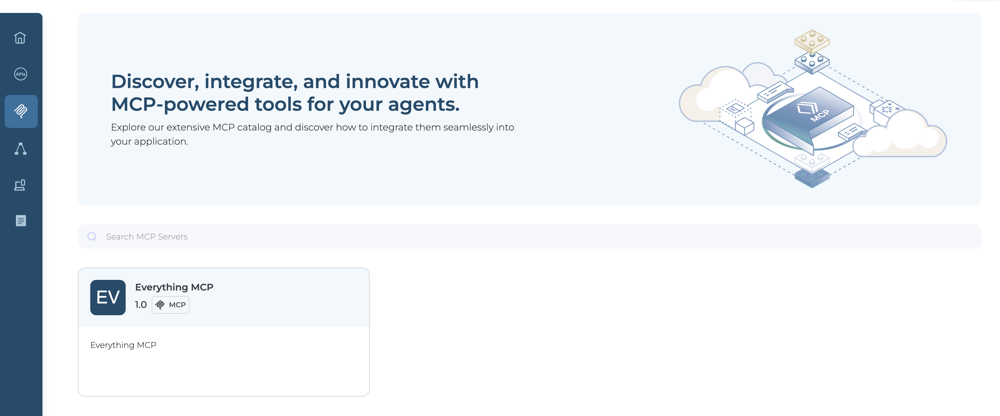
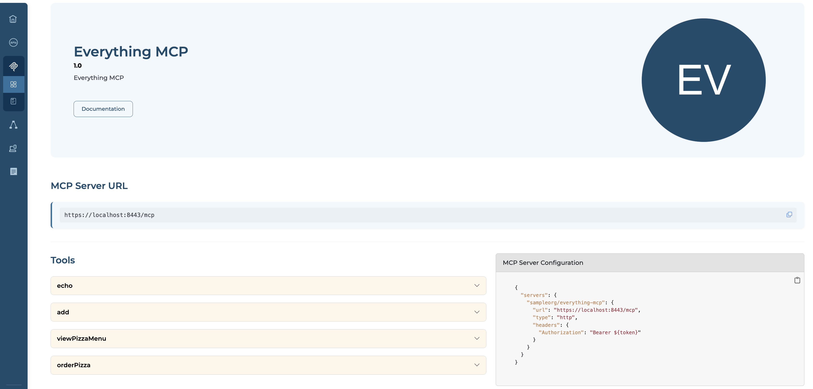

# Browse the MCP Hub

The MCP Hub is the visual catalog for your organization's MCP registry. Use it to explore available MCP servers, review their capabilities, and get the connection details needed to wire them into an AI client or agent.

## Prerequisites

- You have access to your organization's MCP Hub.

## Step 1: Open the MCP Hub

1. Navigate to the [MCP Hub](https://devportal.bijira.dev).
2. In the left navigation, select **MCP Servers**.

The Hub displays the list of all MCP servers registered in your organization's registry. Each card shows the server name, version, description, and any tags.

## Step 2: View a Server

Click a server card to open its detail page. You can view the MCP server details, including its tools, resources, prompts, and connection configuration.

## Step 3: Explore Capabilities

Scroll down to the capabilities section. The server's tools, resources, and prompts are listed in expandable panels.

- **Tools**: Each tool panel shows the tool name, description, and its input schema with the parameters the tool accepts. Expand a tool to see the full schema before connecting.
- **Resources**: Each resource panel shows the resource name, description, URI, and MIME type.
- **Prompts**: Each prompt panel shows the prompt name, description, and the arguments it accepts.

## Related Topics

- [What is an MCP Registry?](./mcp-registry.md)
- [Publish MCP Proxies](./publish-mcp-proxies.md)
- [Use the MCP Registry API](./mcp-registry-api.md)