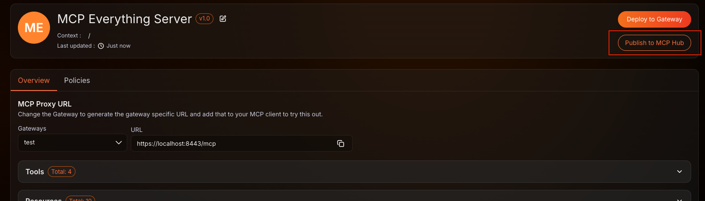

# Publish MCP Proxies

Once you have [configured and deployed an MCP proxy](../ai-workspace/mcp-proxies/configure-proxy.md) in the AI Workspace, you can publish it to the MCP Hub. Publishing registers the proxy in your organization's MCP registry, making it discoverable through the MCP Hub and the MCP Registry API.

## Publish to MCP Hub

1. In the AI Workspace, open the MCP proxy you want to publish.
2. Click **Publish to MCP Hub**.

    

The proxy is registered in your organization's MCP registry and becomes immediately discoverable through the [MCP Hub](./browse-mcp-hub.md) and the [MCP Registry API](./mcp-registry-api.md).

## Related Topics

- [What is an MCP Registry?](./mcp-registry.md)
- [Browse the MCP Hub](./browse-mcp-hub.md)
- [Use the MCP Registry API](./mcp-registry-api.md)