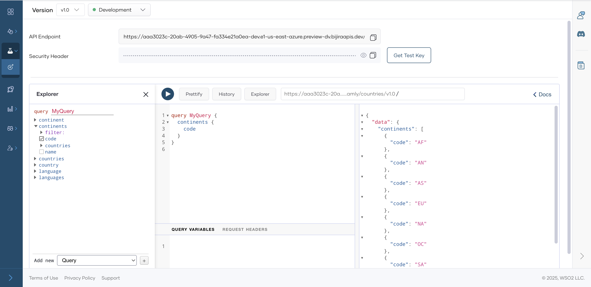

# Test GraphQL APIs via the GraphQL Console

API Platform offers an integrated GraphQL Console to test GraphQL API proxies that you create and deploy. Since API Platform secures APIs with OAuth 2.0 authentication, the GraphQL Console generates test keys to help you invoke your GraphQL operations.

Follow these steps to test a GraphQL API proxy using the GraphQL Console:

1. Go to the [API Platform Console](https://console.bijira.dev/) and log in.
2. Select the project and GraphQL API proxy that you want to test.
3. Click **Test** in the left navigation menu, then select **Console**. This will open the **GraphQL Console** pane.

    {.cInlineImage-full}
    
4. In the **Console** pane, select the desired environment from the drop-down menu.
5. In the query editor, enter the GraphQL operation you want to execute (for example, a `query` or `mutation`).
6. Click **The Play Button**. The response from the GraphQL API proxy will be displayed under the **Response** section.

