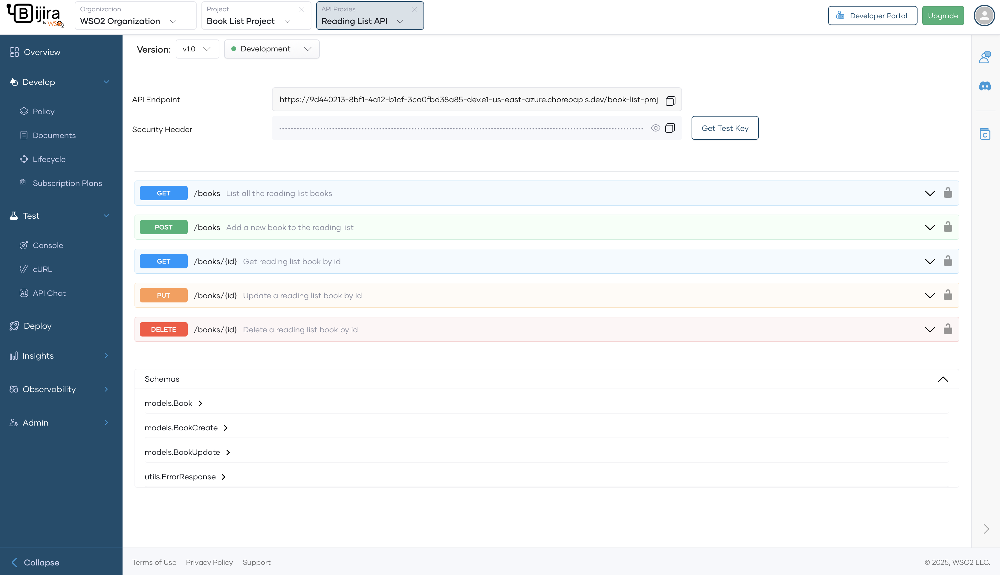
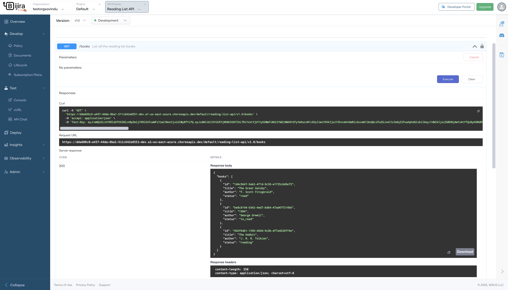

# Test REST Endpoints via the OpenAPI Console

API Platform offers an integrated OpenAPI Console to test REST endpoints for the API proxies you create and deploy. Since API Platform secures REST APIs with OAuth 2.0 authentication, the OpenAPI Console generates test keys to help you test your APIs.

Follow these steps to test a REST endpoint using the OpenAPI Console:

1. Go to the [API Platform Console](https://console.bijira.dev/) and log in.
2. Select the project and API which you want to test.
3. Click **Test** in the left navigation menu, then select **Console**. This will open the **OpenAPI Console** pane.
4. In the **OpenAPI Console** pane, select the desired environment from the drop-down menu.

    {.cInlineImage-full}

5. Expand the resource you want to test.
6. Click the **Try it out** button to enable testing.
7. Provide values for any parameters, if applicable.
8. Click **Execute**. The response will be displayed under the **Responses** section.

    {.cInlineImage-full}