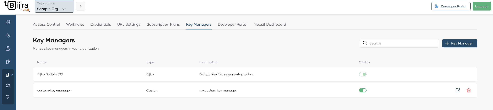

# Configure Custom External Key Manager

If your organization uses Asgardeo or Microsoft Azure Active Directory (Azure AD) as a key manager follow the platform-specific guides below to add them as an external key manager in Bijira.

- [Configure Asgardeo as an External Key Manager](configure-asgardeo-as-an-external-idp.md)
- [Configure Azure as an External Key Manager](configure-azure-ad-as-an-external-idp.md)

If you use any other Key manager, you can still integrate it with Bijira provided it supports standard OIDC/OAuth2 endpoints. Integrating a custom key manager allows you to enforce API access using scopes and restrict access to specific user groups. This guide walks you through the steps to set up the external key manager.

## Prerequisites

Before you try out this guide, be sure you have the following:

- The key manager's `Well‑Known URL` (to import configuration automatically).
- Administrator access to your Bijira organization and to the key manager.

## Step 1: Add custom external key manager in Bijira

Follow the steps below to add a custom key manager in Bijira:

1. Sign in to the Bijira Console at [https://console.bijira.dev/](https://console.bijira.dev).
2. In the left navigation menu, click **Settings**.
3. In the header, click the **Organization** list. This will open the organization level settings page.
4. On the **Key Managers** tab, click **+ Key Manager**.

    

5. Select  **Custom** as the key manager.

    

6. Provide a name and a description for the key manager.
7. Obtain the `Well-Known URL` of your key manager and Provide it under Well-Known URL.
8. Leave the **Apply to all environments** checkbox selected. However, if you want to restrict the use of the external key manager to a certain environment, you can select them from the **Environments** list.

    

9. Click **Next**.
    
10. The next page will list all the relevant configurations extracted from the `Well-Known URL`. Review the configurations and click **Add**.

Now you have configured your custom key manager as an external key manager in Bijira.

## Step 2: Add the external key manager in Bijira Developer Portal¶

Once the key manager is configured as an external key manager in Bijira, it is necessary to configure it in the Bijira Developer Portal as well. For that, follow the steps below.

1. In the left navigation menu of the Bijira Console, click **Admin** and then click **Settings**.
2. Click the **Developer Portal** tab, then click the **Key Managers** tab. This page will list all the key managers available in Bijira.
3. Select the key manager you configured at [Step 1](#step-1-add-custom-external-key-manager-in-bijira).
4. Click **Save**.

Now you have configured your key manager as an external key manager in Bijira Developer Portal as well.

## What Next?

To secure API access with the above-configured key manager follow the steps mentioned [here](../../develop-api-proxy/authentication-and-authorization/secure-api-access-with-external-idp.md).
