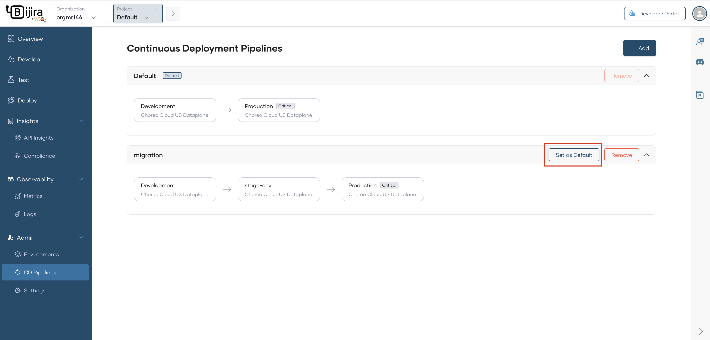

# Manage Continuous Deployment Pipelines

By default, all the organizations in Bijira are provisioned with a default continuous deployment pipeline.

Environments within an organization are applied to projects in the order specified by the continuous deployment pipeline. The organization's default continuous deployment pipeline is applied to all the projects. You can create additional pipelines and customize the sequence in which environments are applied in projects.

## Create a new continuous deployment pipeline

To create a new pipeline, follow the steps given below:

1. Sign in to [Bijira](https://console.bijira.dev/).
2. In the Bijira Console, go to the top navigation menu and click **Organization**. Then select your organization.
3. In the left navigation menu, click **Admin** and then click **CD Pipelines**.
4. On the **CD Pipelines** page, click **+ Create Pipeline** and specify the following details required to create a new pipeline:

   - **Name**: A display name for the new pipeline.
   - **Mark as Default**: Select if you want to assign this new pipeline as the default pipeline for all new projects.

5. Click **+ Add Environment** and add required environments for the pipeline according to the preferred environment sequence.
6. Click **Create**.

## Edit a continuous deployment pipeline

To edit a pipeline, follow the steps given below:

1. Sign in to [Bijira](https://console.bijira.dev/).
2. In the Bijira Console, go to the top navigation menu and click **Organization**. Then select your organization.
3. In the left navigation menu, click **Admin** and then click **CD Pipelines**.
4. Click the edit icon corresponding to the pipeline you want to edit.
5. Update the pipeline name, mark the pipeline as default, and change the sequence of environments.
6. Click **Update**.

## Delete a continuous deployment pipeline

To delete a pipeline, follow the steps given below:

!!! warning
    Continuous deployment pipeline deletion is a permanent, non-reversible operation.

!!! info "Note"
    The **default** continuous deployment pipeline of the organization cannot be deleted.

1. Sign in to [Bijira](https://console.bijira.dev/).
2. In the Bijira Console, go to the top navigation menu and click **Organization**. Then select your organization.
3. In the left navigation menu, click **Admin** and then click **CD Pipelines**.
4. Click the delete icon corresponding to the pipeline you want to delete. This displays a confirmation dialog with details on the impact of deletion.

!!! info "Note"
    If the pipeline is utilized by one or more projects, deletion will not be permitted. To proceed with deleting such a pipeline, you must first remove it from every project that is currently using it.

5. Review the details, then type the pipeline name to confirm the deletion.
6. Click **Delete**.

## Add a continuous deployment pipeline to a project

To add a pipeline to a project, follow the steps given below:

1. Sign in to [Bijira](https://console.bijira.dev/).
2. In the Bijira Console, go to the top navigation menu and click **Organization**. Then select your organization.
3. Click the project you want to add the pipeline.
4. In the left navigation menu, click **Admin** and then click **CD Pipelines**.
5. Click **+ Add** and select the pipelines you want to add to the project.
6. Click **Add**.

## Remove a continuous deployment pipeline from a project

To remove a pipeline from a project, follow the steps given below:

1. Sign in to [Bijira](https://console.bijira.dev/).
2. In the Bijira Console, go to the top navigation menu and click **Organization**. Then select your organization.
3. Click the project you want to remove the pipeline.
4. In the left navigation menu, click **Admin** and then click **CD Pipelines**.
5. Click **Remove** corresponding to the pipeline you want to remove from the project. This displays a confirmation dialog with details on the impact of deletion.
6. Review the details, then type the pipeline name to confirm the deletion.
7. Click **Remove**.

## Change default continuous deployment pipeline of a project

To change the default pipeline of a project, follow the steps given below:

1. Sign in to [Bijira](https://console.bijira.dev/).
2. In the Bijira Console, go to the top navigation menu and click **Organization**. Then select your organization.
3. Click the project you want to change the default pipeline.
4. In the left navigation menu, click **Admin** and then click **CD Pipelines**.
5. Click **Set as Default** corresponding to the pipeline you want to set as the default pipeline for the project. This displays a confirmation dialog that details the impact of setting the new pipeline as the project default.
6. Click **Confirm**.

!!! info "Note"
    The **default** continuous deployment pipeline is configured separately at both the organization and project levels. When a project is created, it inherits the organization's **default** pipeline. The project's **default** pipeline then defines the default promotion order for its components on the Deploy page.

