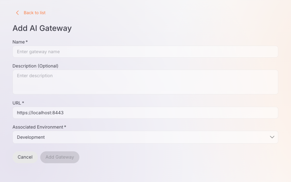

# Setting up an AI Gateway

AI Gateways are the runtime components that process and route requests between your applications and LLM providers. You can create and manage AI gateways directly within the AI Workspace to deploy your LLM providers and proxies.

## Prerequisites

- Access to Bijira Console with **Admin** role

---

## View AI Gateways

1. Navigate to **AI Gateways** in the left navigation menu.

The AI Gateways page displays a list of all configured gateways with the following details:

| Column | Description |
|--------|-------------|
| **Name** | The gateway name |
| **Description** | A brief description of the gateway |
| **Status** | Current status (Active or Not Active) |
| **Last Updated** | Timestamp of the most recent change |
| **Actions** | Edit and delete options |

---

## Add a New AI Gateway

1. Navigate to **AI Gateways** in the left navigation menu.

2. Click **+ Add AI Gateway**.

   3. Fill in the gateway details:

       1. **Name*** (Required): Enter a unique name for the gateway (e.g., `production-gateway`, `dev-gateway`).

       2. **Description** (Optional): Add a brief description to identify the gateway's purpose.

       3. **URL*** (Required): Enter the gateway URL (e.g., `https://localhost:8443`). This is the endpoint where the gateway runtime is accessible.

       4. **Associated Environment*** (Required): Select the environment from the dropdown (e.g., `Development`, `Production`).

    

4. Click **Add Gateway** to create the gateway.

5. After creation, the gateway detail page opens showing the gateway name, status (**Inactive** initially), vhost, and creation timestamp.

---

## Set Up the Gateway

After creating an AI gateway, you need to set up the gateway runtime. The detail page provides a **Get Started** section with setup instructions.

### Gateway Registration Token

A **Gateway Registration Token** is displayed at the top of the Get Started section. This token is required to connect your gateway runtime to the control plane.

!!! danger "Important"
    This token is shown only once. Ensure it is securely saved before leaving this page.

!!! tip "Lost your token?"
    The registration token is single-use. If you need to reconfigure the gateway, click the **Reconfigure** button to generate a new token. This will revoke the old token and disconnect the gateway from the control plane.

### Installation Methods

The Get Started section provides setup instructions for multiple deployment options:

=== "Quick Start"
    **Prerequisites:**

    - cURL installed
    - unzip installed
    - Docker installed and running

    **Step 1: Download the Gateway**

    Run this command in your terminal to download the gateway:

    ```bash
    curl -sLO https://github.com/wso2/api-platform/releases/download/ai-gateway/v0.8.4/ai-gateway-v0.8.4.zip && \
    unzip ai-gateway-v0.8.4.zip
    ```

    **Step 2: Configure the Gateway**

    Run this command to create the environment configuration file with the required environment variables:

    ```bash
    cat > ai-gateway-v0.8.4/configs/keys.env << 'ENVFILE'
    GATEWAY_CONTROLPLANE_HOST=platform-api.preview-dv.choreo.dev
    GATEWAY_REGISTRATION_TOKEN=<your-gateway-token>
    ENVFILE
    ```

    Replace `<your-gateway-token>` with the token from the Get Started section.

    **Step 3: Start the Gateway**

    1. Navigate to the gateway folder:

        ```bash
        cd ai-gateway-v0.8.4
        ```

    2. Run this command to start the gateway using the environment file created in Step 2:

        ```bash
        docker compose --env-file configs/keys.env up
        ```

=== "Virtual Machine"
    **Prerequisites:**

    - cURL installed
    - unzip installed
    - A Docker-compatible container runtime such as:
        - Docker Desktop (Windows / macOS)
        - Rancher Desktop (Windows / macOS)
        - Colima (macOS)
        - Docker Engine + Compose plugin (Linux)

    Ensure docker and docker compose commands are available:

    ```bash
    docker --version
    docker compose version
    ```

    **Step 1: Download the Gateway**

    Run this command in your terminal to download the gateway:

    ```bash
    curl -sLO https://github.com/wso2/api-platform/releases/download/ai-gateway/v0.8.4/ai-gateway-v0.8.4.zip && \
    unzip ai-gateway-v0.8.4.zip
    ```

    **Step 2: Configure the Gateway**

    The registration token is single-use. If you need to reconfigure the gateway, click **Reconfigure** to generate a new token — this will revoke the old token and disconnect the gateway from the control plane.

    **Step 3: Start the Gateway**

    1. Navigate to the gateway folder:

        ```bash
        cd ai-gateway-v0.8.4
        ```

    2. Run this command to start the gateway using the environment file created in Step 2:

        ```bash
        docker compose --env-file configs/keys.env up
        ```

=== "Docker"
    **Prerequisites:**

    - cURL installed
    - unzip installed

    **Step 1: Download the Gateway**

    Run this command in your terminal to download the gateway:

    ```bash
    curl -sLO https://github.com/wso2/api-platform/releases/download/ai-gateway/v0.8.4/ai-gateway-v0.8.4.zip && \
    unzip ai-gateway-v0.8.4.zip
    ```

    **Step 2: Configure the Gateway**

    The registration token is single-use. If you need to reconfigure the gateway, click **Reconfigure** to generate a new token — this will revoke the old token and disconnect the gateway from the control plane.

    **Step 3: Start the Gateway**

    1. Navigate to the gateway folder:

        ```bash
        cd ai-gateway-v0.8.4
        ```

    2. Run this command to start the gateway using the environment file created in Step 2:

        ```bash
        docker compose --env-file configs/keys.env up
        ```

=== "Kubernetes"
    **Prerequisites:**

    - cURL installed
    - unzip installed
    - Kubernetes 1.32+
    - Helm 3.18+

    The registration token is a one-time generated token for this gateway. If you need to install or update the gateway chart again, first reconfigure this gateway to generate a new registration token. Reconfiguring will revoke the previous token.

    **Installing the Chart**

    Run this command to install the gateway chart with control plane configurations:

    ```bash
    helm install gateway oci://ghcr.io/wso2/api-platform/helm-charts/gateway --version 0.8.4 \
    --set gateway.controller.controlPlane.host="host.docker.internal" \
    --set gateway.controller.controlPlane.port=8443 \
    --set gateway.controller.controlPlane.token.value="your-gateway-token"
    ```

    Replace `your-gateway-token` with the token from the Get Started section.

Once the gateway runtime is running and connected, the gateway status will change from **Inactive** to **Active**.

---

## Manage AI Gateways

### Edit a Gateway

1. In the AI Gateways list, click the **edit** icon next to the gateway you want to modify.

2. Update the gateway details as needed.

3. Click **Save** to apply the changes.

### Delete a Gateway

1. In the AI Gateways list, click the **delete** icon (trash icon) next to the gateway you want to remove.

2. Confirm the deletion when prompted.

!!! danger "Irreversible Action"
    Deleting a gateway is permanent. All providers and proxies deployed to this gateway will be undeployed immediately.

---

## Next Steps

- [Configure LLM Provider](../llm-providers/configure-provider.md) - Set up an LLM provider and deploy it to your gateway
- [Configure LLM Proxy](../llm-proxies/configure-proxy.md) - Create a proxy and deploy it to your gateway
