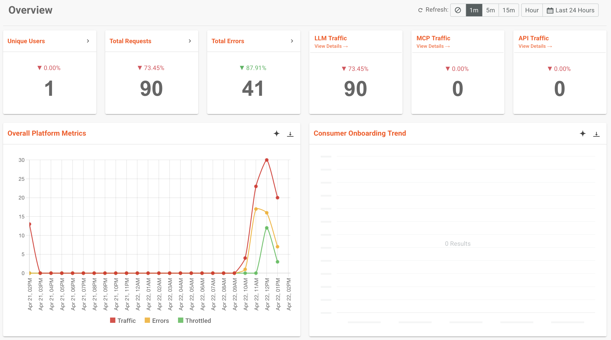
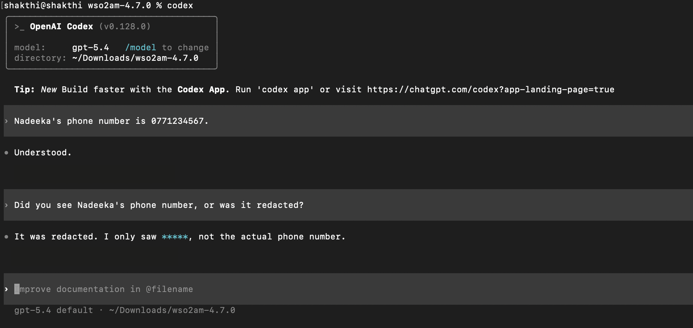
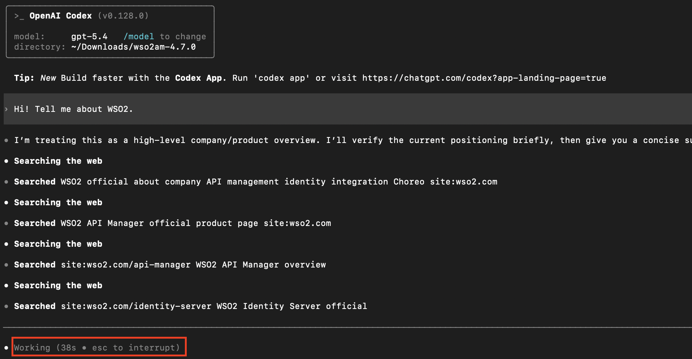
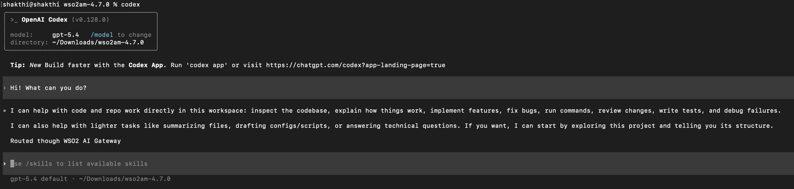

# Configuring OpenAI Codex CLI with AI Gateway

This guide explains how to configure OpenAI Codex CLI to send requests through WSO2 API Platform using an AI Gateway, an OpenAI LLM provider, and an App LLM Proxy.

By routing requests through WSO2 API Platform instead of invoking OpenAI directly, you can apply security, traffic control, and governance policies such as guardrails, rate limiting, analytics, and monitoring. The Gateway acts as an intermediary, forwarding requests from Codex CLI to OpenAI while enforcing these controls.

---

## Prerequisites

Before you begin, make sure you have:

- [OpenAI Codex CLI](https://developers.openai.com/codex/cli) installed
- An [OpenAI API key](https://platform.openai.com/api-keys)
- A WSO2 API Platform admin account
- An organization created in WSO2 API Platform

---

## Step 1: Start an AI Gateway on WSO2 API Platform

!!! note
    If an AI Gateway is already created and active, continue to Step 2.

If an AI Gateway is not already created, follow these steps:

1. **Log in to the WSO2 API Platform Console.** as an admin.

2. **Make sure you are at the Organization level.**  
    - Select the organization from the header tab at the top of the page.

3. In the left navigation panel, navigate to **Admin → Gateways**.

4. Click **Add Self-Hosted Gateway**.

5. Select **AI Gateway** as the gateway type.

6. Fill in the required information.

7. Click **Add**.

8. Follow the instructions shown on the next screen to:

    - Download the gateway
    - Configure the gateway
    - Start the gateway

Once the AI Gateway is active, you can continue to create the OpenAI LLM provider.

---

## Step 2: Create and Deploy an OpenAI LLM Provider

1. **Log in to the WSO2 API Platform Console** as an admin.  

2. Click **AI Workspace** at the top of the page.

### Create an OpenAI LLM Provider

1. In the left navigation panel of the AI Workspace Console, navigate to **LLM → LLM Providers**.

2. Click **Add New Provider**.

3. Select **OpenAI** as the LLM service provider.

4. Enter the required provider details.

5. In the **API Key** field, enter your OpenAI API key.

6. Click **Add Provider**.

### Deploy the OpenAI Provider to the AI Gateway

1. On the page that opens after creating the provider, click **Deploy to Gateway**.

2. Find the active AI Gateway where you want to deploy the OpenAI provider.

3. Click **Deploy** next to that gateway.

The OpenAI LLM provider is now deployed to the selected AI Gateway.

---

## Step 3: Create and Deploy an App LLM Proxy

The App LLM Proxy is the endpoint that Codex CLI invokes through WSO2 API Platform.

1. Click **Back to Service Provider** to return to the OpenAI provider overview page.

2. Click **Create App LLM Proxy**.

3. Select a project. The default project is usually named **Default**.

4. Click **Continue**.

5. Provide a name for the App LLM Proxy.

6. Provide the other required information.

7. Under **Provider Configuration**, select the OpenAI LLM provider you created earlier.

8. Click **Generate API Key**.

9. Provide a name for the API key and generate it.

10. Copy and save the generated API key if required.

11. Provide a unique **Context** for the proxy.

    For example:

    ```text
    /codexcliproxy
    ```

12. Click **Create Proxy**.

### Deploy the App LLM Proxy to the AI Gateway

1. Click **Deploy to Gateway**.

2. Find the active AI Gateway where you deployed the OpenAI LLM provider.

3. Click **Deploy** next to that gateway.

The App LLM Proxy is now deployed to the selected AI Gateway.

### Generate an API Key for Codex CLI

Codex CLI needs an API key from WSO2 API Platform to invoke the deployed App LLM Proxy.

1. Click **Back to App LLM Proxy**.

2. Under **API Keys**, click **Generate API Key**.

3. Provide a name for the API key.

4. Click **Generate**.

5. Copy and save the generated API key.

    This is the API key that must be provided to Codex CLI using the `X-API-Key` custom header.

6. In the **Overview** tab, copy and save the **Invoke URL**.

You will use these values when configuring Codex CLI.

---

## Step 4: Configure Codex CLI to Use the App LLM Proxy

Codex CLI can be configured to use a custom OpenAI-compatible provider by updating its `config.toml` file.

1. Open the Codex CLI configuration file located at:

    ```bash
    ~/.codex/config.toml
    ```

    If the file does not already exist, create it:

    ```bash
    mkdir -p ~/.codex
    touch ~/.codex/config.toml
    ```

2. Add the following configuration to `~/.codex/config.toml`, replacing the `base_url` with the Invoke URL copied from the App LLM Proxy overview page:

    ```toml
    model = "gpt-5.4"
    model_provider = "openaicustom"

    [model_providers.openaicustom]
    name = "WSO2 OPEN AI PROXY"
    base_url = "<INVOKE URL>"
    env_key = "OPENAI_AUTH_TOKEN"
    wire_api = "responses"
    env_http_headers = { "X-API-Key" = "OPENAI_AUTH_TOKEN" }
    ```

    The configuration above instructs Codex CLI to use the WSO2 API Platform App LLM Proxy endpoint and send the WSO2 API Platform API key using the `X-API-Key` header.


### Configure Environment Variables for Codex CLI

1. Open a terminal session where you want to run Codex CLI.

2. Export the API key generated from WSO2 API Platform:

    ```bash
    export OPENAI_AUTH_TOKEN="<API PLATFORM API KEY>"
    ```

    Replace `<API PLATFORM API KEY>` with the API key generated for the App LLM Proxy.

!!! note
    This environment variable must be set in the same terminal session where Codex CLI is executed. Alternatively, it can be configured as a permanent environment variable.

---

## Step 5: Configure the Gateway Certificate for Codex CLI

When using a local WSO2 API Platform AI Gateway over HTTPS, Codex CLI must be able to trust the certificate presented by the Gateway.

!!! note
    If the AI Gateway uses a valid CA-signed certificate, no additional certificate configuration is required.

If the Gateway uses a self-signed certificate, Codex CLI may fail to connect due to certificate verification errors. In such cases, add the Gateway certificate to the certificate trust store used by Codex CLI before running the client.

Use the following command to connect to the local Gateway, extract the certificate, and save it as `gateway_certificate.pem` in the current directory:

```bash
echo -n | openssl s_client -connect localhost:8243 | sed -ne '/-BEGIN CERTIFICATE-/,/-END CERTIFICATE-/p' > gateway_certificate.pem
```

This creates a certificate file named:

```bash
gateway_certificate.pem
```

Export the certificate path using the `SSL_CERT_FILE` environment variable:

```bash
export SSL_CERT_FILE="<PATH TO CERTIFICATE>/gateway_certificate.pem"
```

!!! note
    You may also add the extracted gateway certificate to the certificate trust store used by Codex CLI before running the client if required. 

---

## Step 6: Run the Codex CLI Client

Execute Codex CLI:

```bash
codex
```

Requests will now be routed through WSO2 API Platform.

---

## Use case examples

### View API Analytics and Insights

By routing Codex CLI requests through the WSO2 API Manager AI Gateway, you automatically gain access to built-in analytics and reporting capabilities.

WSO2 provides integrated analytics, powered by Moesif, and also supports integration with external tools such as the ELK stack (**Elasticsearch**, **Logstash**, **Kibana**) and Choreo Analytics.

The following example shows Moesif being used to view analytics.  

[](../../../assets/img/ai-gateway/ai-workspace/ai-gateway/analytics-example.png)

For more information on Analytics, refer to the official [WSO2 API Platform Documentation](https://wso2.com/api-platform/docs/monitoring-and-insights/integrate-bijira-with-moesif/)

---

### Implement WSO2 AI Gateway Guardrails for Enhanced Control

WSO2 API Manager AI Gateway guardrails enable granular control over the data exchanged between Codex CLI and the OpenAI API.

By applying guardrails, you can enforce security and compliance policies.

For example, a **PII Masking Regex Guardrail** can be configured in the request flow to prevent Personally Identifiable Information (PII) from reaching the OpenAI API. If a user submits a prompt containing PII, the guardrail evaluates the request against defined patterns and redacts them before they reach the OpenAI API.

[](../../../assets/img/ai-gateway/ai-workspace/ai-gateway/codex-guardrail-redacted-example.png)

For more information on AI Guardrails, refer to the official [WSO2 API Platform Documentation](https://wso2.com/api-platform/docs/ai-gateway/llm/guardrails/pii-masking-regex/)

---

### Rate Limiting at AI Gateway

WSO2 API Manager AI Gateway supports request-based and token-based rate limiting for AI APIs. This allows you to control Codex CLI usage when requests are routed through the Gateway.

For example, you can create an AI subscription policy with a limited request count or total token count, and apply it when subscribing to the OpenAI AI API. Once Codex CLI invokes the API through that subscription, the Gateway enforces the selected quota automatically. If the configured limit is exceeded, subsequent requests are throttled until the quota resets.

This helps control token consumption and avoid unexpected costs.

The following screenshot illustrates Codex CLI operating under a configured AI Gateway rate limit.

[](../../../assets/img/ai-gateway/ai-workspace/ai-gateway/codex-rate-limit-example.png)

For more information on Rate Limiting and other policies, refer to the official [WSO2 API Platform documentation](https://wso2.com/api-platform/docs/ai-workspace/policies/overview/)

---

### Prompt Decorator

WSO2 API Manager AI Gateway supports Prompt Decorators, which allow you to modify or enrich prompts before they are sent to the backend AI provider. This is useful for enforcing consistent instructions, adding system-level context, or guiding model behavior without requiring changes in the client application.

As a simple example, you can configure a Prompt Decorator in the request flow to prepend a system instruction to all incoming prompts:

```text
You are operating behind an enterprise AI gateway. Follow these rules:
1. Be concise and direct.
2. Never output secrets, tokens, or credentials.
3. When editing code, explain the change briefly.
4. When unsure, state the assumption explicitly.
5. At the end of every response, add the text: 'Routed through WSO2 AI Gateway'.
```

Once configured, every request sent from Codex CLI is automatically modified by the Gateway to include this instruction before being forwarded to OpenAI.

[](../../../assets/img/ai-gateway/ai-workspace/ai-gateway/codex-prompt-decorator-example.png)

For more information on Prompt Management, refer to the official [WSO2 API Platform documentation](https://wso2.com/api-platform/docs/ai-gateway/llm/prompt-management/prompt-decorator/)
