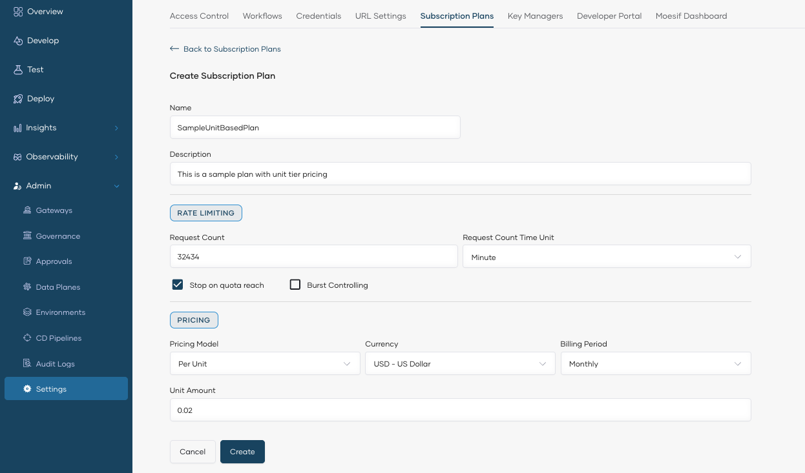
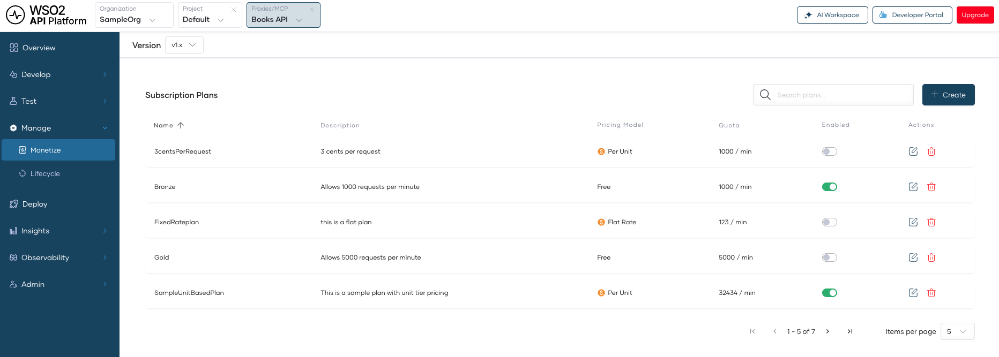

# Manage Paid Subscription Plans

Paid subscription plans allow organizations to monetize their APIs by charging API consumers based on usage or access. API Platform supports multiple pricing models, enabling you to tailor plans to different business requirements. Once created, you can assign these plans to specific APIs.

---

## Prerequisites

Before you begin, ensure you have:

- [Stripe credentials configured](getting-started.md) at the organization level
- Admin access to your API Platform organization

---

## Pricing Models

API Platform supports the following pricing models for paid subscription plans.

| Pricing Model | Description |
|---------------|-------------|
| **Free** | No charge. Consumers can access the API at no cost. |
| **Flat** | A fixed recurring fee regardless of usage. Consumers pay the same amount each billing period. |
| **Unit** | Charges a fixed price per unit consumed. The total cost scales linearly with usage. |
| **Volume** | Applies a single per-unit price based on the total volume consumed. The price tier is determined by the total quantity, and that rate applies to all units. |
| **Graduated** | Applies different per-unit prices across usage tiers. As consumption increases, each tier of usage is charged at its respective rate. |

!!! note
    In all usage-based models, a **unit** refers to a single API request.

---

## Step 1: Create a Paid Subscription Plan

1. Sign in to the [API Platform Console](https://console.bijira.dev/).
2. In the API Platform Console header, go to the **Organization** list and select your organization.
3. In the left navigation menu, click **Admin** and then click **Settings**. This opens the organization-level settings page.
4. Click the **Subscription Plans** tab.

    

5. Click **+ Create**.
6. In the **Create Subscription Plan** pane, enter the plan details:

    - **Name** and **Description** for the plan. The name is unique and cannot be changed after creation.
    - **Rate Limiting:** Set the **Request Count** (must be greater than 0) and the **Request Count Time Unit** (Minute, Hour, or Day). Enable **Burst Control** to protect your backend from sudden request spikes — the burst limit is enforced over a shorter time unit than the one you selected.
    - **Pricing:** Select a **Pricing Model** (Free, Flat, Unit, Volume, or Graduated), **Currency**, **Billing Period**, and the price amount.

    { width="800" }

    !!! note
        The pricing fields vary by model. For example, Volume and Graduated models require defining price tiers instead of a single unit amount.

7. Click **Create**.

The paid subscription plan is now created and listed under **Subscription Plans**. You can create multiple plans with different pricing models to offer various tiers of access to your APIs.

---

## Step 2: Assign Paid Plans to an API

Once you have created paid subscription plans, you can enable them for specific APIs. This allows API consumers to discover and subscribe to paid plans through the Developer Portal.

1. Select the project and the API for which you want to enable paid subscription plans.
2. In the left navigation menu, click **Manage** and then click **Monetize**. This displays the subscription plans available for the API.
3. Enable the toggle corresponding to the paid subscription plans you want to assign to the API.

    

4. Click **Save**.

!!! note
    You can enable a combination of free and paid subscription plans for the same API. This allows you to offer a free tier alongside premium paid tiers, giving API consumers flexibility to choose the plan that best fits their needs.

---

## Step 3: Publish the API to the Developer Portal

After assigning paid plans, publish the API so that consumers can discover and subscribe to it via the Developer Portal.

1. In the left navigation menu of the API, click **Lifecycle**.
2. In the **Lifecycle Management** pane, click **Publish** to transition the API to the **Published** state.

Once published, API consumers can view the API and its available paid plans on the Developer Portal and subscribe to a plan that fits their needs.

!!! tip
    For more details on lifecycle states and transitions, see [Lifecycle Management](../develop-api-proxy/lifecycle-management.md).

<!-- TODO: Add link to consumer subscription documentation once available -->
