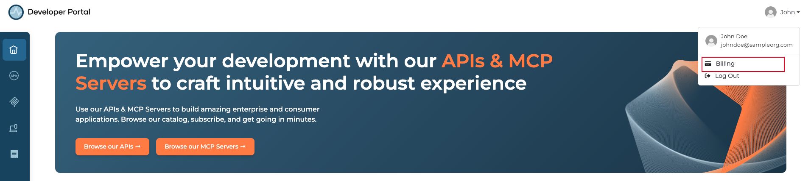
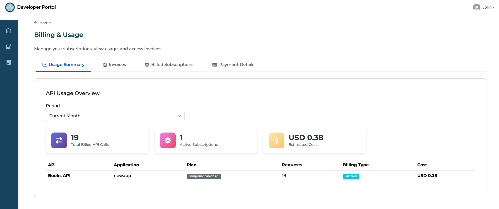
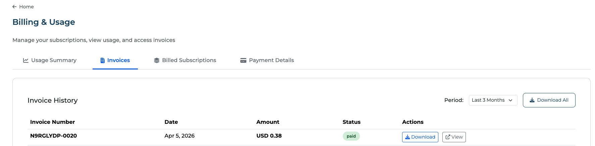
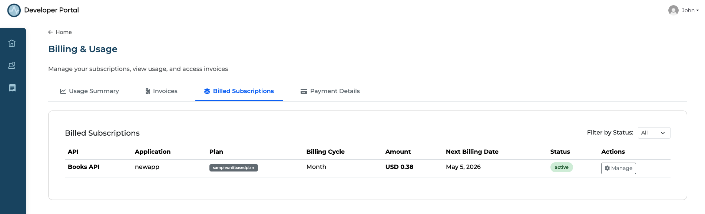

# View Billing and Usage

The Developer Portal provides a consolidated **Billing & Usage** view where API consumers can monitor usage, review invoices, and manage their paid subscriptions across all subscribed APIs.

---

## Access the Billing Page

1. Go to the [API Platform Developer Portal](https://devportal.bijira.dev/) and sign in to your organization.
2. Click your profile icon in the top right corner.
3. Click **Billing** from the profile menu.

    { width="900" }

---

## Usage Summary

The **Usage Summary** tab displays an **API Usage Overview** for a selected period (e.g., Current Month). This includes:

- **Total Billed API Calls** across all your paid subscriptions.
- **Active Subscriptions** count.
- **Estimated Cost** for the current billing period.
- A breakdown table showing usage per API, application, plan, request count, billing type, and cost.

    { width="900" }

Use this view to track your consumption patterns and anticipate upcoming charges before the billing period closes.

---

## Invoices

The **Invoices** tab shows your **Invoice History**, listing all invoices generated for your paid subscriptions. For each invoice you can view the invoice number, date, amount, and payment status, and download the invoice receipt for your records. Use the **Period** filter to view invoices for a specific timeframe, or click **Download All** to export all invoices at once.

{ width="900" }

Invoices are generated and issued by Stripe based on your subscription's billing cycle.

---

## Billed Subscriptions

The **Billed Subscriptions** tab shows all paid subscriptions associated with your account. For each subscription you can see the API, application, plan, billing cycle, amount, next billing date, and status. Use the **Filter by Status** dropdown to narrow the list, and click **Manage** to update or cancel a subscription.

{ width="900" }
