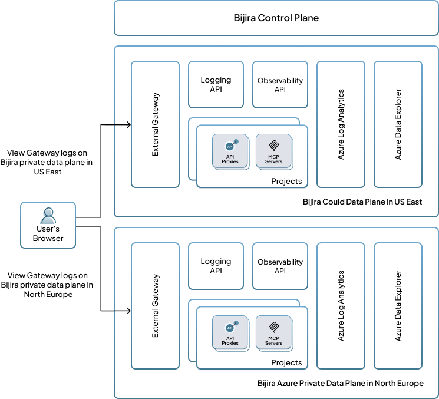

# Data Planes

Bijira’s architecture is built around two core components, i.e. the control plane and the data plane.

### Control Plane
The control plane manages key administrative tasks, including the configuration of organizations, users, and projects. It also orchestrates the entire API Proxy development lifecycle, from creation and deployment to governance enforcement, observability enablement, and publishing to the Developer Portal for application developers to consume APIs.

As a SaaS platform, the Bijira control plane oversees both cloud data planes and private data planes. It supports a wide range of user roles, including CIOs, architects, and developers.

### Data Plane
The data plane is where user-deployed API Proxies run, based on configurations defined in the control plane. All traffic related to these API Proxies is confined within the data plane, ensuring that user data remains securely contained.

Bijira supports two types of data planes.

- **Cloud Data Planes (CDP):** Use a multi-tenant infrastructure to deploy API Proxies, offering a shared yet secure runtime environment.
- **Private Data Planes (PDP):** Offer dedicated infrastructure for a single organization, providing enhanced privacy and control to meet specific compliance or security requirements.

## Private Data Planes

### Infrastructure Compatibility
Bijira private data planes can be deployed on most major cloud providers such as Azure, AWS, GCP, as well as on-premises environments.

Minimum infrastructure requirements include,

- Kubernetes clusters compatible with upstream distributions
- Container registry
- Key vault (secret store)
- Logging service or log storage

### System components

Setting up a Bijira PDP involves deploying components via Helm on the Kubernetes infrastructure. The installation include,

- Cilium CNI
- API Gateways and related components
- PDP Agent
- Observability and logging APIs, including observability agents
- Flux Controller

All components are automatically updated, including security patches and bug fixes via the Flux Controller, which is connected to the Update Management System.

### Control Plane Connectivity
Private data planes communicate with the control plane for ongoing operations. All communication is outbound only from the private data plane. If your organization’s network restricts outbound traffic, allow access to the control plane's public IP range.

The following table details the required inbound and outbound connections for private data planes.

| Data plane component      | Endpoint                                | Direction                 | Protocol |
|:---------------------------|:---------------------------------------|:---------------------------|:---------|
| Bijira PDP agent           | Bijira control plane (CP) (mizzen server) | Outbound                  | WSS      |
|                            | Kubernetes API server                  | Outbound (cluster internal) | HTTPS, WS |
| APIM/local adaptor         | Global adaptor                         | Outbound                  | HTTPS    |
|                            | Azure Service Bus (CP)                 | Outbound                  | AMQP     |
| APIM/Enforcer              | Event hub (CP)                         | Outbound                  | AMQP     |
| Bijira secret resolver     | Cloud secret store                     | Outbound (VPC internal)    | HTTPS    |
| Container registry         | Container registry (public)            | Inbound                   | HTTPS    |
|                            | Container registry                     | Outbound (VPC internal)    | HTTPS    |
| Certificate manager        | Azure DNS service                      | Outbound                  | HTTPS    |
|                            | LetsEncrypt                            | Outbound                  | HTTPS    |
| Flux source controller     | GitHub                                 | Outbound                  | HTTPS    |
| Flux Helm controller       | Bijira container registry              | Outbound                  | HTTPS    |

All communications between the control plane and the private data plane are secured using TLS encryption.

### Observability Architecture

The following diagram illustrates the log and observability architecture of a Bijira Azure PDP deployment.

---

This architecture emphasizes data privacy and regulatory compliance by retaining logs and observability data within the data plane itself. Key design principles include:

- **Data storage at source:** Logs and observability data are stored locally within the data plane, improving security and simplifying access, and ensuring compliance.
- **Direct browser-to-data-plane interaction:** The Bijira Console in the user’s browser interacts directly with APIs in the data plane, reducing potential data routing complexities and ensuring a more secure, direct flow of information.
- **Minimized exposure points:** Retrieving data directly from in-plane APIs minimizes the number of data transfer points, effectively decreasing the chances of data exposure or interception.
- **Regulatory compliance:** By supporting data locality, the architecture aligns with GDPR, CCPA, and other regulatory frameworks.
- **Real-time insights and improved performance:** Direct communication between the browser and the data plane enables faster data access and near real-time visibility.
- **Transparency and control:** Users have clear insight into where their data resides and how it is accessed, with fine-grained control.

### Security

The Bijira private data plane is built with production-grade security in mind, covering infrastructure, architecture, and zero-trust network security. All inbound traffic passes through a firewall and is authenticated and authorized via the API Gateway.

End-to-end encryption is enforced using Cilium transparent encryption, ensuring secure and efficient network traffic flow.

### Private Data Plane Management Models

Bijira supports flexible management models for private data planes, facilitating collaboration between WSO2 and customers across diverse scenarios.

- **WSO2 Fully Managed – WSO2 Subscription:** Infrastructure and PDP are hosted under WSO2’s subscription.
- **WSO2 Fully Managed – Customer Subscription:** Infrastructure is hosted under the customer’s subscription, but WSO2 manages the PDP.
- **Customer Self-Managed:** WSO2 provides installation scripts and updates, while the customer maintains full control of the infrastructure and operations.

