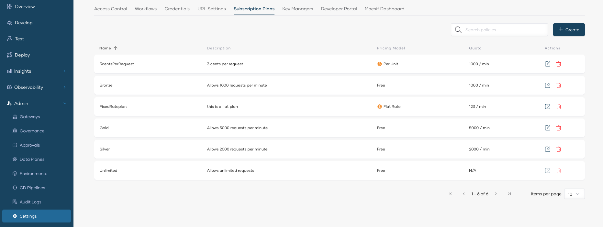

# Create API Subscription Plans

API subscription plans are essential to control and manage access to APIs. These plans define the rules and limitations on how clients can interact with APIs, ensuring efficient resource utilization and robust security. With the option to set rate limits, burst control, and pricing models, subscription plans allow API providers to manage traffic, prevent misuse, offer tiered service levels, and monetize APIs. Organizations can implement subscription plans to provide varying levels of API access, accommodating different user needs and business models, while ensuring optimal performance and security.

In API Platform, users with the administrator role can create, update, and delete subscription plans at the organization level.

!!! tip
    Deleting a subscription plan is only possible if there are no active subscriptions associated with it.

To create an organization-level subscription plan, follow the steps given below:

1. Sign in to the [API Platform Console](https://console.bijira.dev/).
2. In the API Platform Console header, go to the **Organization** list and select your organization.
3. In the left navigation menu, click **Admin** and then click **Settings**. This opens the organization-level settings page.
4. Click the **Subscription Plans** tab (here you can see the already available subscription plans).

    

5. Click **+ Create**.
6. In the **Create Subscription Plan** pane, enter the plan details:

    - **Name** and **Description** for the plan. The name is unique and cannot be changed after creation.
    - **Rate Limiting:** Set the **Request Count** (must be greater than 0) and the **Request Count Time Unit** (Minute, Hour, or Day). Enable **Burst Control** to protect your backend from sudden request spikes — the burst limit is enforced over a shorter time unit than the one you selected.
    - **Pricing:** Select a **Pricing Model** (Free, Flat, Unit, Volume, or Graduated), **Currency**, **Billing Period**, and the price amount.

    

    !!! note
        The pricing fields vary by model. For example, Volume and Graduated models require defining price tiers instead of a single unit amount. For details on pricing models and monetization, see [API Monetization](../../api-monetization/overview.md).

7. Click **Create**. This creates the subscription plan and lists it under **Subscription Plans**.

After creating subscription plans, users with the API publisher role can [assign subscription plans to APIs](../../develop-api-proxy/subscription-plans.md). API consumers can then choose the appropriate subscription plan during the subscription process depending on their requirements.
