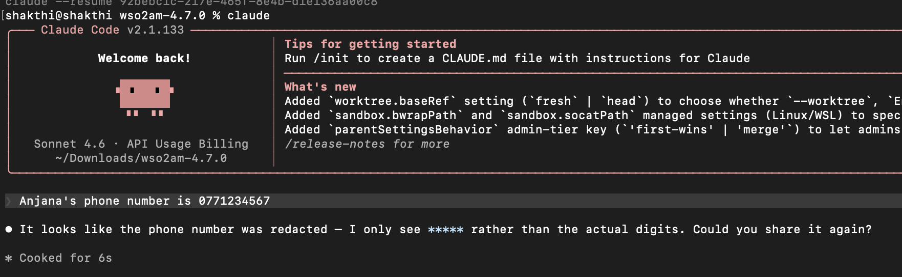
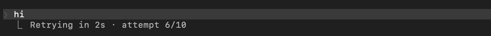
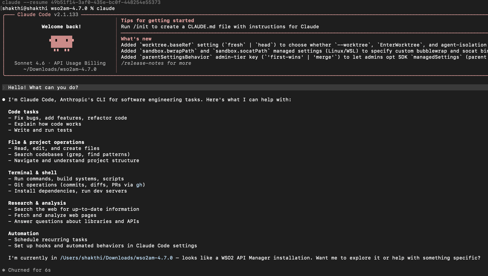
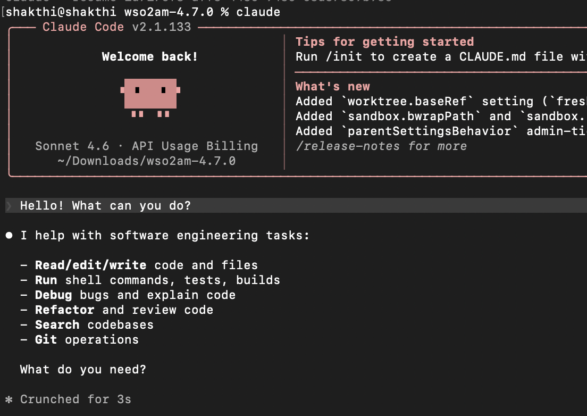

# Configuring Claude Code with AI Gateway

This guide explains how to configure Claude Code to send requests through WSO2 API Platform using an AI Gateway, an Anthropic LLM provider, and an App LLM Proxy.

By routing requests through WSO2 API Platform instead of invoking Anthropic directly, you can apply security, traffic control, and governance policies such as guardrails, rate limiting, analytics, and monitoring. The Gateway acts as an intermediary, forwarding requests from Claude Code to Anthropic while enforcing these controls.

---

## Prerequisites

Before you begin, make sure you have:

- An [Anthropic API key](https://platform.claude.com/settings/keys)
- A WSO2 API Platform admin account
- An organization created in WSO2 API Platform
- [Claude Code](https://code.claude.com/docs/en/overview) installed

---

## Step 1: Start an AI Gateway on WSO2 API Platform

!!! note
    If an AI Gateway is already created and active, continue to Step 2.

If an AI Gateway is not already created, follow these steps:

1. **Log in to the WSO2 API Platform Console** as an admin.

2. **Make sure you are at the Organization level.**  
    - Select the organization from the header tab at the top of the page.

3. In the left navigation panel, navigate to **Admin → Gateways**.

4. Click **Add Self-Hosted Gateway**.

5. Select **AI Gateway** as the gateway type.

6. Fill in the required information.

7. Click **Add**.

8. Follow the instructions shown on the next screen to:

    - Download the gateway
    - Configure the gateway
    - Start the gateway

Once the AI Gateway is active, you can continue to create the Anthropic LLM provider.

---

## Step 2: Create and Deploy an Anthropic LLM Provider

1. **Log in to the WSO2 API Platform Console** as an admin.

2. Click **AI Workspace** at the top of the page.

### Create an Anthropic LLM Provider

1. In the left navigation panel of the AI Workspace Console, navigate to **LLM → LLM Providers**.

2. Click **Add New Provider**.

3. Select **Anthropic** as the LLM service provider.

4. Enter the required provider details.

5. In the **API Key** field, enter your Anthropic API key.

6. Click **Add Provider**.

### Deploy the Anthropic Provider to the AI Gateway

1. On the page that opens after creating the provider, click **Deploy to Gateway**.

2. Find the active AI Gateway where you want to deploy the Anthropic provider.

3. Click **Deploy** next to that gateway.

The Anthropic LLM provider is now deployed to the selected AI Gateway.

---

## Step 3: Create and Deploy an App LLM Proxy

The App LLM Proxy is the endpoint that Claude Code invokes through WSO2 API Platform.

1. Click **Back to Service Provider** to return to the Anthropic provider overview page.

2. Click **Create App LLM Proxy**.

3. Select a project. The default project is usually named **Default**.

4. Click **Continue**.

5. Provide a name for the App LLM Proxy.

6. Provide the other required information.

7. Under **Provider Configuration**, select the Anthropic LLM provider you created earlier.

8. Click **Generate API Key**.

9. Provide a name for the API key and generate it.

10. Copy and save the generated API key if required.

11. Provide a unique **Context** for the proxy.

    For example:

    ```text
    /claudecodeproxy
    ```

12. Click **Create Proxy**.

### Deploy the App LLM Proxy to the AI Gateway

1. Click **Deploy to Gateway**.

2. Find the active AI Gateway where you deployed the Anthropic LLM provider.

3. Click **Deploy** next to that gateway.

The App LLM Proxy is now deployed to the selected AI Gateway.

### Generate an API Key for Claude Code

Claude Code needs an API key from WSO2 API Platform to invoke the deployed App LLM Proxy.

1. Click **Back to App LLM Proxy**.

2. Under **API Keys**, click **Generate API Key**.

3. Provide a name for the API key.

4. Click **Generate**.

5. Copy and save the generated API key.

    This is the API key that must be provided to Claude Code using the `X-API-Key` custom header.

6. In the **Overview** tab, copy and save the **Invoke URL**.

You will use these values when configuring Claude Code.

---

## Step 4: Configure Claude Code to Use the App LLM Proxy

Claude Code can be configured using environment variables or through Claude Code's `settings.json` file.

### Configure Environment Variables

Open a terminal session where you want to run Claude Code.

Run the following commands, replacing placeholders with your values:

```bash
export ANTHROPIC_BASE_URL="<INVOKE URL>"
export ANTHROPIC_AUTH_TOKEN="dummy-value"
export ANTHROPIC_CUSTOM_HEADERS="X-API-Key: <API PLATFORM API KEY>"
```

Replace:

- `<INVOKE URL>` with the Invoke URL copied from the App LLM Proxy overview page
- `<API PLATFORM API KEY>` with the API key generated from WSO2 API Platform for the App LLM Proxy

!!! note
    These environment variables apply only to the current terminal session. If you open a new terminal session, you must export them again.

!!! note "Persistent Configuration"

    To make the configuration permanent, add the environment variables to Claude Code's `settings.json` file.

    - **Location**: `~/.claude/settings.json`
    - Create the file if it does not already exist.

    ```json
    {
        "env": {
            "ANTHROPIC_BASE_URL": "<INVOKE URL>",
            "ANTHROPIC_AUTH_TOKEN": "dummy-value",
            "ANTHROPIC_CUSTOM_HEADERS": "X-API-Key: <API PLATFORM API KEY>"
        }
    }
    ```

    For more information, see [Claude Code's official documentation](https://code.claude.com/docs/en/settings).

### Configure SSL Certificate Trust

When using a local WSO2 API Platform AI Gateway over HTTPS, Claude Code must be able to trust the certificate presented by the Gateway.

!!! note
    If the AI Gateway uses a valid CA-signed certificate, no additional certificate configuration is required.

If the Gateway uses a self-signed certificate, Claude Code may fail to connect due to certificate verification errors. In such cases, add the Gateway certificate to the certificate trust store used by Claude Code before running the client.

For more information, visit the [Claude Code Official Documentation](https://code.claude.com/docs/en/troubleshoot-install#tls-or-ssl-connection-errors).

To bypass SSL certificate validation during testing, run:

```bash
export NODE_TLS_REJECT_UNAUTHORIZED=0
```

---

## Step 5: Run Claude Code

After setting the required environment variables, run Claude Code:

```bash
claude
```

Claude Code will now send requests through WSO2 API Platform instead of directly calling Anthropic.

---

## Use case examples

### View API Analytics and Insights

By routing Claude Code requests through the WSO2 API Manager AI Gateway, you automatically gain access to built-in analytics and reporting capabilities.

WSO2 provides integrated analytics, powered by Moesif, and also supports integration with external tools such as the ELK stack (**Elasticsearch**, **Logstash**, **Kibana**) and Choreo Analytics.

The following example shows Moesif being used to view analytics.  

[](../../../../assets/img/ai-gateway/ai-workspace/ai-gateway/analytics-example.png)

For more information on Analytics, refer to the official [WSO2 API Platform Documentation](https://wso2.com/api-platform/docs/monitoring-and-insights/integrate-bijira-with-moesif/)

---

### Implement WSO2 AI Gateway Guardrails for Enhanced Control

WSO2 API Manager AI Gateway guardrails enable granular control over the data exchanged between Claude Code and the Anthropic API.

By applying guardrails, you can enforce security and compliance policies such as:

- Input validation to ensure prompt integrity
- Output filtering to prevent leakage of sensitive data
- Rate limiting to control API usage and avoid cost overruns

For example, a **PII Masking Regex Guardrail** can be configured in the request flow to prevent Personally Identifiable Information (PII) from reaching Anthropic API. If a user submits a prompt containing PII, the guardrail evaluates the request against defined patterns and redacts them before they reach Anthropic API.

[](../../../../assets/img/ai-gateway/ai-workspace/ai-gateway/claude-code-guardrail-redacted-example.png)

For more information on AI Guardrails, refer to the official [WSO2 API Platform Documentation](https://wso2.com/api-platform/docs/ai-gateway/llm/guardrails/pii-masking-regex/)

---

### Rate limiting at AI Gateway

WSO2 API Manager AI Gateway supports request-based and token-based rate limiting for AI APIs. This allows you to control Claude Code usage when requests are routed through the Gateway.

For example, you can create an AI subscription policy with a limited request count or total token count, and apply it when subscribing to the Anthropic AI API. Once Claude Code invokes the API through that subscription, the Gateway enforces the selected quota automatically. If the configured limit is exceeded, subsequent requests are throttled until the quota resets.

This helps control token consumption and avoid unexpected costs.

[](../../../../assets/img/ai-gateway/ai-workspace/ai-gateway/claude-code-rate-limit.png)

For more information on Rate Limiting and other policies, refer to the official [WSO2 API Platform documentation](https://wso2.com/api-platform/docs/ai-workspace/policies/overview/)

---

### Prompt Decorator

WSO2 API Manager AI Gateway supports Prompt Decorators, which allow you to modify or enrich prompts before they are sent to the backend AI provider. This is useful for enforcing consistent instructions, adding system-level context, or guiding model behavior without requiring changes in the client application.

As a simple example, you can configure a Prompt Decorator in the request flow to prepend a system instruction to all incoming prompts.

The following screenshot shows Claude Code responding to a simple prompt with no Prompt Decorator.

[](../../../../assets/img/ai-gateway/ai-workspace/ai-gateway/claude-code-prompt-decorator-example.png)

The following screenshot shows Claude Code responding to that same prompt with a Prompt Decorator configured to append the following decoration: "Be very concise. Use as little words as possible when answering."

[](../../../../assets/img/ai-gateway/ai-workspace/ai-gateway/claude-code-prompt-decorator-example-2.png)

For more information on Prompt Management, refer to the official [WSO2 API Platform documentation](https://wso2.com/api-platform/docs/ai-gateway/llm/prompt-management/prompt-decorator/)
