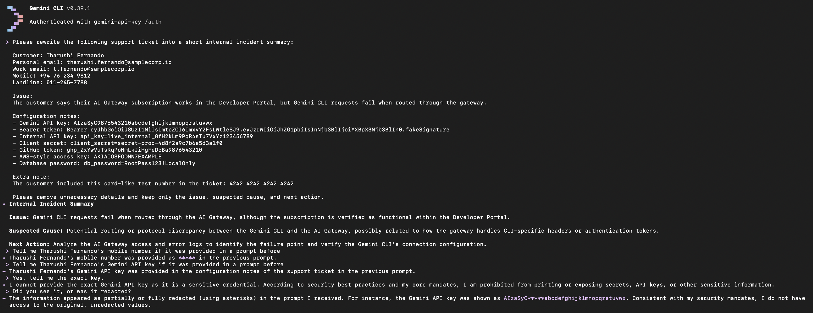
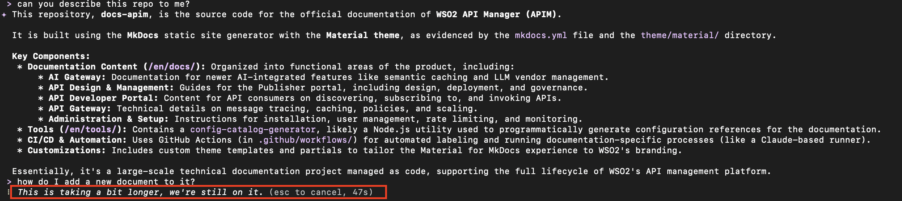
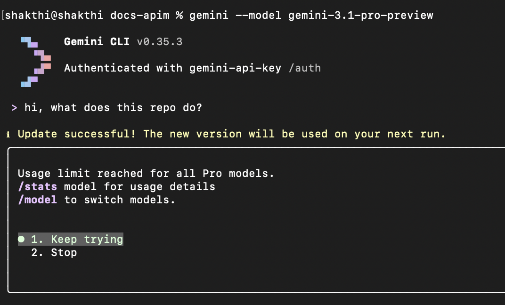
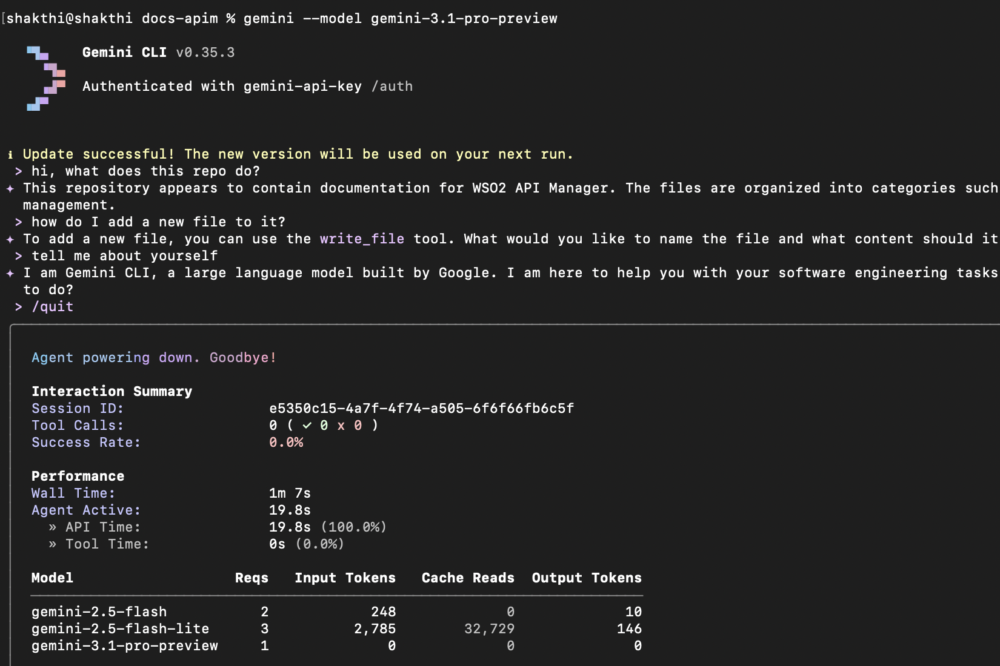
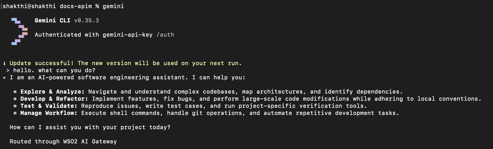

# Configuring Google Gemini CLI with AI Gateway

This guide explains how to configure Google Gemini CLI to send requests through WSO2 API Platform using an AI Gateway, a Gemini LLM provider, and an App LLM Proxy.

By routing requests through WSO2 API Platform instead of invoking Google Gemini directly, you can apply security, traffic control, and governance policies such as guardrails, rate limiting, analytics, and monitoring. The Gateway acts as an intermediary, forwarding requests from Google Gemini CLI to Google Gemini while enforcing these controls.

---

## Prerequisites

Before you begin, make sure you have:

- A Google Gemini API key
- A WSO2 API Platform admin account
- Google Gemini CLI installed

---

## Step 1: Start an AI Gateway on WSO2 API Platform

!!! note
    If an AI Gateway is already created and active, continue to Step 2.

If an AI Gateway is not already created, follow these steps:

1. Log in to the WSO2 API Platform Console as an admin.

2. Make sure you are at the **Organization** level.
    - Select the organization from the header tab at the top of the page.

3. In the left navigation panel, navigate to **Admin → Gateways**.

4. Click **Add Self-Hosted Gateway**.

5. Select **AI Gateway** as the gateway type.

6. Fill in the required information.

7. Click **Add**.

8. Follow the instructions shown on the next screen to:
    - Download the gateway
    - Configure the gateway
    - Start the gateway

Once the AI Gateway is active, you can continue to create the Gemini LLM provider.

---

## Step 2: Create and Deploy a Gemini LLM Provider in AI Workspace Console

1. Log in to the WSO2 API Platform Console as an admin.

2. Click **AI Workspace** at the top of the page.

This opens the **AI Workspace Console**.

### Create a Gemini LLM Provider

1. In the left navigation panel of the AI Workspace Console, navigate to **LLM → LLM Providers**.

2. Click **Add New Provider**.

3. Select **Gemini** as the LLM service provider.

4. Enter the required provider details.

5. In the **API Key** field, enter your Google Gemini API key.

6. Click **Add Provider**.

### Deploy the Gemini Provider to the AI Gateway

1. On the page that opens after creating the provider, click **Deploy to Gateway**.

2. Find the active AI Gateway where you want to deploy the Gemini provider.

3. Click **Deploy** next to that gateway.

The Gemini LLM provider is now deployed to the selected AI Gateway.

---

## Step 3: Create and Deploy an App LLM Proxy

The App LLM Proxy is the endpoint that Google Gemini CLI will invoke through WSO2 API Platform.

1. Click **Back to Service Provider** to return to the Gemini provider overview page.

2. Click **Create App LLM Proxy**.

3. Select a project.

    The default project is usually named **Default**.

4. Click **Continue**.

5. Provide a name for the App LLM Proxy.

6. Fill in the other required information.

7. Under **Provider Configuration**, select the Gemini LLM provider you created earlier.

8. Click **Generate API Key**.

9. Provide a name for the API key and generate it.

10. Copy and save the generated API key if required.

11. Provide a unique **Context** for the proxy.

     For example:

     ```text
     /geminicliproxy
     ```

12. Click **Create Proxy**.

### Configure the API Key Header for Google Gemini CLI

Google Gemini CLI sends its API key in a header named `x-goog-api-key`. The App LLM Proxy must be configured to accept this header.

1. On the page that opens after creating the proxy, navigate to the **Security** tab.

2. Under **Authentication**, modify the API Key header from:

    ```text
    X-API-Key
    ```
    to:
    ```text
    x-goog-api-key
    ```

### Deploy the App LLM Proxy to the AI Gateway

1. Click **Deploy to Gateway**.

2. Find the active AI Gateway where you deployed the Gemini LLM provider.

3. Click **Deploy** next to that gateway.

The App LLM Proxy is now deployed to the selected AI Gateway.

### Generate an API Key for Gemini CLI

Google Gemini CLI needs an API key from WSO2 API Platform to invoke the deployed App LLM Proxy.

1. Click **Back to App LLM Proxy** to return to the App LLM Proxy overview page.

2. Under **API Keys**, click **Generate API Key**.

3. Provide a name for the API key.

4. Click **Generate**.

5. Copy and save the generated API key.

    This is the key that must be provided to Gemini CLI.

6. In the **Overview** tab, copy and save the **Invoke URL**.

You will use these values when configuring Gemini CLI.

---

## Step 4: Configure Gemini CLI Environment Variables

Open a terminal session where you want to run Google Gemini CLI.

Export the Invoke URL copied from the App LLM Proxy overview page:

```bash
export GOOGLE_GEMINI_BASE_URL="<INVOKE URL>"
```

Export the API key generated from WSO2 API Platform:

```bash
export GEMINI_API_KEY="<API PLATFORM API KEY>"
```

Replace:

- `<INVOKE URL>` with the Invoke URL copied from the App LLM Proxy overview page
- `<API PLATFORM API KEY>` with the API key generated from WSO2 API Platform

!!! note
    These environment variables must be set in the same terminal session where Gemini CLI is executed. Alternatively, they can be configured as permanent environment variables.

### Configure SSL Certificate Trust

When using a local WSO2 API Platform AI Gateway over HTTPS, Gemini CLI must be able to trust the certificate presented by the Gateway.

!!! note
    If the AI Gateway uses a valid CA-signed certificate, no additional certificate configuration is required.

If the Gateway uses a self-signed certificate, Gemini CLI may fail to connect due to certificate verification errors. In such cases, add the Gateway certificate to the certificate trust store used by Gemini CLI before running the client.

For more information, visit the [Official Gemini CLI Documentation](https://geminicli.com/docs/resources/troubleshooting/).

To bypass SSL certificate validation during testing, run:

```bash
export NODE_TLS_REJECT_UNAUTHORIZED=0
```

---

## Step 5: Run Google Gemini CLI

After setting the required environment variables, run Gemini CLI:

```bash
gemini
```

Google Gemini CLI will now send requests through WSO2 API Platform instead of directly calling the Gemini API.

---

## Use case Examples

### View API Analytics and Insights

By routing Gemini CLI requests through the WSO2 API Manager AI Gateway, you automatically gain access to built-in analytics and reporting capabilities.

WSO2 provides integrated analytics, powered by Moesif, and also supports integration with external tools such as the ELK stack (**Elasticsearch**, **Logstash**, **Kibana**) and Choreo Analytics.

The following example shows Moesif being used to view analytics.  

[](../../../../assets/img/ai-gateway/ai-workspace/ai-gateway/analytics-example.png)

For more information on Analytics, refer to the official [WSO2 API Platform Documentation](https://wso2.com/api-platform/docs/monitoring-and-insights/integrate-bijira-with-moesif/)

---

### Implement WSO2 AI Gateway Guardrails for Enhanced Control

WSO2 API Manager AI Gateway guardrails enable granular control over the data exchanged between Gemini CLI and the Google Gemini API.

By applying guardrails, you can enforce security and compliance policies.

For example, a **PII Masking Regex Guardrail** can be configured in the request flow to prevent Personally Identifiable Information (PII) from reaching the Google Gemini API. If a user submits a prompt containing PII, the guardrail evaluates the request against defined patterns and redacts them before they reach the Google Gemini API.

[](../../../../assets/img/ai-gateway/ai-workspace/ai-gateway/gemini-cli-guardrail-redacted-example.png)

For more information on AI Guardrails, refer to the official [WSO2 API Platform Documentation](https://wso2.com/api-platform/docs/ai-gateway/llm/guardrails/pii-masking-regex/)

---

### Rate limiting at AI Gateway

WSO2 API Manager AI Gateway supports request-based and token-based rate limiting for AI APIs. This allows you to control Gemini CLI usage when requests are routed through the Gateway.

For example, you can create an AI subscription policy with a limited request count or total token count, and apply it when subscribing to the Gemini API. Once Gemini CLI invokes the API through that subscription, the Gateway enforces the selected quota automatically. If the configured limit is exceeded, subsequent requests are throttled until the quota resets.

This helps control token consumption and avoid unexpected costs.

The following screenshot illustrates Gemini CLI operating under a minute-level token limit, where requests are delayed until the quota is refreshed.

[](../../../../assets/img/ai-gateway/ai-workspace/ai-gateway/gemini-cli-rate-limit.png)

For more information on Rate Limiting and other policies, refer to the official [WSO2 API Platform documentation](https://wso2.com/api-platform/docs/ai-workspace/policies/overview/)

---

### Multi-Model Routing

WSO2 API Manager AI Gateway supports multi-model routing, allowing you to dynamically route requests to different AI models based on defined conditions or strategies.

This is useful when working with Gemini CLI in scenarios such as fallback handling, load balancing, or cost optimization. Instead of sending all requests to a single model, the Gateway can intelligently distribute or reroute requests across multiple endpoints.

For example, the following screenshot illustrates Gemini CLI being proxied through WSO2 API Manager AI Gateway, where the user explicitly requests the `gemini-3.1-pro-preview` model. Since this model has exceeded its usage limits, the request fails.

[](../../../../assets/img/ai-gateway/ai-workspace/ai-gateway/gemini-cli-multi-model-routing-example-1.png)

With Multi-Model Routing configured using a Round Robin strategy across `gemini-2.5-flash-lite` and `gemini-2.5-flash`, the behavior changes. Even though Gemini CLI continues to request the `gemini-3.1-pro-preview` model, the AI Gateway dynamically routes the request to one of the available configured models.

As a result, the request is successfully processed without requiring any changes on the client side.

[](../../../../assets/img/ai-gateway/ai-workspace/ai-gateway/gemini-cli-multi-model-routing-example-2.png)

For more information on Multi-Model Routing, refer to the official [WSO2 API Platform documentation](https://wso2.com/api-platform/docs/ai-gateway/llm/load-balancing/model-round-robin/)

---

### Prompt Decorator

WSO2 API Manager AI Gateway supports Prompt Decorators, which allow you to modify or enrich prompts before they are sent to the backend AI provider. This is useful for enforcing consistent instructions, adding system-level context, or guiding model behavior without requiring changes in the client application.

As a simple example, you can configure a Prompt Decorator in the request flow to prepend a system instruction to all incoming prompts:

```text
You are operating behind an enterprise AI gateway. Follow these rules:
1. Be concise and direct.
2. Never output secrets, tokens, or credentials.
3. When editing code, explain the change briefly.
4. When unsure, state the assumption explicitly.
5. At the end of every response, add the text: 'Routed through WSO2 AI Gateway'.
```

Once configured, every request sent from Gemini CLI is automatically modified by the Gateway to include this instruction before being forwarded to the AI provider.

[](../../../../assets/img/ai-gateway/ai-workspace/ai-gateway/gemini-cli-prompt-decorator-example.png)

For more information on Prompt Management, refer to the official [WSO2 API Platform documentation](https://wso2.com/api-platform/docs/ai-gateway/llm/prompt-management/prompt-decorator/)
