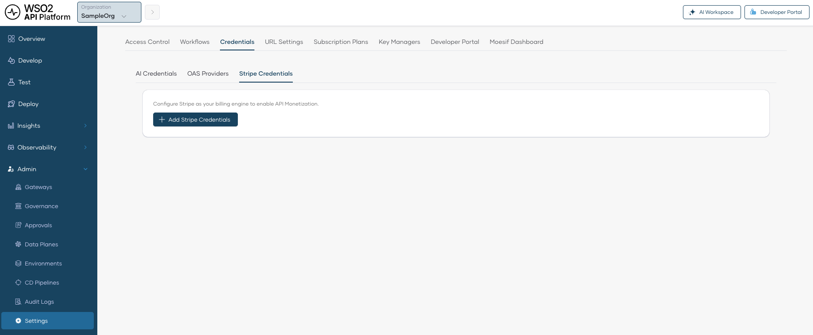

# Getting Started with API Monetization

To enable API monetization, you need to connect your Stripe account to API Platform. Once connected, API Platform creates Stripe products, prices, customers, and subscriptions on your behalf, and reports usage to Stripe for billing.

---

## Prerequisites

Before you begin, ensure you have:

- An active [Stripe](https://stripe.com/) account
- Admin access to your API Platform organization
- Your Stripe **Publishable Key** and a **Secret Key** (available in the Stripe Dashboard under **Developers > API Keys**. For more details, see the [Stripe API keys documentation](https://docs.stripe.com/keys)).

    You can use either of the following options for the secret key:

    - A **Standard secret key**, which has full access to your Stripe account, or
    - A **Restricted secret key**, which scopes access to only the permissions you grant. If you choose this option, make sure the key is granted the permissions listed below.

        ??? info "Permissions for Restricted Secret Keys"

            Grant the following minimum permissions when creating the restricted secret key in the Stripe Dashboard:

            | Permission | Purpose |
            |------------|---------|
            | `customer_read` | Read customer details. |
            | `customer_write` | Create customers and customer balance transactions. |
            | `checkout_session_read` | Read checkout session details. |
            | `checkout_session_write` | Create checkout sessions. |
            | `subscription_read` | Read subscription details. |
            | `subscription_write` | Cancel subscriptions. |
            | `invoice_read` | Read invoices and upcoming invoice previews. |
            | `portal_session_write` | Create Stripe Customer Portal sessions. |
            | `payment_method_read` | Read saved payment methods. |
            | `payment_method_write` | Detach saved payment methods. |
            | `plan_read` | Read plans and prices. |
            | `plan_write` | Create plans and prices. |
            | `product_read` | Read products. |
            | `product_write` | Create products. |
            | `usage_record_read` | Read usage records. |
            | `usage_record_write` | Write usage records. |
            | `billing_meter_read` | Read billing meters. |
            | `billing_meter_write` | Write billing meters. |
            | `billing_meter_event_read` | Read billing meter events. |
            | `billing_meter_event_write` | Write billing meter events. |
            | `billing_meter_event_adjustment_read` | Read billing meter event adjustments. |
            | `billing_meter_event_adjustment_write` | Write billing meter event adjustments. |

---

## Add Stripe Credentials

1. Sign in to the [API Platform Console](https://console.bijira.dev/).
2. In the API Platform Console header, go to the **Organization** list and select your organization.
3. In the left navigation menu, click **Admin** and then click **Settings**. This opens the organization-level settings page.
4. Click the **Credentials** tab.
5. Click the **Stripe Credentials** sub-tab.

    

6. Click **Add Stripe Credentials**.
7. Enter the following details:
    - **Secret Key:** The secret key from your Stripe account.
    - **Publishable Key:** The publishable key from your Stripe account.

8. Click **Save**.

Once saved, API Platform is connected to your Stripe account and you can start monetizing your APIs.

---

## Next Steps

- [Manage Paid Subscription Plans](manage-paid-subscription-plans.md)
