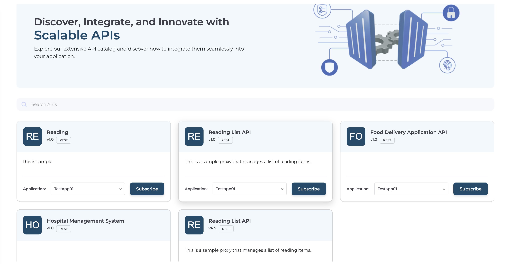
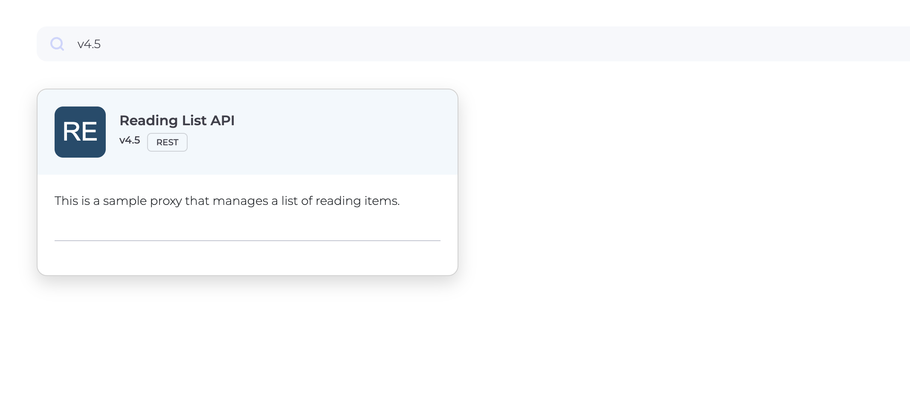

# Search APIs

You can search for APIs in the Developer Portal that have already been published from API Platform.

1. Click **APIs** from the sidebar.APIs list can be seen

    

2. Use one of the following methods to search:

    | **Category**     | **Explanation**                          |
    |------------------|------------------------------------------|
    | **Name**         | Full or partial name of the API          |
    | **Type**         | Type of the API (e.g., REST)             |
    | **Version**      | Version of the API (e.g., v3.5)          |
    | **Description**  | Full or partial description of the API   |

    Example: Searching by API version.

