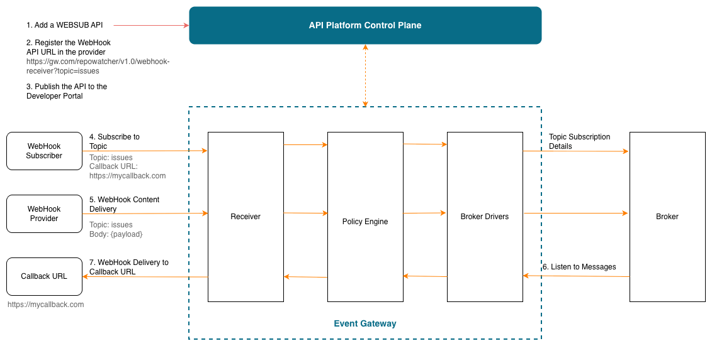

# Event Gateway Overview

The Event Gateway is a self-hosted runtime that performs **Protocol Mediation** — acting as the bridge between web-friendly protocols (WebSocket, WebHook, SSE) and message brokers (Kafka, MQTT, Solace). It enables you to expose event brokers as subscribable APIs while enforcing policies such as authentication, authorization, and rate limiting through the centralized API Platform’s Policy Hub.

## Quick Start

- [Getting Started](getting-started.md) - Create an event gateway in the API Platform Console, download and start the gateway, and deploy a WEBSUB API proxy

## What is Protocol Mediation?

Traditional API gateways are designed for request-response traffic. Event-driven architectures, however, use message brokers such as Kafka and MQTT, which communicate over broker-specific protocols that are not directly accessible to web clients.

Protocol Mediation solves this by placing the Event Gateway between the broker and web clients, translating between broker protocols and web-friendly protocols such as WebSocket, WebHook, and Server-Sent Events (SSE). This means external clients can consume from or produce messages to an event broker using standard web protocols, without needing native broker client support.

## Key Concepts

### Event Gateway Architecture

The Event Gateway consists of three components that work together in the mediation flow:

| Component | Role |
|-----------|------|
| **Receiver** | Entry point for web-friendly protocol clients (WebSocket, WebHook, SSE). Accepts inbound connections and messages from external clients. |
| **Policy Engine** | Enforces policies on inbound and outbound flows, including authentication, authorization, rate limiting, and delivery guarantees. |
| **Broker Driver** | Bridges the Event Gateway and the backend message or event broker (e.g., Kafka, MQTT, Solace). Handles protocol translation to and from the broker. |

### WebSub APIs

A WebSub API is an event-driven API type supported by the Event Gateway. It follows the [WebSub](https://www.w3.org/TR/websub/) specification and enables webhook-based publish/subscribe flows.

A WebSub API exposes two resources:

| Resource | Description |
|----------|-------------|
| `/webhook-receiver?topic=<topic name>` | Used by a WebHook Provider to push a WebHook payload to a specific topic in the Event Gateway |
| `/hub` | Used by Subscribers to subscribe to or unsubscribe from a topic |

## Documentation

| Section | Description                                                                   |
|---------|-------------------------------------------------------------------------------|
| [Getting Started](getting-started.md) | Quick setup: create the event gateway, deploy a WEBSUB API proxy, and test it |
| [Setting Up](setting-up.md) | Production deployment on VM, Docker, or Kubernetes                            |
| [Publish APIs](publish-apis/overview.md) | Publish APIs to the Developer Portal with subscription support                |
| [Troubleshooting](troubleshooting.md) | Common issues and solutions                                                   |
