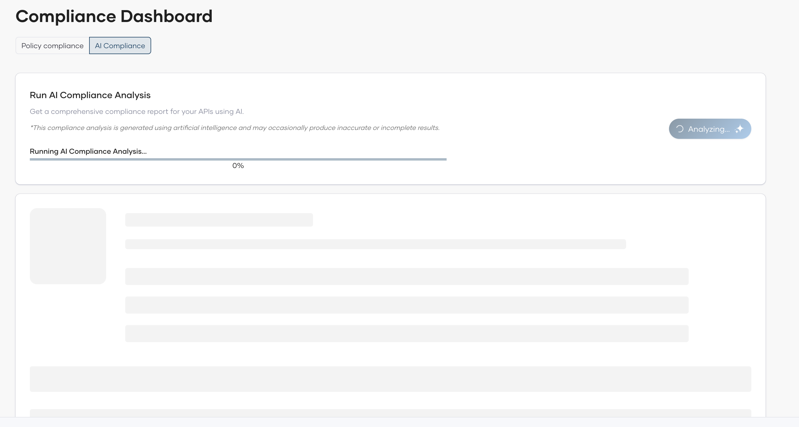
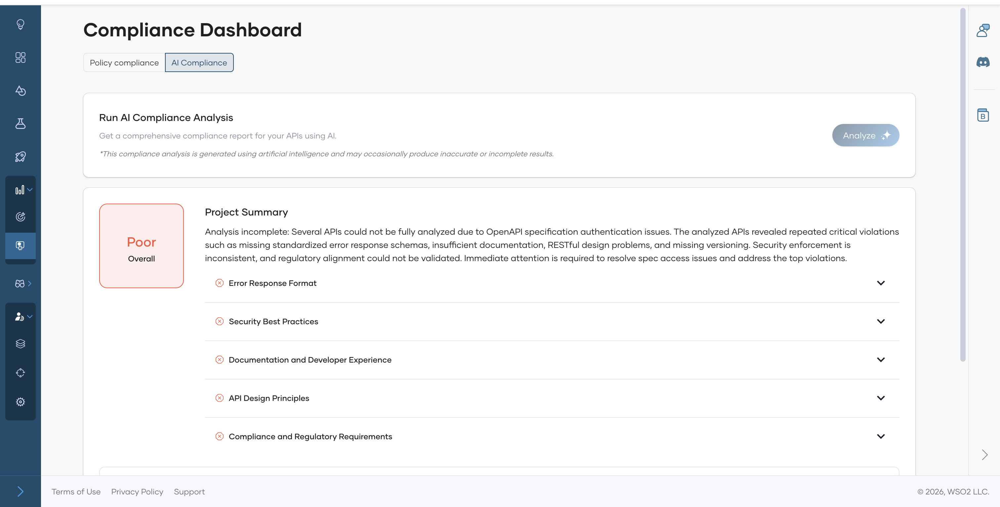

# Compliance Dashboard

The Compliance Dashboard lets you monitor how your API proxies adhere to the governance policies defined in your organization. Before using this dashboard, ensure you have set up rulesets and policies. See [Govern API Proxies](../governance/govern-api-proxy.md) for instructions on creating rulesets, policies, and documents.

The dashboard is accessible at three levels:

- **Organization level** - go to the Organization and open **Insights > Compliance**.
- **Project level** - go to a project and open **Insights > Compliance**.
- **Component level** - go to a component and open **Insights > Compliance**.

## Organization Level

The organization level shows only the **Policy compliance** tab and provides an org-wide overview with:

- Three summary charts: **Policy Compliance**, **Project Compliance**, and **Artifact Compliance**.
- A **Project Compliance** table listing each project with its compliance status and policy violation counts.
- A **Policy Compliance** table listing each policy with its status across projects.

## Project Level

The project level shows two tabs:

- **Policy compliance** - two summary charts (**Policy Compliance** and **Artifact Compliance**), an Artifact Compliance table listing each component with its compliance status and violation counts, and a Policy Compliance table listing each policy with its status across components.
- **AI Compliance** - results from AI compliance analysis. See [AI Compliance Analysis](#ai-compliance-analysis) below.

## Component Level

The component level shows two tabs:

- **Policy compliance** - two summary charts (**Policy Adherence** and **Ruleset Adherence**), a rule violations detail view, a Policy Adherence Summary table, and a Rulesets Adherence Summary table.
- **AI Compliance** - results from AI compliance analysis. See [AI Compliance Analysis](#ai-compliance-analysis) below.

## AI Compliance Analysis

AI Compliance Analysis is a manually triggered feature that uses AI to analyze your API definitions against the documents uploaded in **Admin > Governance > Documents** and generates a compliance report. Before running an analysis, ensure you have at least one document. See [Govern API Proxies](../governance/govern-api-proxy.md#documents) for instructions on adding documents.

### Run an Analysis

Analysis is triggered at the **project level** and covers all API components in the project.

1. Go to a project and open **Insights > Compliance**.
2. Select the **AI Compliance** tab.
3. Click **Run AI Compliance Analysis**.

!!! note
    The **Run AI Compliance Analysis** button is enabled when your organization has either an active AI credential configured under **Admin > Settings > Credentials > AI Credentials**, or remaining attempts in the default usage quota provided by the platform.

!!! warning
    This compliance analysis is generated using artificial intelligence and may occasionally produce inaccurate or incomplete results.

The analysis runs asynchronously. While in progress, the page shows the current stage of the analysis along with a percentage progress bar.

When complete, the **Project Summary** card displays:

- An **overall rating** (for example, Good, Fair, Poor).
- A **summary** describing the project's compliance with the governance guidelines.
- A list of **guideline categories** evaluated (such as Security Best Practices, Error Response Format, API Documentation Standards, API Versioning), each with a pass or fail status. Expand a guideline to view the detailed finding and suggested fix.

Below the Project Summary, each component is listed as an expandable card showing its individual analysis results.

To re-run the analysis at any time, click **Analyze** at the top of the page.

### View Component-Level Results

After a project-level analysis completes, you can drill down into per-component results. Go to the component and open **Insights > Compliance > AI Compliance**. There is no separate trigger at the component level.

This view shows the **Component AI Compliance Analysis Results** for the selected version. The **API Summary** card displays an overall rating, a summary, and a list of guideline categories with their pass or fail status - the same structure as the project-level summary.
