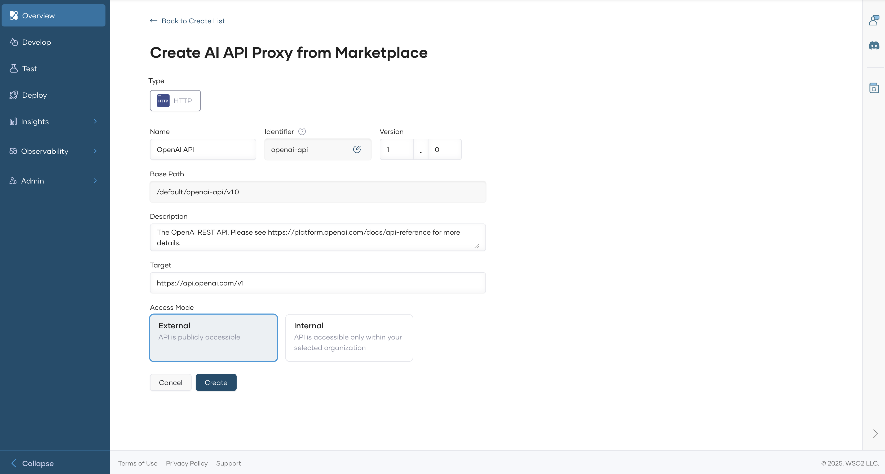

# Create an API Proxy for an AI API  

AI APIs enable seamless integration of artificial intelligence services into applications using **Bijira**. By creating an AI API, users can connect with specific AI service providers that best suit their needs. Bijira offers built-in support for leading AI vendors, including **OpenAI**, **Mistral**, and **Azure AI**.  

Follow the steps below to create an AI API:  

---

## 1. Access the Bijira Console

1. Sign in to the [Bijira Console](https://console.bijira.dev/) and select your project.  

---

## 2. Create an AI API

1. Click **+Create**.
2. Navigate to **Create an API Proxy for Third-Party APIs (Egress)** and click **AI APIs**.  
3. On the **Create AI API Proxy from Marketplace** page, select the desired **AI Provider**.  
4. Configure the AI API details, such as:  
    - API Name  
    - Identifier  
    - Version  
    - AI Provider  
    - Target Endpoint  

      

5. Click **Create** to finalize the AI API creation.  

   Once created, the overview page of the new API appears.  

---

## 3. Configure Backend Settings

1. In the left navigation menu, click **Develop**, then select **Policy**.  
2. Depending on the AI provider’s requirements, configure **Endpoint Configurations** or set up an **API-level mediation policy** to handle authentication and authorization.  

---

## Next Steps

- **Test the AI API** to ensure it correctly forwards requests to the AI service. See [Test REST Endpoints via the OpenAPI Console](../../test-api-proxy/openapi-console.md).  
- **Apply additional policies** (e.g., rate limiting, security policies). See [Policy Overview](../../develop-api-proxy/policy/attach-and-manage-policies.md#attach-a-policy).  
- **Publish the API for consumers** to enable integration into applications. See [Lifecycle Management](../../develop-api-proxy/lifecycle-management.md).  

By following these steps, you can efficiently integrate AI services into your Bijira environment and manage them with ease.  
