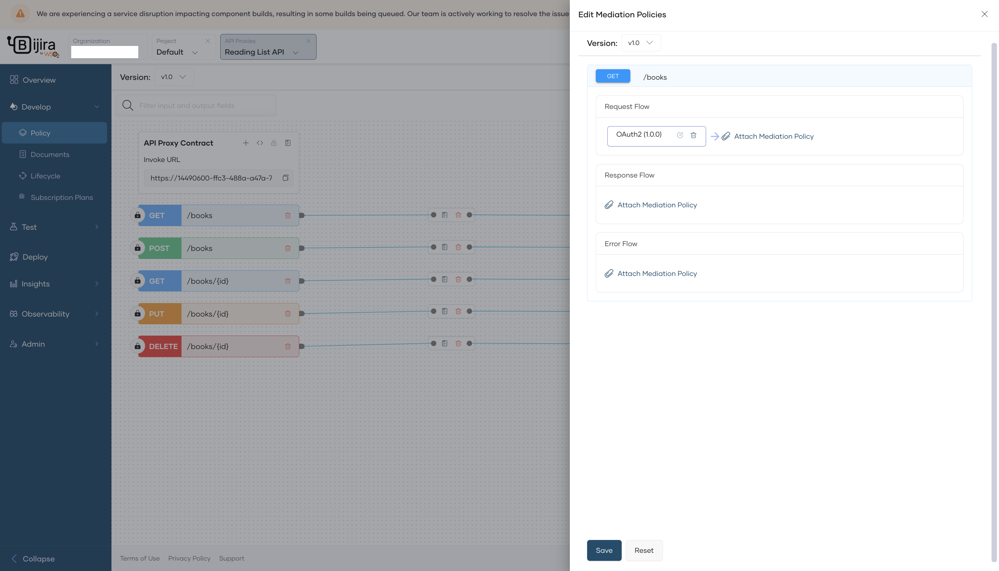
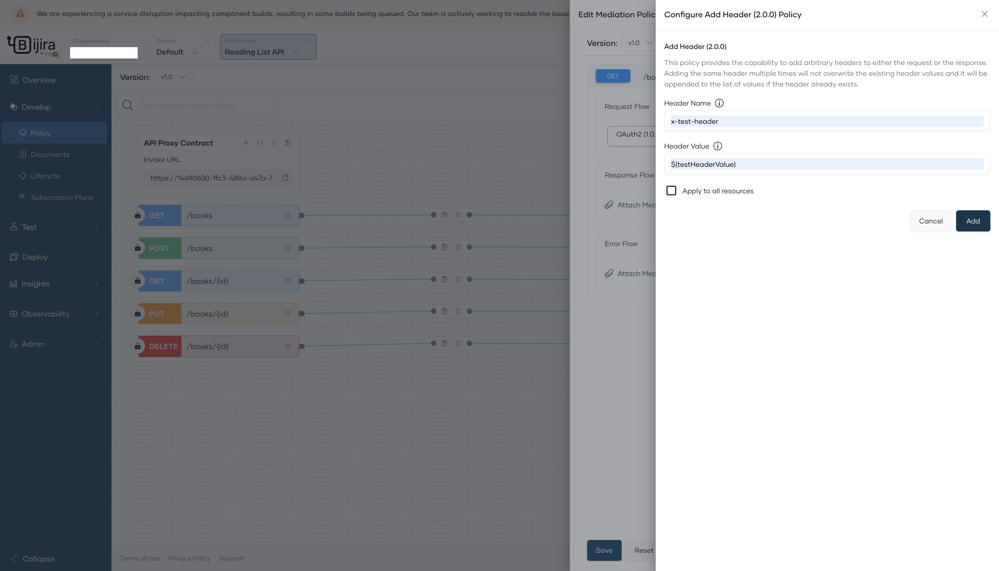
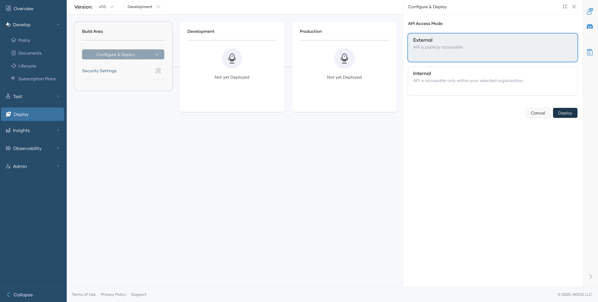

# Attach and Manage Policies

You can easily attach one or more policies to an API proxy component implementation via the Bijira Console. If necessary, you can also rearrange or swap the policies you attach.

In Bijira, when you attach a mediation policy to a proxy, the deployment is a two-step process.

1. Deployment initiation: 

     If the component to which you want to attach the mediation policy is new, the system creates and commits a new repository with the mediation service code based on the attached policy. This new service is called the mediation application. 

2. Deploying the API:

     Once the deployment initiation is complete, you can specify configuration values if any, and proceed to deploy. Bijira builds the generated mediation application and pushes the Docker image to the Docker registry. Finally, Bijira deploys the mediation application with the API Proxy.

When a mediation policy is attached to a specific flow, the API invocation undergoes the following behavioral modification:
 
 

 - In the request path, the requests that pass through the gateway reach the relevant component, and Bijira executes any attached policies to the resource's request path before sending it to the backend. 

- In the response path, the mediation component receives response messages from the backend, and Bijira executes any mediation policies attached to the `Response` flow or the `Error` flow. Then the response is forwarded to the client.

- If an error occurs during the execution of policies or due to an internal error, Bijira executes the `Error` flow and sends an error response to the client.

## Attach a Policy

To attach a resource level policy to the `Request`, `Response`, or `Error` flow of a REST API proxy, follow the steps given below:

1. Sign in to the [Bijira Console](https://console.bijira.dev).
2. Select the project and API to which you want to attach a policy.
3. In the left navigation menu, click **Develop**, then click **Policy**.
4. From the list of resources, click the **Attach Policy Button** for the required policy. 
    
5. In the **Edit Mediation Policies** pane, click **Attach Mediation Policy** in the respective flow where you want to attach a policy.  
     
6. In the **Policy List** pane that opens, click on a policy to view its details.
7. If the attached policy requires parameter configuration, on the policy pane enter the appropriate values and configure the parameters. To make a parameter a configurable variable, input the value in the `${<variableName>}` format. For example, you can use `${name}` as an example.
     
8. Click **Add** to attach the policy to the selected flow. Then, click **Save** to apply the configuration to the API resource.  

!!! Note
    After attaching an API Policy, it is necessary to deploy the API for the policy to become active within its corresponding flow. 

To deploy the API follow the steps below: 

1. In the left navigation menu, click **Deploy** and then click **Configure & Deploy**. Bijira performs the mediation application generation step and opens the **Configure & Deploy** pane.
    <!-- TODO: Add images to step 1 and 2 after they are done -->
    <!--   -->

2. In the **Configure & Deploy** pane, if you have any configurable variables that require values, specify appropriate values for them.

    <!--  -->

3. Click **Save & Deploy**.

## Refresh Mediation Policies

Bijira selectively generates and builds the mediation application code during component deployment depending on specific changes. These changes include:

 - Addition, deletion, or modification of API resources.
 - Attachment, removal, or editing of API mediation policies.
 - Endpoint modifications via the **Develop** page.
 - Initial configuration or removal of backend endpoints or mutual TLS certificates.

If none of the above changes occur during deployment, Bijira skips the code generation and build process of the mediation application.

!!! info
    - If you want to enforce the code generation and build process of the mediation application in instances where the specified changes do not take place, you must turn on the **Refresh Mediation Policies** toggle when you configure and deploy the component. 
    - It is useful to enable **Refresh Mediation Policies** when you want to incorporate the latest Ballerina patches for your generated mediation application. However, this can result in longer deployment times.
