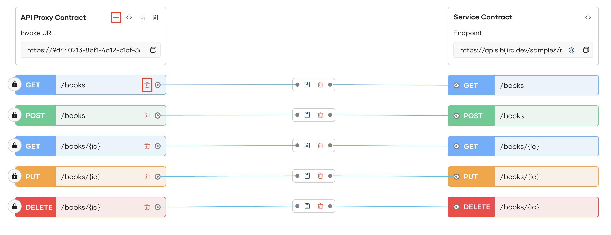
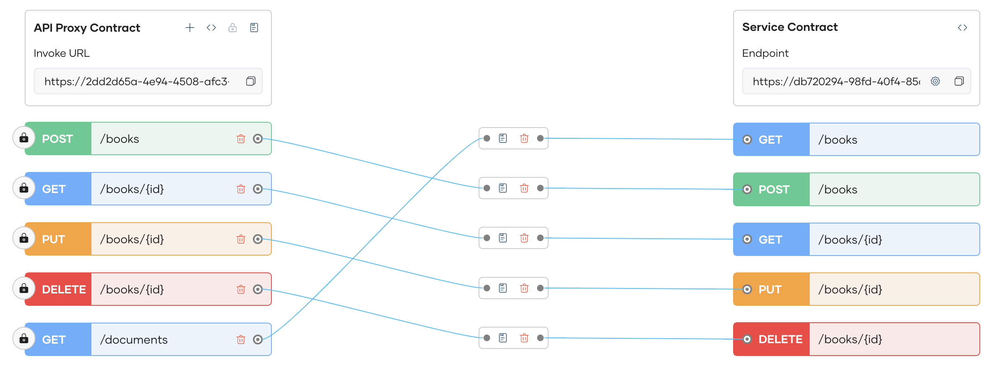

# Overview

Bijira simplifies the design, management, and mediation of API proxies with its interactive UI. It enables seamless API proxy customization within its unified UI, allowing you to add or remove resources, map resources, and apply policies at both the API and resource levels—all from the same interface. 

You can intuitively map API proxies to service contracts with Bijira's interactive UI, ensuring clear and consistent request routing to backend services. With built-in mediation policies, Bijira provides flexibility to manage API requests and responses, facilitating custom transformations and logic without requiring custom code. This enhances API manageability, making it easier to configure, update, and control API traffic within the platform.

## Designing API Proxies
You can further redesign and customize your API proxy created from following the [Create API Proxy](../../create-api-proxy/overview.md) flow. 

1. You can add new resources and delete existing ones as necessary
   

2. You can delete existing resource mappings, with the option to delete the resources along with the mapping if you do not intend to map it to a different backend resource
   

3. You can create a new mapping for a new resource you created
   

!!! Info 
    Each change made to proxy will be automatically saved as the `Latest saved` version in History. You can restore to the initial version or to an earlier version that has been deployed by clicking the `Restore` button in the History Pane.
