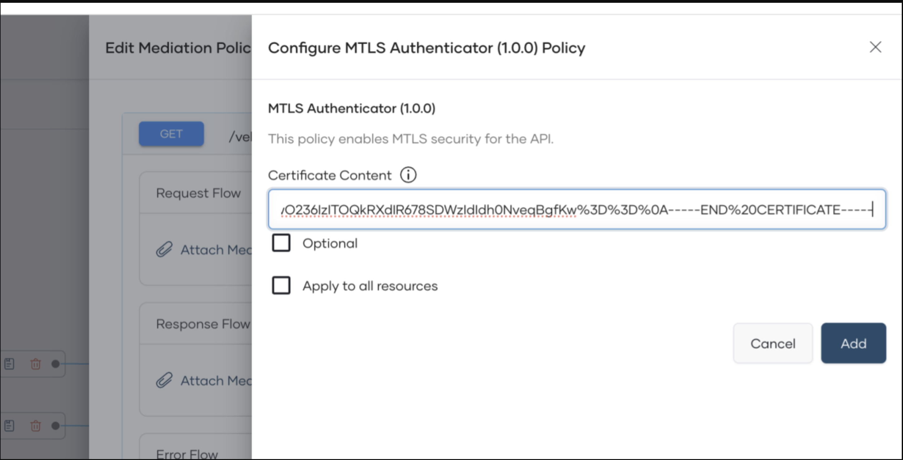

# Secure Client-Gateway Communication with Mutual TLS

Mutual TLS (mTLS) adds client-side certificate authentication to ensure only trusted clients can call an API. In WSO2 Bijira you enable mTLS at the API proxy level by configuring the MTLS Authenticator mediation policy to validate client certificates or an intermediate CA chain during the TLS handshake. 

This guide walks through the end-to-end steps on configuring mTLS for an API proxy to consume the API Proxy.

## Prerequisites

1. Set up [ Ballerina 2201.5.5](https://ballerina.io/downloads/swan-lake-release-notes/swan-lake-2201.5.5).
2. Open the `~/.ballerina/settings.toml` file and ensure you have configured an access token to Ballerina Central. If you have not configured an access token, follow the steps given below to configure one: 
    1. Generate a token via [https://central.ballerina.io/dashboard?tab=token](https://central.ballerina.io/dashboard?tab=token).
    2. Download the generated `Settings.toml` file and copy it to your local `~/.ballerina` directory.
    
Alternatively, you can set the access token via the `BALLERINA_CENTRAL_ACCESS_TOKEN` environment variable.

``` bash
export BALLERINA_CENTRAL_ACCESS_TOKEN=<access-token> 
```

## Configure mTLS Policy

1. Mutual SSL will be configured through a mediation. Please download the mediation app from [link to the mediation app].
2. Open the `Ballerina.toml` file in your preferred text editor and modify the `org` parameter to match with your current Bijira organization. 
3. Build the mediation app and publish it to the Ballerina central using the following command. 

!!!note
    If setting up in dev environment use `export BALLERINA_DEV_CENTRAL=true` before following commands

```bash
bal pack
bal push
```

## Generate a Self-signed Certificate

!!! note
  If you don't have a CA-signed certificate, use the following command to generate a self-signed certificate.

```bash
openssl req -x509 -newkey rsa:2048 -keyout mykey.pem -out mycert.pem -days 365 -nodes
```

1. Open the certificate via the preferred text editor and get the content in PEM format. Convert the content in to URL encoding and copy the content to the clipboard for future use. 

## Apply mTLS to API Proxy

1. Sign in to the Bijira Console.
2. In the Proxy Listing pane, click on the API proxy for which you want to enable MTLS. For instructions on how to create an API proxy component, see Develop an API Proxy: Step 1.
3. Go to Develop, Policy page and click "Resource level policies".

!!! note
    If you don't need OAuth2 to be enabled, remove the "OAuth2" mediation policy.

4. Under the policies, select "MTLS Authenticator".
5. Paste the URL encoded certificate content you copied to the clipboard in the above section and save.

!!! note
    If you need to support multiple client certificates, you can use an intermediate CA certificate and add here. Once that is done, all certificates signed by the intermediate certificate will be allowed to access the resource.



6. Deploy the API to development and then to the production environment.

## Invoke the API Proxy

!!! note
    If you haven’t removed OAuth2 policy, you will have to subscribe to the API and get access token. 

You can use curl for this. Get the URL for the API from the dev portal and invoke API. 

```bash
curl --request GET \
  --url <api_proxy_endpoint_url> \
  --header 'Accept: application/json' \
  --cert /<path>/mycert.pem \
  --key /<path>/mykey.pem
```

For a failed scenario, you will get the following error.

```json
{
    "error_message":"Invalid Credentials", 
    "code":"900901", 
    "error_description":"Make sure you have provided the correct security credentials."
}
```

## Configure a Custom Domain

To configure a custom domain for an API Proxy, follow the steps mentioned in [Configure a Custom Domain for Your Organization](../../../administer/settings/configure-a-custom-domain-for-your-organization/). 

Once the above step is completed, contact the Bijira team via bijira-help@wso2.com to enable mTLS for the given custom domain.