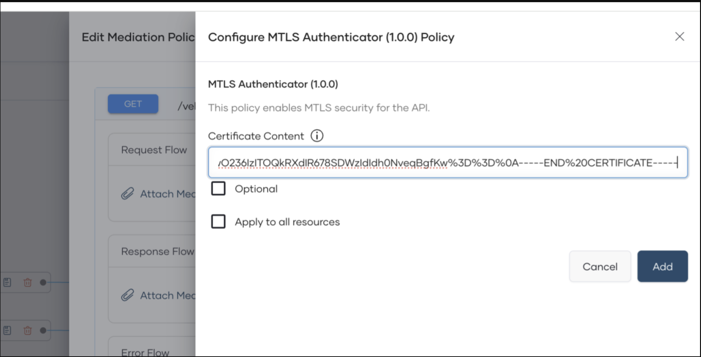

# Secure Client-Gateway Communication with Mutual TLS

Mutual TLS (mTLS) adds client-side certificate authentication to ensure only trusted clients can call an API. In API Platform, you can enable mTLS at the API proxy level by applying the built-in `MTLS Authenticator` policy to validate client certificates or an intermediate CA chain during the TLS handshake.

This guide walks through the end-to-end steps to configure mTLS for an API proxy.

## Generate a Self-signed Certificate

1. If you don't have a CA-signed certificate, use the following command to generate a self-signed certificate.

    ```bash
    openssl req -x509 -newkey rsa:2048 -keyout mykey.pem -out mycert.pem -days 365 -nodes
    ```

2. Open the certificate via the preferred text editor and get the content in PEM format. Convert the content in to URL encoding and copy the content to the clipboard for future use. 

## Apply mTLS to API Proxy

1. Sign in to the [API Platform Console](https://console.bijira.dev/).
2. In the Proxy Listing pane, click on the API proxy for which you want to enable MTLS. For instructions on how to create an API proxy component, see [Create an API Proxy](../../create-api-proxy/my-apis/http/import-api-contract.md).
3. Go to Develop -> Policies and click "Resource wise policies" in the left panel.
4. Select a resource.

    !!! note
        If you don't need OAuth2 to be enabled, remove the "OAuth2" mediation policy.

5. Under the Resource wise policies in the right panel, select `MTLS Authenticator`.
6. Paste the URL-encoded certificate content you copied to the clipboard at the step [Generate a Self-signed Certificate](#generate-a-self-signed-certificate) section above and save.

    !!! note
        If you need to support multiple client certificates, you can use an intermediate CA certificate and add here. Once that is done, all certificates signed by the intermediate certificate will be allowed to access the resource.

    

7. Deploy the API to development and then to the production environment.

## Invoke the API Proxy

!!! note
    If you haven’t removed OAuth2 policy, you will have to subscribe to the API and get access token. 

You can use curl for this. Get the URL for the API from the dev portal and invoke API. 

```bash
curl --request GET \
  --url <api_proxy_endpoint_url> \
  --header 'Accept: application/json' \
  --cert /<path>/mycert.pem \
  --key /<path>/mykey.pem
```

For a failed scenario, you will get the following error.

```json
{
    "error_message":"Invalid Credentials", 
    "code":"900901", 
    "error_description":"Make sure you have provided the correct security credentials."
}
```

## Configure a Custom Domain

To configure a custom domain for an API Proxy, follow the steps mentioned in [Configure a Custom Domain for Your Organization](../../../administer/settings/configure-a-custom-domain-for-your-organization/).

Once the above step is completed, contact the API Platform team via [bijira-help@wso2.com](mailto:bijira-help@wso2.com) to enable mTLS for the given custom domain.