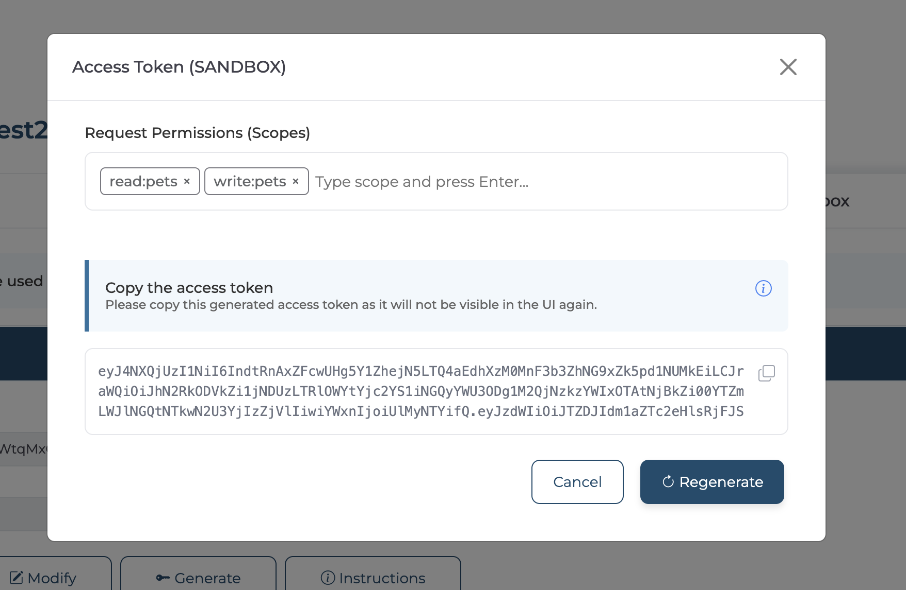

# Consume an API Secured with OAuth2

## Prerequisites

Before proceeding, ensure you have [Created an Application](../manage-applications/create-an-application.md) and [Subscribed to an API](../manage-subscriptions/subscribe-to-an-api.md) to consume.

## Generate keys

Bijira uses OAuth 2.0 bearer token-based authentication for API access. An API access token is a string passed as an HTTP header in API requests to authenticate access.

Once you create an application, you can generate credentials for it. Bijira provides a consumer key and consumer secret when you generate credentials for the first time. The consumer key acts as the unique identifier for the application and is used for authentication.

To generate an access token for **testing purposes**, follow these steps:

1. Navigate to the [Bijira Developer Portal](https://devportal.bijira.dev) and sign in.

2. Click on **Applications** in the Developer Portal sidebar.

3. Click on the application for which you want to generate keys and tokens.

4. In the Application detail banner, click **Manage Keys**. This opens the **Manage Keys** page.

5. On the **Manage Keys** page, select either the **Production** or **Sandbox** tab based on your requirement.

    !!!info
        Sandbox keys can only be used in the sandbox environment.

6. Click **Generate** and wait for the keys to be generated. This will generate the consumer key and consumer secret with default configurations. Once the keys are generated, close the dialog.

7. Click **Generate** to generate an access token. You can add scopes through the Request Permission section in the Access Token dialog.

    

    !!!info
        Currently, Bijira does not support configuring allowed scopes at the application level.

8. Copy the displayed access token.

You can use the **View** and **Modify** buttons to inspect and customize the default key generation settings.

Alternatively, click **Instructions** to view details about the token endpoint. You can either copy the generated cURL command to obtain a test token using a cURL client, or use the consumer key and consumer secret to generate an API access token by invoking the token endpoint. You can also revoke the access token by invoking the revoke endpoint.

## Consume an API

Use this generated access token to authenticate API requests by including it in the `Bearer` header when invoking the API.

Example:

```bash
curl -H "Authorization: Bearer <YOUR_ACCESS_TOKEN>" -X GET "https://my-sample-api.bijiraapis.dev/greet"
```

!!! note
    The name of the Authorization header may vary depending on the API provider’s configuration. Always refer to the API’s Swagger (OpenAPI) definition for the correct header format.
