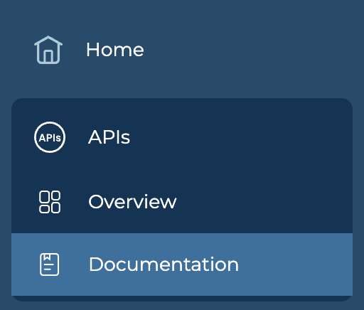
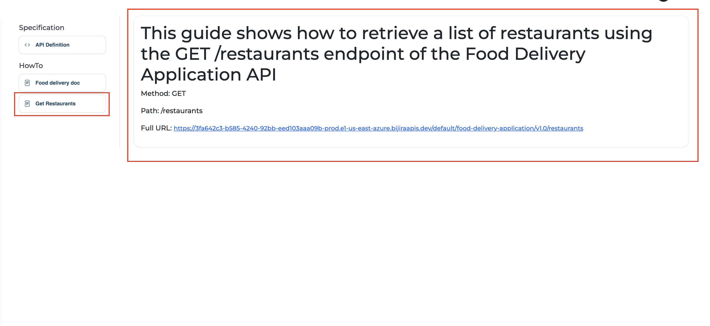

# API Documentation

The API documentation page provides essential information such as endpoints, schemas, security mechanisms, and the base URL.

## View API Documentation

1. Go to **APIs** in the sidebar.
2. Select an API to view the documentation.
3. Select **Documentation** under APIs or you can click the **documentation** button in the header section.

    {style="max-width:250px;"}

4. You can see the Documentations added to your API under different sections.
5. Select the documentation to view the content.

    
