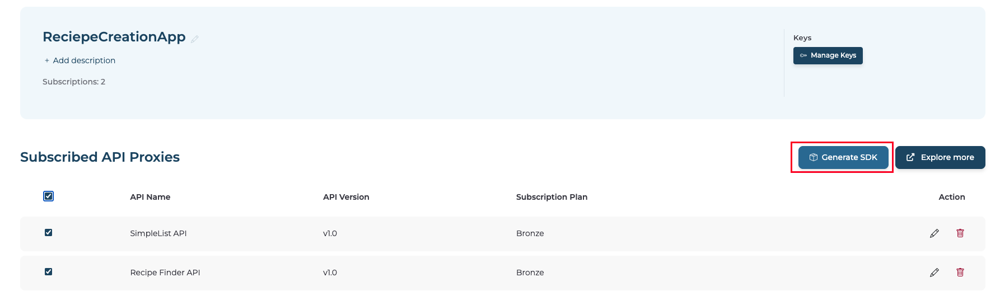

# AI assisted SDK Generation

The AI-assisted SDK generation feature helps developers quickly create a use case–specific SDK and sample application code based on selected APIs. Instead of integrating multiple SDKs manually, developers can generate a single SDK and a working code example tailored to their requirements.

## What is AI-assisted SDK Generation?

When building applications that consume multiple APIs, developers often need to:
- Download and manage multiple SDKs
- Understand how the APIs work together
- Write integration code from scratch

This process can take significant time and effort.

AI-assisted SDK generation simplifies this by:

- Combining selected APIs into a single SDK
- Generating application code based on your use case
- Providing a ready starting point for development

This allows developers to focus on business logic instead of setup and integration.

## Prerequisites

- There should be at least one API in the project to use this feature. If there are no APIs, you can create an API proxy by following the instructions in [this guide](../../introduction/quick-start-guide.md).

## Generate an SDK using the Devportal

Follow these steps to generate a use case–specific SDK and sample application.

### Step 1: Select APIs for your Application

1. Sign in to the Devportal.
2. Go to **Applications**.
3. Open an existing application or create a new one (for example, *MySampleApp*).
4. Go to the **APIs** tab and subscribe to the APIs using the created application.  
   To use this feature, you need to subscribe to at least one API. You can subscribe to multiple APIs based on your SDK generation requirement.

### Step 2: Select APIs for SDK Generation

1. Go to the **Applications** tab and select the created application (for example, *MySampleApp*).
2. All subscribed APIs will be listed. Select the APIs you want to include in the SDK generation.

!!! note
    The **Generate SDK** button becomes active once **one or more APIs are selected**.

### Step 3: Generate SDK

1. Click the **Generate SDK** button. This opens the SDK generation drawer.

2. Select the programming language for the SDK from the dropdown list (for example, Java).
3. Describe your use case in the text area. This helps the AI understand your requirement and generate relevant application code.

   Example:
   > Create an application that allows users to view and manage their orders using the Order API and the User API.

4. Click the **Arrow** button to start the SDK generation process.
5. The system processes your request and generates a use case-specific SDK along with sample application code. Once the generation is complete, a ZIP file containing the SDK and sample code is downloaded to your local machine.

## Notes and Considerations

- AI services require valid configuration and active subscriptions.
- Generated code is intended as a starting point and may require modifications.
- Application code generation currently uses the **Anthropic Claude 3.5 Sonnet (20241022)** model.

