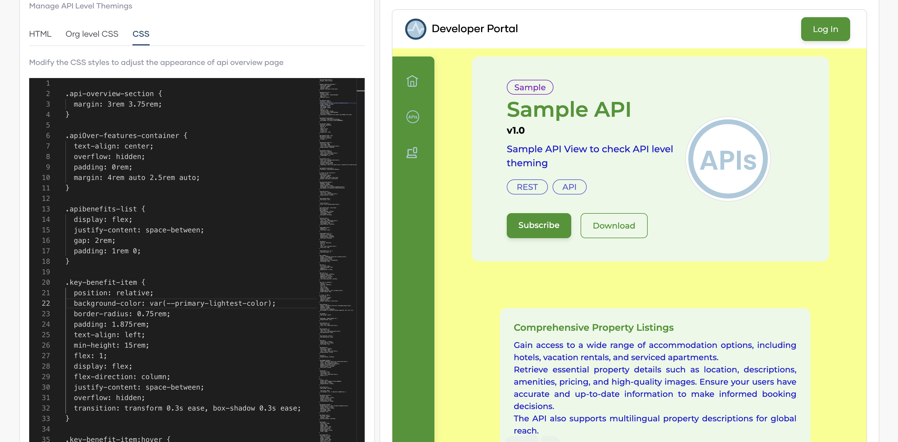
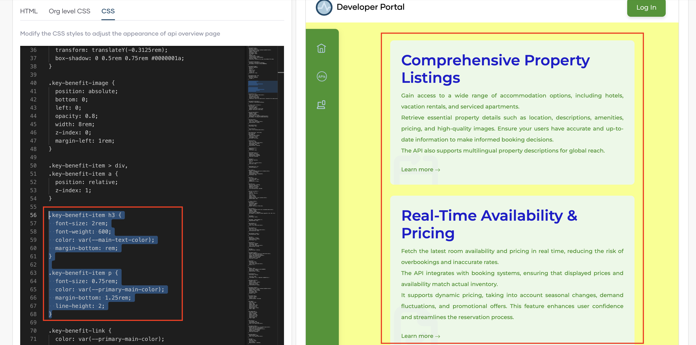
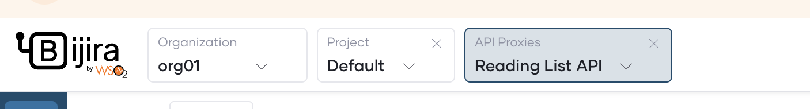
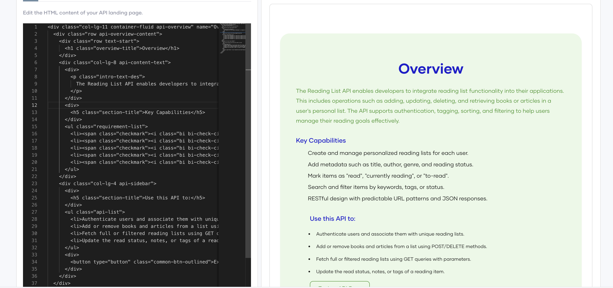

# Customize Developer Portal Manually for your Organization

Developer portal allows you to customize the user interfaces(UIs)in organization level as well as in API level. with this you can ensure that your pages not only look great but also align perfectly with your brand's identity.

Customization take place at two levels:

- Org Level : This functions as the default branding and applies to all APIs in an organization.
- API Level : Each API can have its own branding. This overrides the organizational level branding applied by default to the organization.

## Prerequisites

- If you're signing in to the Bijira Console for the first time, create an organization:
    1. Go to [Bijira Console](https://console.bijira.dev/) and sign in using your preferred method.
    2. Enter a unique organization name. For example, `TestingOrg`.
    3. Read and accept the privacy policy and terms of use.
    4. Click **Create**.

This creates the organization and opens the **Project Home** page of the default project created for you.

## Get into `Developer Portal` tab

Go though the below steps to get the `Developer Portal` tab.

- Close the project tab selected by default. Then the `Organization` tab will be selected.
- In the left navigation menu, click `Admin` and then click `Settings`.
- Select `Developer Portal` tab.

## Theme your Devportal in API Level

Go through the following steps to customize the theme of the Devportal in the API level.

1. Select `API Level` tab.

### HTML

The `HTML` tab will show the the read only view reference to the HTML structure of APIs in your organization. To edit the content of this page go to [Customize API Landing Page content](#customize-api-landing-page-content).

### Org level CSS

This tab will shows the reference to main CSS from the the organizational level theme settings.

### CSS

Here you can adjust appearance of the API Overview page by changing the css styles.



1. Replace the following sections in the CSS, You can see the changes in the preview.

    ```CSS
    .key-benefit-item h3 {
    font-size: 2rem;
    font-weight: 600;
    color: var(--main-text-color);
    margin-bottom: 0.625rem;
    }

    .key-benefit-item p {
    font-size: 0.75rem;
    color: var(--primary-main-color);
    margin-bottom: 1.25rem;
    line-height: 2;
    }

    ```

    

2. Click **Publish to Developer Portal** to publish the CSS changes.

### Customize API Landing Page content

To customize the content of an API go through the following steps.

1. Select a **Project** in your organization.
2. Select an **API** to do the customization.

    

3. Click **Documents** under **Develop** from the sidebar.
4. Go to **API Landing Page** tab.
5. Select **HTML** tab. 
6. Customize the content by changing the html given. You can see the finalized details in the preview.

!!! info "Try This in Preview"

    Here is a sample HTML code. You can paste it and see the changes in the preview.

    ```html
    <div class="col-lg-11 container-fluid api-overview" name="Overview">
        <div class="row api-overview-content">
            <div class="row text-start">
                <h1 class="overview-title">Overview</h1>
            </div>
            <div class="col-lg-8 api-content-text">
                <div>
                    <p class="intro-text-des">
                        The Reading List API enables developers to integrate reading list functionality into their applications. This includes operations such as adding, updating, deleting, and retrieving books or articles in a user's personal list. The API supports authentication, tagging, sorting, and filtering to help users manage their reading goals effectively.
                    </p>
                </div>
                <div>
                    <h5 class="section-title">Key Capabilities</h5>
                </div>
                <ul class="requirement-list">
                    <li><span class="checkmark"><i class="bi bi-check-circle-fill"></i></span> Create and manage personalized reading lists for each user.</li>
                    <li><span class="checkmark"><i class="bi bi-check-circle-fill"></i></span> Add metadata such as title, author, genre, and reading status.</li>
                    <li><span class="checkmark"><i class="bi bi-check-circle-fill"></i></span> Mark items as "read", "currently reading", or "to-read".</li>
                    <li><span class="checkmark"><i class="bi bi-check-circle-fill"></i></span> Search and filter items by keywords, tags, or status.</li>
                    <li><span class="checkmark"><i class="bi bi-check-circle-fill"></i></span> RESTful design with predictable URL patterns and JSON responses.</li>
                </ul>
            </div>
            <div class="col-lg-4 api-sidebar">
                <div>
                    <h5 class="section-title">Use this API to:</h5>
                </div>
                <ul class="api-list">
                    <li>Authenticate users and associate them with unique reading lists.</li>
                    <li>Add or remove books and articles from a list using POST/DELETE methods.</li>
                    <li>Fetch full or filtered reading lists using GET queries with parameters.</li>
                    <li>Update the read status, notes, or tags of a reading item.</li>
                </ul>
                <div>
                    <button type="button" class="common-btn-outlined">Explore API Docs</button>
                </div>
            </div>
        </div>
    </div>
    ```

    

