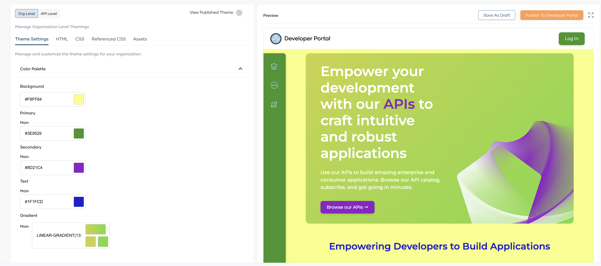
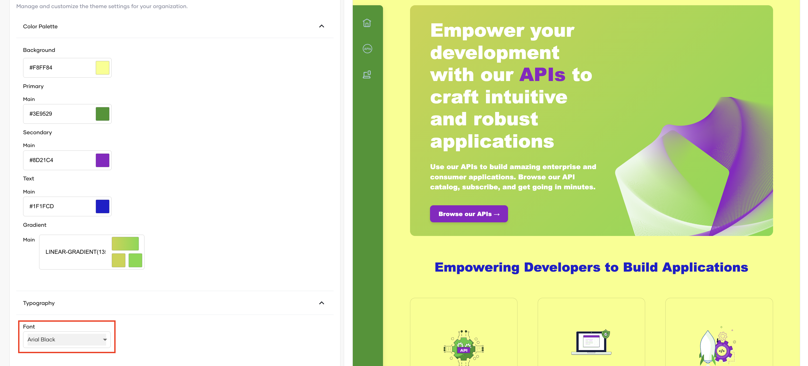
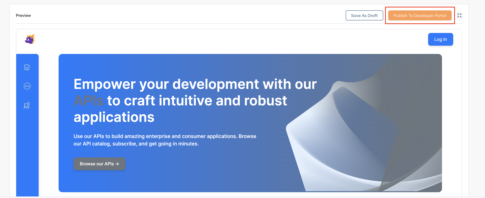
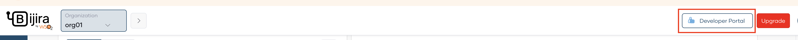
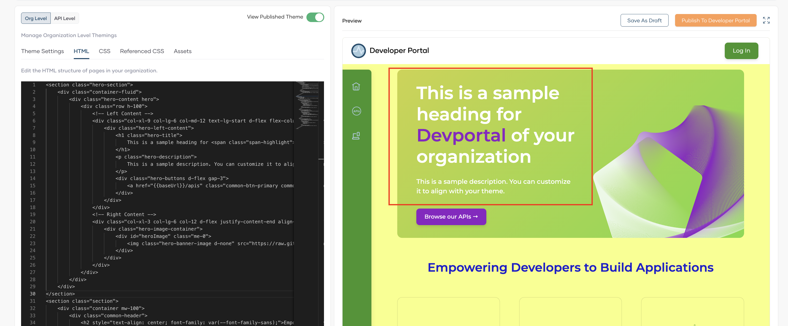
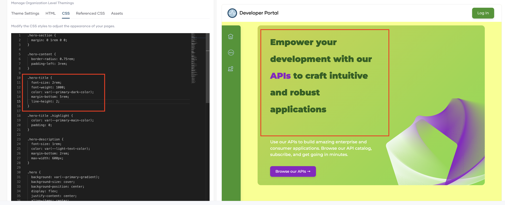
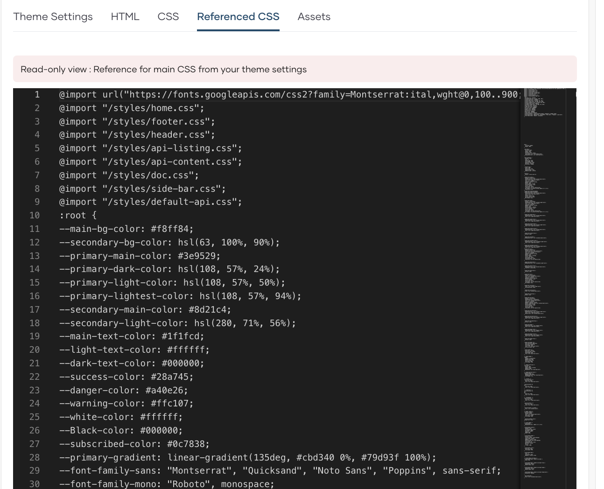
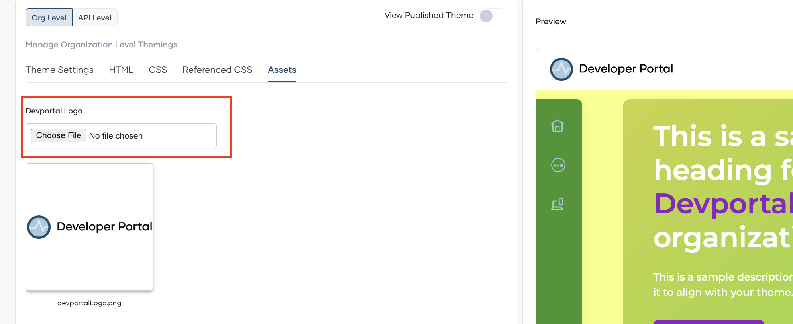
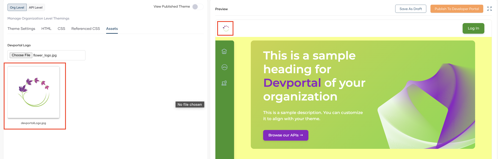

# Customize Developer Portal Manually for your Organization

Developer portal allows you to customize the user interfaces(UIs)in organization level as well as in API level. with this you can ensure that your pages not only look great but also align perfectly with your brand's identity.

Customization take place at two levels:

- Org Level : This functions as the default branding and applies to all APIs in an organization.
- API Level : Each API can have its own branding. This overrides the organizational level branding applied by default to the organization.

## Prerequisites

- If you're signing in to the Bijira Console for the first time, create an organization:
    1. Go to [Bijira Console](https://console.bijira.dev/) and sign in using your preferred method.
    2. Enter a unique organization name. For example, `TestingOrg`.
    3. Read and accept the privacy policy and terms of use.
    4. Click **Create**.

This creates the organization and opens the **Project Home** page of the default project created for you.

## Get into `Developer Portal` tab

Go though the below steps to get the `Developer Portal` tab.

- Close the project tab selected by default. Then the `Organization` tab will be selected.
- In the left navigation menu, click `Admin` and then click `Settings`.
- Select `Developer Portal` tab.

## Theme your Devportal in Org Level

Go through the following steps to customize the theme of the Devportal in the organization level.

### Theme Settings

1. Select `Org Level` tab.
2. Select `Theme Settings` tab. Here, you can manage and customize theme colors for your organization.
3. Expand the **Color Palette** section to see the available color fields.
4. Click on each color field to open the color selection interface and choose your desired colors.
5. The preview panel on the right will show real-time changes as you modify the colors.

    

4. Expand the dropdown for `Typography` and select the font (e.g., Arial Black).

    

5. If you want to save these changes as a draft, select  `Save As Draft`.

6. If it perfectly aligns with your organization's unique identity, click `Publish to Devportal`.

    

7. Go to `Developer portal` to see the changes.

    

### HTML

1. Select `HTML` tab. You can edit the HTML structure of pages.
2. paste the below html code for `hero-section` .

    ``` html
    <section class="hero-section">
        <div class="container-fluid">
            <div class="hero-content hero">
                <div class="row h-100">
                    <!-- Left Content -->
                    <div class="col-xl-9 col-lg-6 col-md-12 text-lg-start d-flex flex-column justify-content-center">
                        <div class="hero-left-content">
                            <h1 class="hero-title">
                                Empower your development with our <span class="span-highlight"> APIs </span>
                                to craft intuitive and robust applications
                            </h1>
                            <p class="hero-description">
                                Use our APIs to build amazing enterprise and consumer applications. Browse our API catalog,
                                subscribe, and get going in minutes.
                            </p>
                            <div class="hero-buttons d-flex gap-3">
                                <a href="{{baseUrl}}/apis" class="common-btn-primary common-btn-secondary">Browse our APIs →</a>
                            </div>
                        </div>
                    </div>
                    <!-- Right Content -->
                    <div class="col-xl-3 col-lg-6 col-12 d-flex justify-content-end align-items-end">
                        <div class="hero-image-container">
                            <div id="heroImage" class="me-0">
                                
                            </div>
                        </div>
                    </div>
                </div>
            </div>
        </div>
    </section>
    ```

3. The changes can be seen in the preview section.

    

### CSS

1. Select `CSS` tab. You can modify CSS styles to adjust the appearance of the pages.
2. Paste the below code for `.hero-title`.

    ```css
    .hero-title {
        font-size: 2rem;
        font-weight: 1000;
        color: var(--primary-dark-color);
        margin-bottom: 5rem;
        line-height: 2;
    }
    ```

3. The changes can be seen in the preview section.

    

### Referenced CSS

This section shows the reference for the main CSS from the theme settings you assigned at the beginning.



### Assets

01. The Logo of the devportal can be changed by clicking `Choosing File` under Devportal Logo.

    

02. After adding the image you can see the finalized changes in the preview.

    
