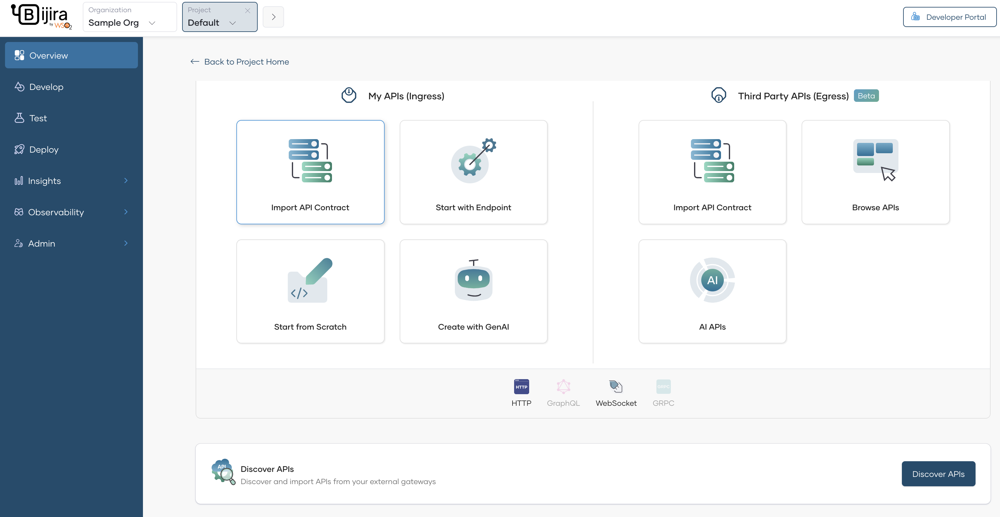

# Discover APIs from AWS API Gateway

Bijira allows you to discover APIs from AWS API Gateway and bring them under centralized governance.

---

## Prerequisites

Before you begin, ensure you have:

- An active AWS account with access to AWS API Gateway
- Appropriate permissions to create IAM users and manage API Gateway resources
- Admin access to your Bijira organization. (Only required for Step 1 and 2)

---

## Step 1: Configure User Credentials in AWS API Gateway

1. Login to your AWS account and navigate to Console Home. Search for "IAM" in the search bar.
2. Click on the IAM service. Navigate to Users under Access Management.
3. Create an IAM user in AWS with `AmazonAPIGatewayAdministrator` permission.
4. Obtain an Access Key and Secret Key for the IAM user created in the previous step. Select Third-party service as the use case.

!!! Warning 
    It is not recommended to enter root credentials of the AWS account. Instead, create a new IAM user with the required permissions and use the credentials of the IAM user. For more information see [Best practices for managing AWS access keys](https://docs.aws.amazon.com/IAM/latest/UserGuide/id_credentials_access-keys.html#securing_access-keys).

---

## Step 2: Add an External Gateway in Bijira

Now that you have your AWS credentials ready, configure the external gateway connection in Bijira.

1. Navigate to **Organization Level** in Bijira.  
2. Click **Add External Gateway**.

      

3. Enter the gateway configuration details:
      - **Gateway Name:** A descriptive name for this gateway (e.g., `Production AWS API Gateway`)
      - **Region:** The AWS region where your API Gateway is deployed (e.g., `us-east-1`)
      - **Stage:** The API Gateway stage to discover APIs from (e.g., `prod`, `dev`)
      - **Access Key :** The Access Key  from Step 1
      - **Secret Key:** The Secret Key from Step 1
4. Click **Save**
   
   { width="800" }

The external gateway is now connected to Bijira and ready for API discovery.

---

## Step 3: Discover APIs from the Gateway

Once the external gateway is configured, you can discover and federate APIs into Bijira.

1. Navigate to a **Project** in Bijira.  
2. Click **Create** in the project overview.
3. Click on **Discover APIs**.

     { width="1000" }

3. Select the external gateway(s) from which you want to discover APIs and proceed with discovery.

4. Click **Discover APIs from Gateways**.

      { width="1000" }
      

5. View the list of discovered APIs from the selected gateway(s).

      { width="1000" } 
  
!!! Note
        Only [REST APIs](https://docs.aws.amazon.com/apigateway/latest/developerguide/apigateway-rest-api.html) are supported for discovery from AWS API Gateway.

6. For each API, click **Create** next to the API name. This federates the API into the Bijira control plane.
   - Repeat for all desired APIs.
   - Navigate to the project **Overview** page to view all federated APIs.
7. You can view the federated API overview by navigating to the API overview page

      { width="900" } 
