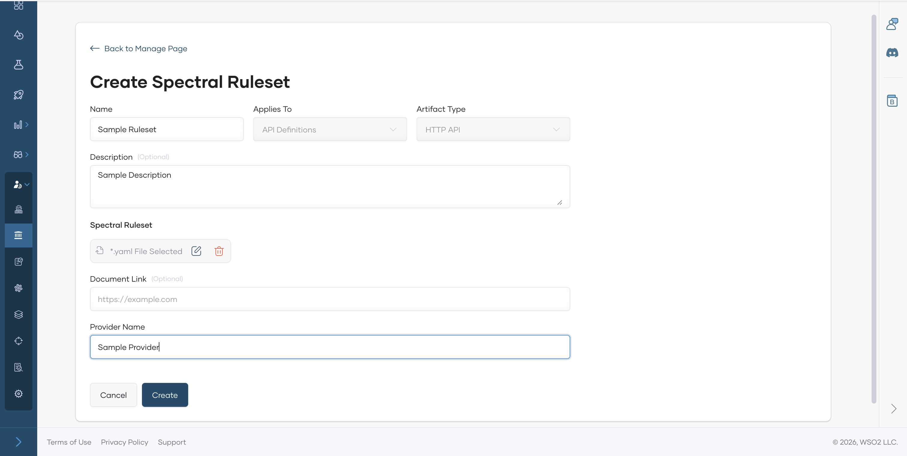
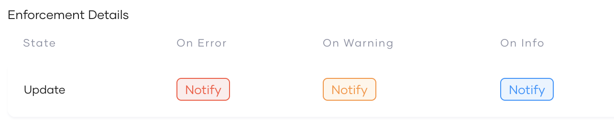

# Govern API Proxies

To govern the API proxies, you can define rulesets/documents, and policies. These concepts help you enforce governance policies on APIs and ensure compliance with security, compliance, performance, and operational guidelines.

To define the governance compliance standards for API proxies, you can either create Spectral rulesets or use the natural language specification to define the rules.

## Create a Ruleset

1. Sign in to the [Bijira Console](https://console.bijira.dev/).
2. In the Bijira Console header, go to the **Organization** list and select your organization.
3. In the left navigation menu, click **Admin** and then click **Governance**. This opens the Governance page.
4. From the Rulesets / Documents section, select Rulesets and click **Add Rulesets** button.
5. Provide the following details

| Field Name | Description  | Mandatory | Options/Values |
|------------|---------------------------------------|-----------|----------------|
| Name | The name of the ruleset.  | Yes | - |
| Description | A brief description of the ruleset.  | No | - |
| Applies To | The Proxy component to which the ruleset is applied.| Yes | - |
| Artifact Type | The type of the API.   | Yes | REST API, Async API |
| Documentation Link | A link to the documentation of the ruleset.                                                                                                                                                                                                                                 | No | - |
| Spectral Ruleset| Define the ruleset content using the **Spectral**. You can upload a pre-written ruleset file.  | Yes | - |
| Provider Name| The name of the provider who created the ruleset.                                                                                                                                                                                                                           | Yes | - |

## Add a Document

1. From the Rulesets / Documents section, select Documents and click **Add Document** button.
2. Provide the following details

| Field Name | Description                                          | Mandatory | Options/Values |
|----------|------------------------------------------------------|-----------|----------------|
| Name | The name of the document.                            | Yes       | -              |
| Description | A brief description of the document.                 | No        | -              |
| Applies To | The Proxy component to which the document is applied. | Yes       | API Definition |
| Artifact Type | The type of the API.                                 | Yes       | HTTP API       |
| Document | Select a file for the document.                      | Yes       | -              |

## Policy

Policy will be used to enforce the rulesets and documents on the API proxies. A policy can only be have either rulesets or documents attached to it. To create a policy, follow the below steps.

1. From the Policies section, click **Add Policy** button.
2. From the pop-up window, Select the source of the rules whether it is Using Rule Definition or Using Document.
3. Based on the selection, fill in the required fields.

| Field Name         | Description                                                  | Mandatory | Options/Values  |
|--------------------|--------------------------------------------------------------|-----------|-----------------|
| Name               | The name of the policy.                                      | Yes       | -               |
| Description        | A brief description of the policy.                           | No        | -               |
| Applicability      | The level of applicability of the policy.                    | Yes       | Global/ Specify |
| Enforcement Detail | The detail of the policy enforcement criteria.               | Yes       |                 |
| Ruleset/Document   | The rulesets or document that should attached to the policy. | Yes       | -               |

### Enforcement Detail

| Field Name         | Description                                                                                  | Mandatory | Options/Values |
|--------------------|----------------------------------------------------------------------------------------------|-----------|--------------|
| Governed State     | The state of the API to which the policy is applied. (Currently only supports Update)        | Yes       | Update |
| Severity Levels    | The severity level of the policy violation.                                                  | Yes       | Error, Warn, Info |
| Actions            | The action to be taken when a policy violation is detected. (Currently only supports Notify) | Yes       | Notify  |

By adding the policy, all the existing and newly created API proxies will be validated against the defined rulesets and documents.
