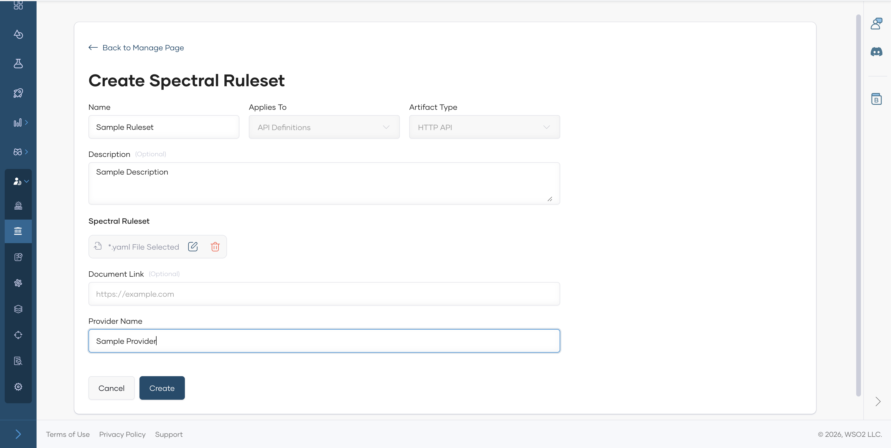
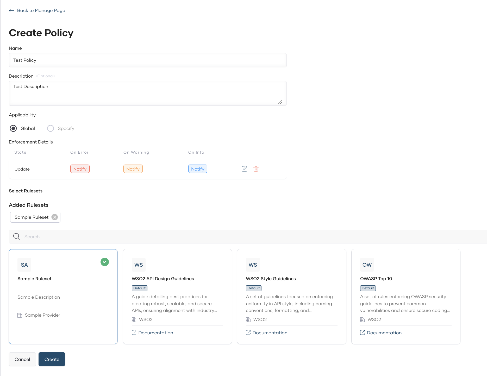
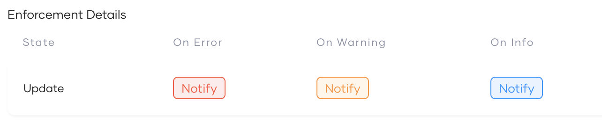
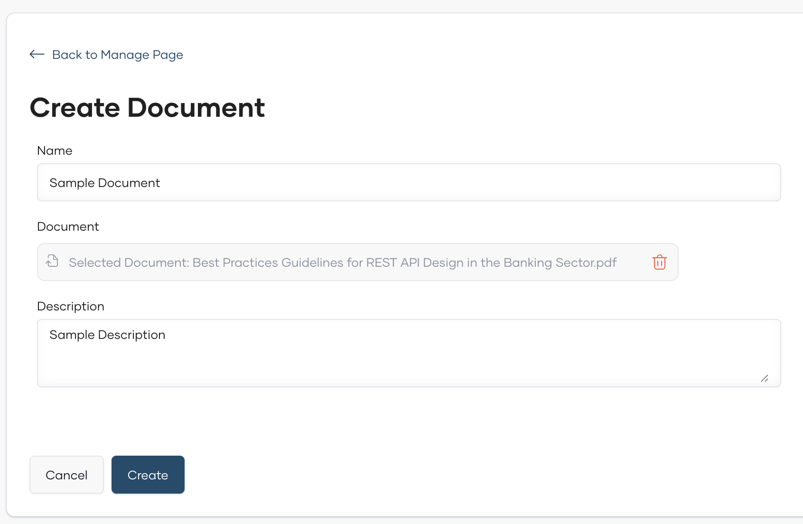

# Govern API Proxies

API governance lets you enforce compliance standards on API proxies across your organization. You can define rulesets, attach them to policies, and monitor adherence through a compliance dashboard. You can also upload governance documents to run AI-powered compliance analysis against your APIs.

The Governance page is organized into two main sections, toggled at the top:

- **Policies** - Manage governance policies and the rulesets that back them.
- **Documents** - Manage PDF documents used as guidelines for AI compliance analysis.

## Rulesets

Rulesets are Spectral YAML-based rule definitions used to validate API artifacts. They are listed under the **Policies** tab in the **Rulesets** section. Once created, rulesets are attached to policies to enforce them on your API proxies.

### Create a Ruleset

1. Sign in to the [API Platform Console](https://console.bijira.dev/).
2. In the API Platform Console header, go to the **Organization** list and select your organization.
3. In the left navigation menu, click **Admin** and then click **Governance**. This opens the Governance page.
4. Ensure the **Policies** tab is selected.
5. Scroll to the **Rulesets** section and click **Add Ruleset**.
6. Provide the following details:

    | Field Name | Description | Mandatory |
    |---|---|---|
    | Name | The name of the ruleset. | Yes |
    | Description | A brief description of the ruleset. | No |
    | Applies To | The scope to which the ruleset applies (fixed to API Definitions). | - |
    | Artifact Type | The type of API artifact (fixed to HTTP API). | - |
    | Spectral Ruleset | Upload a pre-written ruleset file in `.yaml`, `.yml`, or `.json` format. | Yes |
    | Documentation Link | A link to the documentation for the ruleset. | No |
    | Provider Name | The name of the provider who created the ruleset. | Yes |

7. Click **Create**.

!!! note
    The **Applies To** and **Artifact Type** fields are fixed and cannot be changed.

## Policies

Policies attach one or more rulesets to your organization's API proxies and define when and how they are enforced. You can use the default rulesets available in the catalog or create your own. Once created, a policy is automatically applied globally to all existing and newly created API proxies in the organization.

### Create a Policy

1. On the Governance page, ensure the **Policies** tab is selected.
2. Click **Add Policy**.
3. Provide the following details:

    | Field Name | Description | Mandatory |
    |---|---|---|
    | Name | The name of the policy. | Yes |
    | Description | A brief description of the policy. | No |
    | Applicability | The scope of the policy. Currently fixed to **Global** (applies to all API proxies in the organization). | - |
    | Enforcement Detail | Defines when the policy is evaluated and what happens on a violation. | Yes |
    | Rulesets | The rulesets to attach to this policy. | Yes |

4. Click **Create**.

### Enforcement Detail

| Field Name | Description | Mandatory | Options/Values |
|---|---|---|---|
| Governed State | The state of the API to which the policy is applied. (Currently only supports Update) | Yes | Update |
| Severity Levels | The severity level of the policy violation. | Yes | Error, Warn, Info |
| Actions | The action to be taken when a policy violation is detected. (Currently only supports Notify) | Yes | Notify |

## Documents

Documents are PDF files containing governance standards written in natural language. They are used as guidelines by the AI Compliance Analysis feature when evaluating your APIs.

### Add a Document

1. On the Governance page, select the **Documents** tab.
2. Click **Add Document** and provide the following details:

    | Field Name | Description | Mandatory |
    |---|---|---|
    | Name | The name of the document. | Yes |
    | Description | A brief description of the document. | No |
    | Document | Upload a PDF file containing your governance standards. | Yes |

3. Click **Create**.

## Monitoring Compliance

Once policies are applied, compliance results are available through the Compliance Dashboard under **Insights > Compliance** at the organization, project, and component levels. For details on viewing compliance results and running AI compliance analysis, see [Compliance Dashboard](../monitoring-and-insights/compliance.md).
