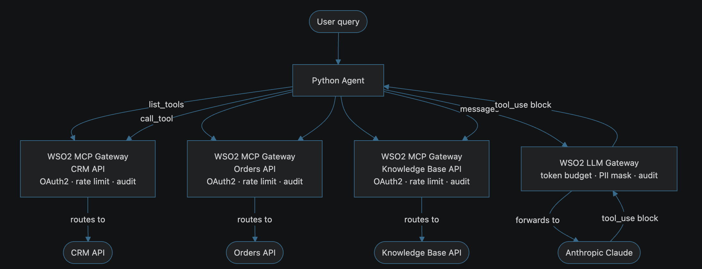
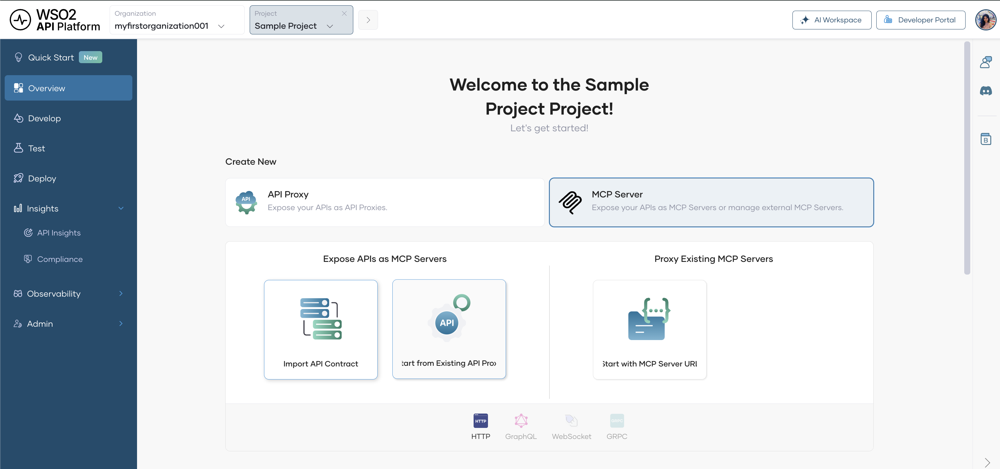
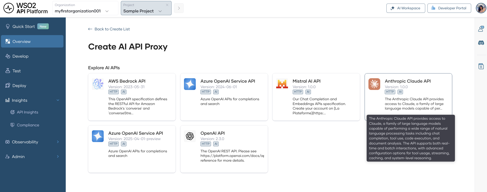
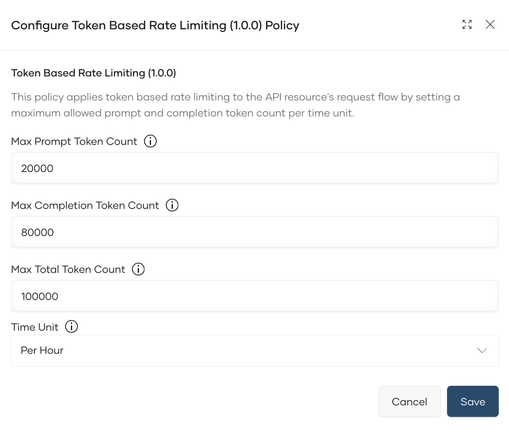
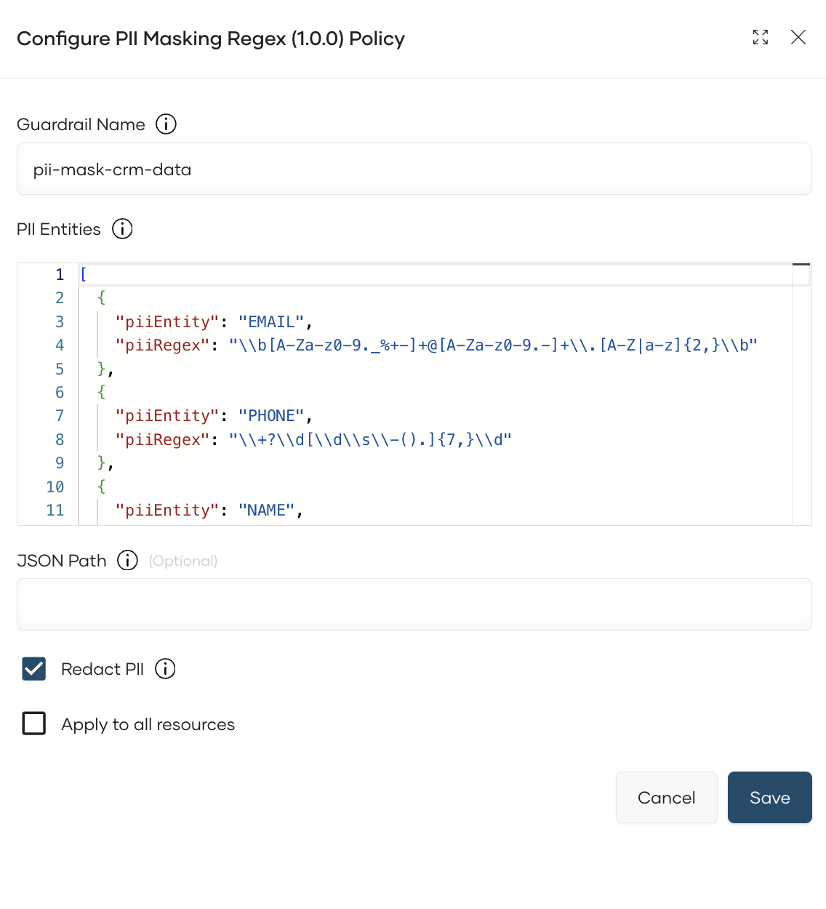
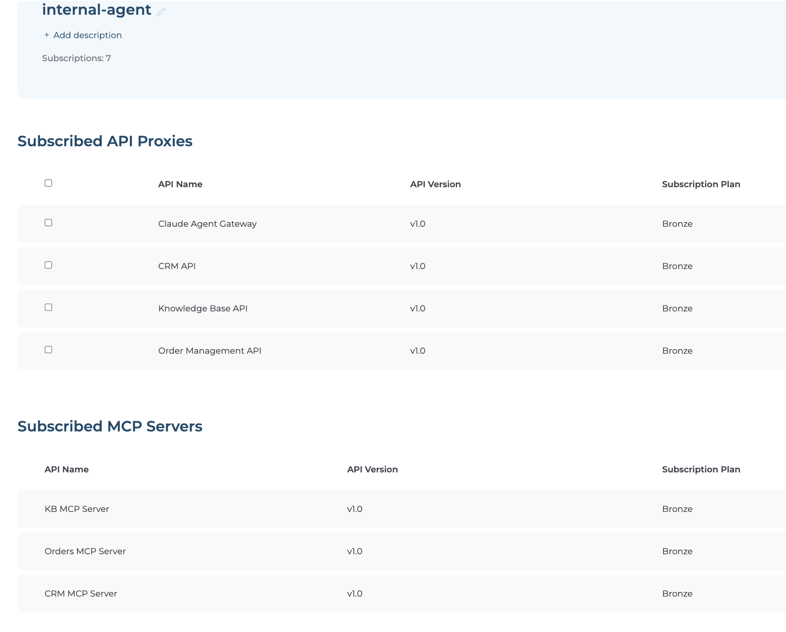
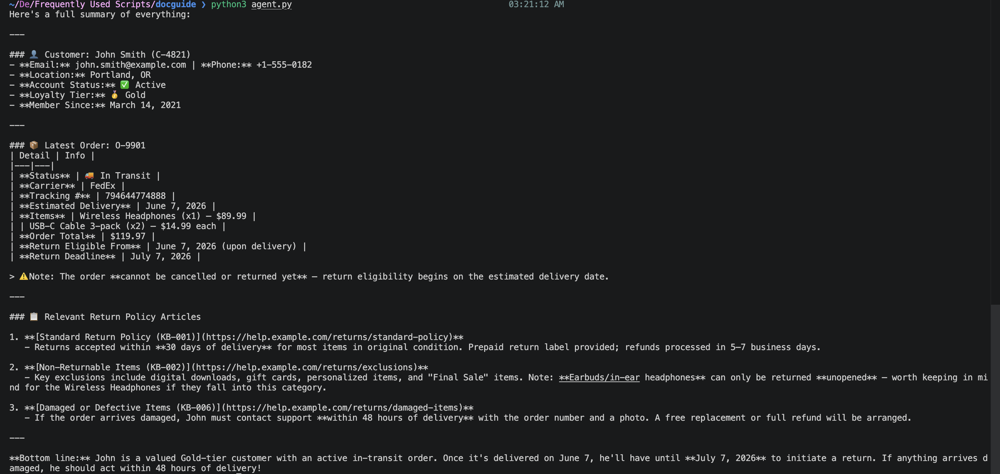

# Build an AI agent that uses aggregated MCP tools from multiple APIs

## Overview

This guide shows you how to connect a Python AI agent to three separately governed MCP servers; a CRM, an order management system, and a knowledge base, all through the WSO2 AI Gateway. By the end, you'll have a running agent that can answer multi-step questions like "Find customer C-4821, check their latest order, and tell me if there are any relevant return policy articles" by discovering tools from all three servers at startup and routing each call through the gateway, where authentication, rate limits, and audit logs are enforced automatically.

The agent also calls Claude through a WSO2 LLM Gateway endpoint. Every reasoning call is token-budgeted, and customer data fetched from the CRM is PII-masked before it reaches Anthropic.

---

## Key Concepts

Before you start, here are the WSO2 terms this guide uses.

**WSO2 Bijira** is the cloud API platform where you create and manage all resources in this guide — API proxies, MCP servers, the LLM API, and subscriptions.

**API proxy** is a managed endpoint Bijira creates in front of your backend API. It enforces authentication, rate limits, and audit logging on every inbound request before forwarding it to the backend.

**MCP server** is a governed endpoint Bijira generates from an existing API proxy. It speaks the Model Context Protocol, so an AI agent can discover the proxy's operations as tools and call them using standard MCP tool calls.

**LLM API** is a governed egress endpoint for calling a third-party LLM provider. Your agent sends every Claude request through this endpoint, where token budgets and guardrails like PII masking are applied before the request leaves your network.

**Application** is a client identity in Bijira. You create one application — `internal-agent` — to represent your agent. All seven APIs (three backends, three MCP servers, one LLM API) are subscribed under this single identity, so every call is attributed to the same application in analytics.

**Developer Portal** is where you subscribe applications to APIs and generate OAuth2 credentials.

**session_map** is the routing pattern used in `agent.py`. When the agent starts up, it connects to all three MCP servers simultaneously, collects their tool schemas, and builds a map of tool name → MCP session. When Claude returns a `tool_use` block, the agent looks up which session owns that tool and calls it directly, no hardcoded if/else logic.

---

## Prerequisites

- A Bijira account — sign up at [console.bijira.wso2.com](https://console.bijira.wso2.com) if you don't have one
- OpenAPI specifications (or endpoint URLs) for your three backend APIs: CRM, Orders, and Knowledge Base
- An Anthropic API key, which the LLM Gateway uses to call `api.anthropic.com` on your behalf
- Python 3.9 or later, pip, and a terminal

!!! note
    If you don't have real backend APIs, you can use [this](https://github.com/wso2/api-platform/tree/main/samples/ai-agent-with-mcp/mock-backends) mock server. It provides all three endpoints with synthetic customer, order, and knowledge base data.

---

## Architecture

{.cInlineImage-full}

Each MCP server is a separate governed endpoint with its own OAuth2 policy, rate limit, and audit log. The agent connects to all three in parallel at startup, collects every tool schema, and builds the `session_map` before asking Claude anything.

When the agent calls Claude through the LLM Gateway, the gateway token-budgets the request and masks any PII, names, emails, phone numbers, from CRM data before the payload reaches Anthropic.

---

## Step 1: Create a Bijira Project

All resources in this guide live inside a single Bijira project.

1. Sign in to the [Bijira Console](https://console.bijira.wso2.com).
2. Click **+ Create Project**.
3. Enter the following:

    | Field | Value |
    |---|---|
    | **Display Name** | Sample Project |
    | **Identifier** | Sample Project |

4. Click **Create**.

**Expected result:** You land on the project overview page. All steps that follow happen inside this project.

---

## Step 2: Create the Three API Proxies

Each API proxy is the governed representation of a backend API. You'll generate an MCP server from each proxy in the next step.

!!! warning
    If you're using the mock server, start it and expose port 8000 publicly before creating the proxies. If you are using VS Code, open the **PORTS** panel, right-click port 8000, and set **Port Visibility** to **Public**.

#### CRM API Proxy

1. In your project, click **+ Create** and select **API Proxy**.
2. Choose **My APIs (Ingress)** → **Import API Contract**, then select **Upload** and upload `crm_openapi.yaml`.
3. Fill in the details:

    | Field | Value |
    |---|---|
    | **Name** | `CRM API` |
    | **Version** | `1.0` |
    | **Backend Endpoint** | `https://<your-backend-url>/crm` |

4. Click **Create**.
5. In the left navigation, click **Deploy**, then click **Deploy** in the Development card. Wait for the status indicator to turn green.
6. Click **Manage → Lifecycle → Publish → Confirm**.

**Expected result:** `CRM API` shows **Published** status.


#### Orders API Proxy

Repeat the steps above with these values:

| Field | Value |
|---|---|
| **Name** | `Order Management API` |
| **OpenAPI Contract** | `orders_openapi.yaml` |
| **Backend Endpoint** | `https://<your-backend-url>/orders` |

#### Knowledge Base API Proxy

Repeat the steps above with these values:

| Field | Value |
|---|---|
| **Name** | `Knowledge Base API` |
| **OpenAPI Contract** | `kb_openapi.yaml` |
| **Backend Endpoint** | `https://<your-backend-url>/kb` |

**Expected result:** Your project overview shows three published API proxies: `CRM API`, `Order Management API`, and `Knowledge Base API`. Confirm all three are **Published** before continuing.

---

## Step 3: Generate an MCP Server from Each API Proxy

Bijira generates an MCP server from an existing API proxy in a few clicks. Tool schemas are derived automatically from the OpenAPI spec you uploaded.

#### CRM MCP Server

1. In your project, click **+ Create** and select **MCP Server**.
2. Select the option **Start from Existing API Proxy**
2. Fill in the details:

    | Field | Value |
    |---|---|
    | **Name** | `CRM MCP Server` |
    | **Identifier** | `crm-mcp-server` |
    | **Version** | `1.0` |
    | **Description** | MCP server for the CRM API. Provides tools to look up customer profiles, contact details, account status, and loyalty tier. |
    | **Base Path** | `/crm-mcp-server` |
    | **API Proxy** | `CRM API` |
    | **API Proxy Version** | `1.0` |

3. Click **Create**. Bijira auto-generates tool definitions from the OpenAPI spec.
4. Go to **Develop → Routing**. For the `get_customer` tool, click the edit icon and set the description:

    > Retrieve the full profile of a customer by their ID. Use when you need to find a customer's name, contact details, or account status.

5. Go to **Develop → Security** and enable **OAuth2** security.
6. Go to **Deploy** and click **Deploy** in the Development card.
7. Go to **Manage → Lifecycle → Publish → Confirm**.
8. Do the same for the other 2 API proxies as well.

{.cInlineImage-full}


**Expected result:** Your project shows three published MCP servers: `crm-mcp-server`, `orders-mcp-server`, and `kb-mcp-server`.

---

## Step 4: Create the LLM API

This creates the governed endpoint your agent uses to call Claude. Every reasoning call passes through this endpoint, where token budgets and PII masking are applied before the request reaches Anthropic.

1. In your project, click **+ Create** and select **API Proxy**.
2. Choose **Third Party APIs (Egress)** → **AI APIs** -> **Cloud Gateway**.
3. Select **Anthropic Claude** from the provider list.
4. Enter the name `claude-agent-gateway` and version `1.0`, then click **Create**.

{.cInlineImage-full}

**Configure the Anthropic backend key:**

5. Go to **Develop → Policy** and click **Endpoint Configuration**.
6. Add a request header: name `x-api-key`, value your Anthropic API key.

**Set a token-based rate limit:**

7. Go to **Develop → Policy** and click **Add API Level Policies**.
8. Select **Token Based Rate Limiting Policy** and configure:

    | Field | Value |
    |---|---|
    | **Max Total Token Count** | `100000` |
    | **Max Prompt Token Count** | `20000` |
    | **Max Completion Token Count** | `80000` |
    | **Time Unit** | `Hour` |

{.cInlineImage-full}

9. Click **Add**.

**Enable PII masking:**

10. Click **Add Resource Level Policies**, select **PII Masking Regex**, and configure:

    | Field | Value |
    |---|---|
    | **Guardrail Name** | `pii-mask-crm-data` |
    | **Apply to** | Request and Response |

11. Add the below to **PII Entities**

```json
[
  {
    "piiEntity": "EMAIL",
    "piiRegex": "\\b[A-Za-z0-9._%+-]+@[A-Za-z0-9.-]+\\.[A-Z|a-z]{2,}\\b"
  },
  {
    "piiEntity": "PHONE",
    "piiRegex": "\\+?\\d[\\d\\s\\-().]{7,}\\d"
  },
  {
    "piiEntity": "NAME",
    "piiRegex": "\\b[A-Z][a-z]+ [A-Z][a-z]+\\b"
  },
  {
    "piiEntity": "ADDRESS",
    "piiRegex": "\\b\\d{1,5}\\s[A-Za-z0-9 ]+(Street|St|Avenue|Ave|Road|Rd|Boulevard|Blvd|Lane|Ln|Drive|Dr|Way|Court|Ct)\\b"
  }
]
```

12. Click **Add**.

{.cInlineImage-full}

!!! note
    PII Masking uses a fine-tuned Guardrails AI model to detect and redact names, email addresses, phone numbers, SSNs, and street addresses. Customer data fetched from the CRM is scrubbed before being forwarded to Anthropic.

**Deploy and publish:**

13. Go to **Deploy** and click **Deploy** in the Development card.
14. Go to **Manage → Lifecycle → Publish → Confirm**.
15. Copy the Gateway URL from the Overview page.

---

## Step 5: Create the Developer Portal Application and Subscribe

The agent uses a single OAuth2 application — `internal-agent` — to authenticate with all three MCP servers and the LLM Gateway.

**Create the application:**

1. Open the Developer Portal from the Bijira Console sidebar.
2. Click **Applications → + Create Application**.
3. Enter the name `internal-agent` and click **Create**.

**Subscribe to all APIs:**

4. Inside `internal-agent`, click **Subscriptions → + Add APIs** and subscribe to each of the following:

    | API | Plan |
    |---|---|
    | `crm-api` | Default |
    | `orders-api` | Default |
    | `kb-api` | Default |
    | `crm-mcp-server` | Default |
    | `orders-mcp-server` | Default |
    | `kb-mcp-server` | Default |
    | `claude-agent-gateway` | Default |

**Expected result:** All seven subscriptions appear in the Subscriptions tab.

{.cInlineImage-full}

**Generate credentials:**

5. In `internal-agent`, click **Production Keys → Generate Keys**.
6. Scroll to **Generate Access Token**, click **Generate**, and copy the token.

**Expected result:** You have a bearer token you can pass to the agent as an environment variable.

---

## Step 6: Write and Run agent.py

**Install dependencies:**

```bash
pip install anthropic mcp httpx
```

**Create `agent.py`** with the following content, substituting your actual values for the URLs and token:

```python
import asyncio, os
import anthropic
from mcp import ClientSession
from mcp.client.streamable_http import streamablehttp_client

# ── Bijira endpoints ────────────────────────────────────────────────────
# MCP servers: ingress gateway — obtain from the developer portal
CRM_MCP_URL    = "https://<org-id>-prod.<region>.bijiraapis.dev/default/crm-mcp-server/v1.0/mcp"
ORDERS_MCP_URL = "https://<org-id>-prod.<region>.bijiraapis.dev/default/orders-mcp-server/v1.0/mcp"
KB_MCP_URL     = "https://<org-id>-prod.<region>.bijiraapis.dev/default/kb-mcp-server/v1.0/mcp"

# LLM Gateway: egress gateway - obtain from bijira console
LLM_GW_URL     = "https://eg-<org-id>-prod.<region>.bijiraapis.dev/default/claude-agent-gateway/v1.0"

# ── Credentials ────────────────────────────────────────────────────────
ACCESS_TOKEN = os.environ["BIJIRA_TOKEN"]
AUTH_HEADERS = {"Authorization": f"Bearer {ACCESS_TOKEN}"}

MODEL = "<model-of-your-choice>"

# ── Agent loop ─────────────────────────────────────────────────────────
async def run_agent(user_question: str):
    async with streamablehttp_client(CRM_MCP_URL, headers=AUTH_HEADERS) as (r1, w1, _):
     async with streamablehttp_client(ORDERS_MCP_URL, headers=AUTH_HEADERS) as (r2, w2, _):
      async with streamablehttp_client(KB_MCP_URL, headers=AUTH_HEADERS) as (r3, w3, _):
       async with ClientSession(r1, w1) as crm:
        async with ClientSession(r2, w2) as orders:
         async with ClientSession(r3, w3) as kb:

          await crm.initialize()
          await orders.initialize()
          await kb.initialize()

          crm_tools    = await crm.list_tools()
          orders_tools = await orders.list_tools()
          kb_tools     = await kb.list_tools()

          all_tools = crm_tools.tools + orders_tools.tools + kb_tools.tools

          # Build the session_map: tool_name → MCP session
          session_map = {}
          for t in crm_tools.tools:    session_map[t.name] = crm
          for t in orders_tools.tools: session_map[t.name] = orders
          for t in kb_tools.tools:     session_map[t.name] = kb

          claude_tools = [
              {"name": t.name, "description": t.description,
               "input_schema": t.inputSchema}
              for t in all_tools
          ]

          # Bijira authenticates via Authorization: Bearer, not x-api-key
          client = anthropic.Anthropic(
              base_url=LLM_GW_URL,
              api_key="not-used",
              default_headers=AUTH_HEADERS,
          )

          messages = [{"role": "user", "content": user_question}]

          while True:
              response = client.messages.create(
                  model=MODEL,
                  max_tokens=4096,
                  tools=claude_tools,
                  messages=messages,
              )
              messages.append({"role": "assistant", "content": response.content})

              if response.stop_reason == "end_turn":
                  for block in response.content:
                      if hasattr(block, "text"):
                          print(block.text)
                  break

              tool_results = []
              for block in response.content:
                  if block.type != "tool_use":
                      continue
                  session = session_map.get(block.name)
                  if session is None:
                      raise ValueError(f"Unknown tool: {block.name}")
                  result = await session.call_tool(block.name, arguments=block.input)
                  tool_results.append({
                      "type": "tool_result",
                      "tool_use_id": block.id,
                      "content": result.content[0].text if result.content else "",
                  })
              messages.append({"role": "user", "content": tool_results})

if __name__ == "__main__":
    question = os.environ.get(
        "QUESTION",
        "Find customer C-4821, check their latest order, "
        "and tell me if there are any relevant return policy articles."
    )
    asyncio.run(run_agent(question))
```

**Run the agent:**

```bash
export BIJIRA_TOKEN="eyJhbGciOiJSU..."
python agent.py
```

**Expected result:** The agent connects to all three MCP servers, discovers their tools, then enters the reasoning loop with Claude. The final answer is printed to the terminal.

{.cInlineImage-full}

---

## Verify

1. Run the agent with a direct question about customer C-4821 and confirm the response mentions John Smith, order O-9901, and at least one KB article.

2. Confirm the agent's traffic appears in analytics attributed to `internal-agent`. In the Bijira Console, go to **Insights → API Insights**, to view analytics

!!! note
    Allow a few minutes for traffic to appear in API Insights after the first request.

---

## Troubleshooting

| Symptom | Resolution |
|---|---|
| `401 Unauthorized` from any MCP server | The `BIJIRA_TOKEN` has expired. Regenerate it in Developer Portal → `internal-agent` → **Production Keys**. |
| `401 Unauthorized` from LLM Gateway | Confirm `internal-agent` is subscribed to `claude-agent-gateway`. |
| `404` from MCP server URL | Check that the URL does not have an `eg-` prefix. MCP server URLs use the ingress gateway; only the LLM API URL has `eg-`. |
| Rate limit error from LLM Gateway | The 1M token/day budget was exceeded. Increase the limit in **Develop → Policy** on `claude-agent-gateway`, or wait for the hourly window to reset. |
| Traffic doesn't appear in API Insights | Allow a few minutes after the first request. Confirm requests went through the gateway URL, not directly to the backend. |

---

## What You Learned

- Connected a single AI agent to three separate MCP servers.
- Governed every Claude reasoning call through the WSO2 LLM Gateway with an hourly token budget and PII masking on CRM data
- Used the `session_map` pattern to route tool calls to the correct MCP server without any hardcoded if/else logic
- Attributed all agent activities,tool calls and reasoning calls, to a single application identity in Bijira analytics

---

## Try the Sample

The companion sample runs this setup locally using the WSO2 AI Gateway standalone and WireMock mock backends, no Bijira cloud account needed.

[View the sample on GitHub](https://github.com/wso2/api-platform/tree/main/samples/ai-agent-with-mcp)
