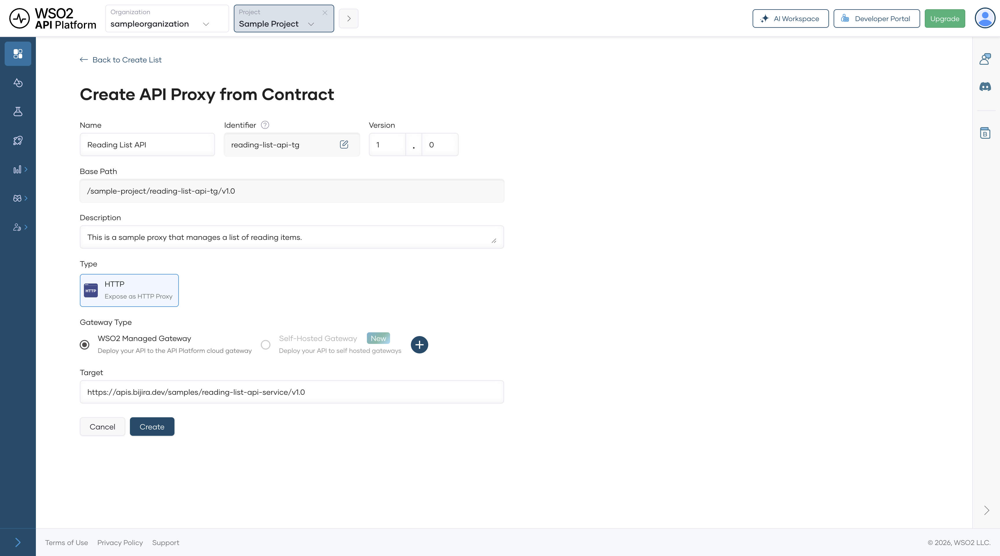
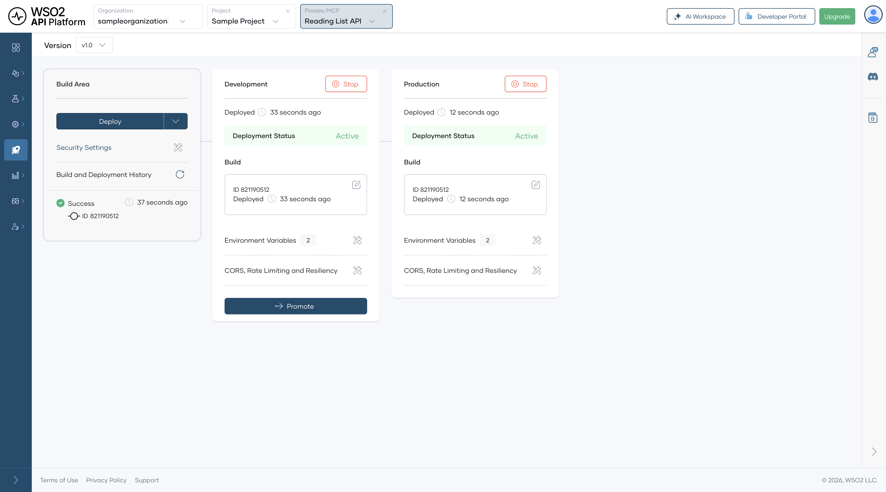
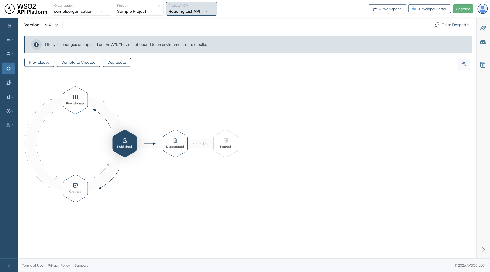
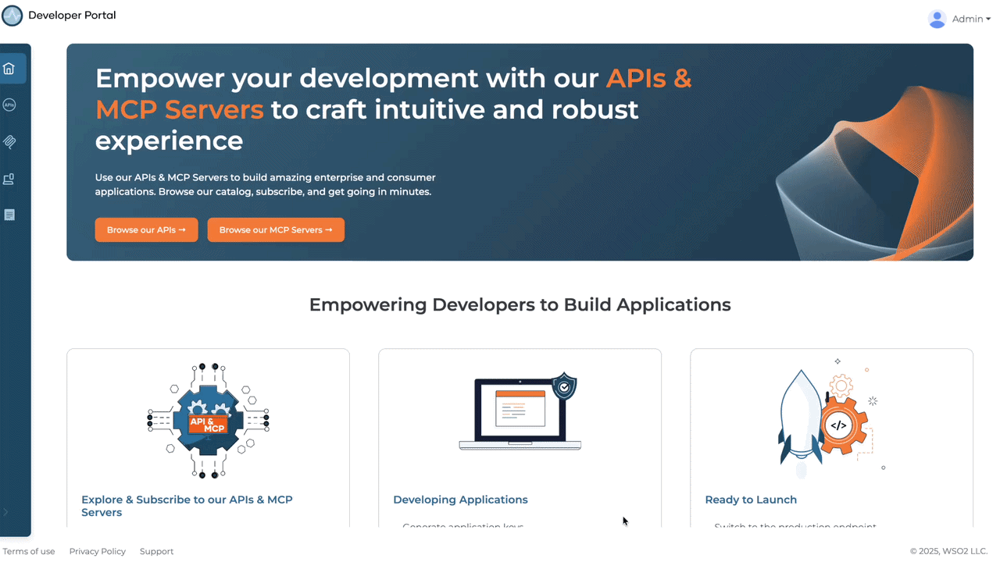
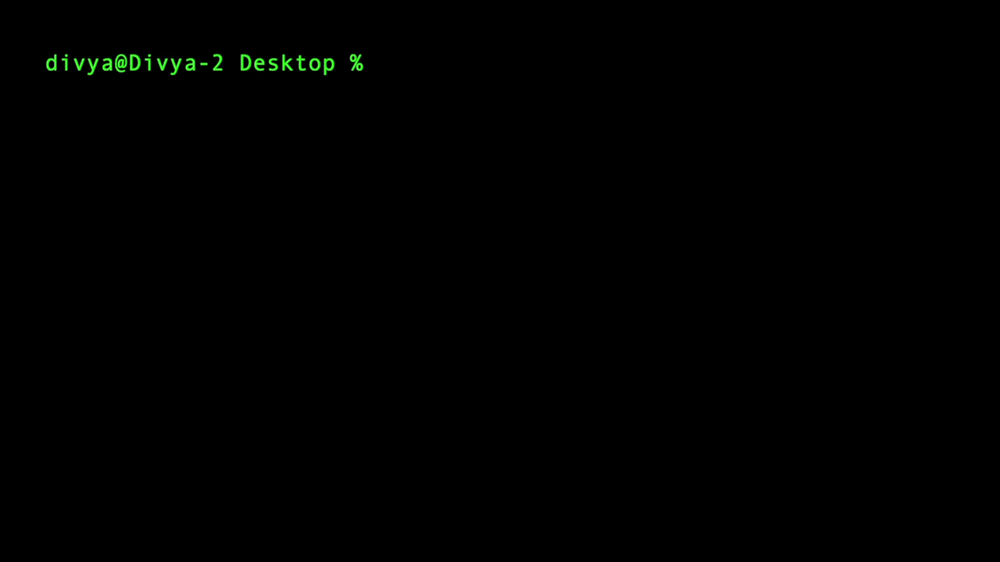

# Build an AI App with Claude Code that Calls Governed Backend APIs

## Overview

This guide shows you how to put a governed API perimeter in front of Claude Code so every API call the agent makes is authenticated, rate-limited, and visible in analytics. By the end, you'll have a Claude Code project that calls the WSO2 Reading List API through WSO2 API Platform, with each request attributed to a dedicated Claude Code Dev application identity.

---

## Key Concepts

Before you start, here are the WSO2 API Platform terms this guide uses:

**WSO2 API Platform** manages backend APIs. The API Platform Console is the web interface where you create and manage API proxies, applications, and subscriptions.

**API proxy** is a managed endpoint WSO2 API Platform creates in front of your backend API. It enforces authentication, rate limits, and audit logging before forwarding requests to the backend.

**Application** is a client identity in WSO2 API Platform. You create a Claude Code Dev application to represent your Claude Code session. Revoking its credentials immediately stops Claude Code's access to your APIs.

**Subscription** links an application to a specific API, granting permission to call that API within a defined rate limit.

**Developer Portal** provides self-service capabilities for discovering published APIs, creating applications, managing subscriptions, and generating OAuth2 credentials.

**Consumer Key and Consumer Secret** are the OAuth2 client credentials generated for your application. The Python helper `api_client.py` uses them to fetch bearer tokens automatically.

**CLAUDE.md** is a briefing file that Claude Code reads at session start. It instructs the agent to use your OAuth2 helper rather than calling APIs directly.

**.claude/settings.json** injects environment variables — token URL, API base URL, and credentials — into every Claude Code session automatically.

---

## Prerequisites

- A WSO2 API Platform account. Sign up for free.
- Claude Code installed (requires a Pro subscription or Anthropic API credits; not available on the free plan). Confirm installation with `claude --version`.
- Python 3.8 or later. Confirm with `python3 --version`.
- curl for testing.

---

## Architecture

```
Claude Code (agent)

    |  Python function calls
    v

+---------------------------+
|      api_client.py        |
|  OAuth2 token refresh     |
+---------------------------+

    |  HTTPS + OAuth2 bearer token
    v

+---------------------------+
|     WSO2 API Gateway      |
|  auth · rate limit · audit|
+---------------------------+

    |  HTTP
    v

Reading List API backend
```

Claude Code generates Python code that calls `api_client.py` for every API request. The helper fetches and caches an OAuth2 bearer token using the Claude Code Dev application credentials, attaches it to every request, and refreshes it automatically before expiration. The WSO2 API Gateway validates the token, enforces rate limits, and logs every call with the Claude Code Dev application identity before forwarding the request to your backend.

---

## Step 1: Create an Organization and Project

Go to the [API Platform Console](https://console.bijira.dev) and sign in with your Google, GitHub, or Microsoft account.

If this is your first time signing in, you'll be prompted to create an organization:

1. Enter `sampleorganization` as the name.
2. Accept the privacy policy and terms of use.
3. Click **Create**.

Once you're on the organization home page, create a project:

1. Click **+ Create Project**.
2. Enter the following details:

    | Field | Value |
    |---|---|
    | **Display Name** | Sample Project |
    | **Identifier** | sample-project |
    | **Description** | My sample project |

3. Click **Create**.

**Expected result:** You land on the Sample Project home page.

---

## Step 2: Create and Publish the Reading List API Proxy

The WSO2 Reading List API is a sample REST API that manages a list of books. You'll expose it as a managed API proxy so WSO2 API Platform can enforce authentication and rate limits on every request.

1. On the project home page, click **Import API Contract** under **My APIs (Ingress)**.
2. Click **URL for API Contract**, paste the following URL, and click **Next**:

    ```
    https://raw.githubusercontent.com/wso2/bijira-samples/refs/heads/main/reading-list-api/openapi.yaml
    ```

3. On the **Create API Proxy from Contract** page, click **Create**.

**Expected result:** The Reading List API proxy is created and deployed to the Development environment automatically.

{.cInlineImage-full}

Promote it to production and publish it:

4. In the left navigation menu, click **Deploy**.
5. In the **Development** card, click **Promote**.
6. In the **Configuration Types** pane, select **Use Development endpoint configuration** and click **Next**.

**Expected result:** The **Production** card shows **Deployment Status** as **Active**.

{.cInlineImage-full}

7. In the left navigation menu, click **Develop**, then click **Lifecycle**.
8. Click **Publish**, confirm the display name, and click **Confirm**.

**Expected result:** The lifecycle state changes to **Published**, and the API is visible in the Developer Portal.

{.cInlineImage-full}

---

## Step 3: Add a Subscription in the Developer Portal

An application gives Claude Code a dedicated identity in WSO2 API Platform. Keeping it separate from your other applications means you can revoke Claude Code's access instantly without affecting anything else.

1. From the Lifecycle screen, click **Go to Developer Portal**.
2. In the Developer Portal left navigation menu, click **Applications**, then click **Create**.
3. Enter an application name, such as `Claude Code Dev`, and click **Create**.
4. Select **Claude Code Dev** and click **Explore More** under the **Subscribed API Proxies** section. This opens the API Proxies listing page.
5. Find your Reading List API and click **Subscribe**.
6. In the **Choose Your Subscription Plan** dialog, select the free tier plan (Bronze).
7. Select **Claude Code Dev** from the application dropdown.
8. Click **Subscribe**.

**Expected result:** Claude Code Dev appears in the application's Subscriptions list with an active subscription to the Reading List API.

{.cInlineImage-full}

---

## Step 4: Create the Project Directory

Create the directory structure Claude Code will work in. Claude Code picks up `CLAUDE.md` and `.claude/settings.json` automatically when you run `claude` from inside the project directory.

```bash
mkdir reading-list-agent
cd reading-list-agent
mkdir .claude
```

**Expected result:** The `reading-list-agent` directory exists with an empty `.claude` subdirectory inside it.

---

## Step 5: Configure .claude/settings.json

The `.claude/settings.json` file injects API credentials and endpoint URLs into every Claude Code session as environment variables. Claude Code reads this file automatically on startup when you run `claude` from the project directory.

Create `.claude/settings.json` with the following placeholder values:

```json
{
  "env": {
    "TOKEN_URL": "<TOKEN-URL>",
    "API_BASE_URL": "<API-BASE-URL>",
    "CLIENT_ID": "<CONSUMER-KEY>",
    "CLIENT_SECRET": "<CONSUMER-SECRET>"
  }
}
```

Then fill in each placeholder as you retrieve the value from the Developer Portal.

**Get your Consumer Key and Consumer Secret:**

1. In the Developer Portal, click **Applications** and open **Claude Code Dev**.
2. Click **Manage Keys**.
3. On the **Manage Keys** page, select the **Production** tab.
4. Click **Generate** and wait for the Consumer Key and Consumer Secret to be populated.

Replace the following:

- `<CONSUMER-KEY>` with the Consumer Key
- `<CONSUMER-SECRET>` with the Consumer Secret
- `<TOKEN-URL>` with the Token Endpoint URL

**Get your API base URL:**

In the left navigation menu, click **APIs**, open the Reading List API, and copy the Production Endpoint URL from the Endpoints section. Replace `<API-BASE-URL>` with this URL.

**Expected result:** `.claude/settings.json` contains the necessary API credentials and endpoint URLs.

{.cInlineImage-full}

!!! warning
    Treat the Consumer Key and Consumer Secret like passwords. Don't share them or commit them to version control.

---

## Step 6: Write api_client.py

`api_client.py` fetches OAuth2 bearer tokens from the WSO2 API Gateway and attaches them to every request. It caches the token and refreshes it automatically before it expires, so Claude Code never has to manage tokens manually.

Create `api_client.py` in the project root:

```python
import os
import time
import requests

_token = None
_token_expiry = 0

def _get_token():
    global _token, _token_expiry
    if _token and time.time() < _token_expiry - 30:
        return _token
    response = requests.post(
        os.environ["TOKEN_URL"],
        data={"grant_type": "client_credentials"},
        auth=(os.environ["CLIENT_ID"], os.environ["CLIENT_SECRET"]),
    )
    response.raise_for_status()
    data = response.json()
    _token = data["access_token"]
    _token_expiry = time.time() + data["expires_in"]
    return _token

def get(path, **kwargs):
    base = os.environ["API_BASE_URL"].rstrip("/")
    headers = kwargs.pop("headers", {})
    headers["Authorization"] = f"Bearer {_get_token()}"
    return requests.get(f"{base}/{path.lstrip('/')}", headers=headers, **kwargs)

def post(path, **kwargs):
    base = os.environ["API_BASE_URL"].rstrip("/")
    headers = kwargs.pop("headers", {})
    headers["Authorization"] = f"Bearer {_get_token()}"
    return requests.post(f"{base}/{path.lstrip('/')}", headers=headers, **kwargs)

def delete(path, **kwargs):
    base = os.environ["API_BASE_URL"].rstrip("/")
    headers = kwargs.pop("headers", {})
    headers["Authorization"] = f"Bearer {_get_token()}"
    return requests.delete(f"{base}/{path.lstrip('/')}", headers=headers, **kwargs)
```

**Expected result:** `api_client.py` is saved in the project root.

---

## Step 7: Write CLAUDE.md

`CLAUDE.md` is the briefing file Claude Code reads at the start of every session. It instructs the agent to always use `api_client.py` for API calls — never to call the API directly or construct `Authorization` headers manually.

Create `CLAUDE.md` in the project root:

````markdown
# Project briefing

## API access rules

This project calls the WSO2 Reading List API through a governed gateway.

Follow these rules on every API call:

- Always use `api_client` for all HTTP requests to the Reading List API.
  Never use `requests` directly for API calls.

- Never construct an `Authorization` header manually.
  `api_client` handles token fetching and refresh automatically.

- Never hardcode credentials, tokens, or API URLs.
  All configuration comes from environment variables set in
  `.claude/settings.json`.

## How to use api_client

Import and use it like this:

    import api_client

    # List all books
    response = api_client.get("/books")
    books = response.json()

    # Add a book
    api_client.post("/books", json={
        "title": "Dune",
        "author": "Frank Herbert",
        "status": "to_read"
    })

    # Delete a book
    api_client.delete(f"/books/{book_id}")

## Rate limits

The `Claude Code Dev` application is subject to the rate limits defined
in its subscription plan. If you receive HTTP 429, back off and retry
after one second. Don't loop without delays.
````

**Expected result:** `CLAUDE.md` is saved in the project root.

{.cInlineImage-full}

!!! note
    `CLAUDE.md` is not required for Claude Code to run, but without it Claude Code doesn't know to use `api_client.py`. It may call the API directly and bypass the WSO2 gateway entirely.

Your project structure at this point:

```
reading-list-agent/
├── .claude/
│   └── settings.json
├── CLAUDE.md
└── api_client.py
```

---

## Step 8: Run Claude Code

`api_client.py` uses the `requests` library. Install it before running Claude Code:

```bash
pip install requests
```

If you see an `externally-managed-environment` error — common on macOS and some Linux distributions — set up a virtual environment first:

```bash
python3 -m venv .venv
source .venv/bin/activate    # macOS/Linux
.venv\Scripts\activate       # Windows
pip install requests
```

!!! note
    If you use a virtual environment, reactivate it each time you open a new terminal session before running Claude Code.

Start a Claude Code session from the project directory:

```bash
cd reading-list-agent
claude
```

Claude Code reads `CLAUDE.md` and `.claude/settings.json` on startup because you're running it from the project directory.

Ask a read-only question to verify the integration end to end:

```
Show me all the books on the reading list and tell me how many there are.
```

Claude Code asks for your approval before executing any code. Review what it plans to run and click **Yes** to proceed.

**Expected result:** Claude Code:

1. Generates Python code that calls `api_client.py`
2. Fetches an OAuth2 token using your credentials
3. Makes a `GET /books` request to the Reading List API
4. Prints the result with a count of books

{.cInlineImage-full}

---

## Verify

1. Confirm Claude Code calls the API through the WSO2 gateway. In your terminal, run a direct authenticated request and confirm you receive `HTTP 200`:

    ```bash
    curl -v -X GET <API-BASE-URL>/books \
      -H "Authorization: Bearer <BEARER-TOKEN>"
    ```

    **Expected response:** `HTTP 200` with a list of books in JSON.

2. Confirm unauthenticated requests are rejected. Call the same endpoint without an `Authorization` header and confirm you receive `HTTP 401 Unauthorized`:

    ```bash
    curl -v -X GET <API-BASE-URL>/books
    ```

    **Expected response:** `HTTP 401 Unauthorized`.

3. Confirm Claude Code traffic appears under the correct identity. In WSO2 API Platform, navigate to **Insights > API Insights**. Confirm your requests appear in the traffic view with the **Claude Code Dev** application name and `HTTP 200` response code.

!!! note
    Allow a few minutes for traffic to appear in API Insights after the first request.

---

## Troubleshooting

| Symptom | Resolution |
|---|---|
| `command not found: claude` | Open a new terminal and run `claude --version`. If still not found, run `echo 'export PATH="$HOME/.local/bin:$PATH"' >> ~/.zshrc && source ~/.zshrc` (macOS/Linux), or check that `%USERPROFILE%\.local\bin` is on your Windows PATH. |
| `externally-managed-environment` when running `pip install requests` | Your system Python blocks direct pip installs. Set up a virtual environment — see Step 8. |
| `ModuleNotFoundError: No module named 'requests'` | Run `pip3 install requests` and try again. |
| `KeyError: 'TOKEN_URL'` when running `api_client.py` | Confirm `.claude/settings.json` exists and contains all four environment variables. Confirm you started Claude Code from the `reading-list-agent` directory. |
| `HTTP 401 Unauthorized` on every API call | Confirm the Consumer Key and Consumer Secret in `.claude/settings.json` match the values on the Manage Keys page in the Developer Portal. |
| `HTTP 429 Too Many Requests` | Claude Code has exceeded the rate limit for the Claude Code Dev subscription plan. Add a `time.sleep(1)` between requests, or upgrade the subscription plan in the Developer Portal. |
| Claude Code calls the API directly instead of using `api_client` | Confirm `CLAUDE.md` is in the project root and that you ran `claude` from inside the project directory. Start a new session and check that Claude Code acknowledges the briefing. |
| `HTTP 404` on API calls | Confirm `API_BASE_URL` in `.claude/settings.json` has no trailing slash and matches the production endpoint URL from the Developer Portal. |
| Traffic doesn't appear in **Insights > API Insights** | Allow a few minutes after the first request. Confirm requests went through the gateway URL, not directly to the backend. |

---

## What You Learned

- Put a governed API perimeter in front of Claude Code so every request is authenticated, rate-limited, and audited by WSO2 API Platform
- Gave Claude Code a dedicated application identity that you can revoke instantly without affecting any other application
- Ensured Claude Code never calls backend APIs directly or manages credentials manually, through a combination of `api_client.py` and `CLAUDE.md`
- Confirmed every Claude Code API call is attributable to the Claude Code Dev application identity in WSO2 API Platform analytics

---

## Next Steps

- **[Convert a REST API into an MCP tool and use it in Claude Desktop](convert-rest-api-to-mcp-server.md)** — expose the same Reading List API as an MCP server so Claude Code can use native tool calling instead of the Python helper
- **Apply rate limiting to API traffic** — configure per-application and per-subscription rate limits on the Reading List API