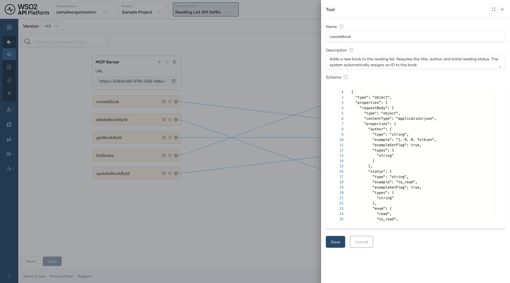
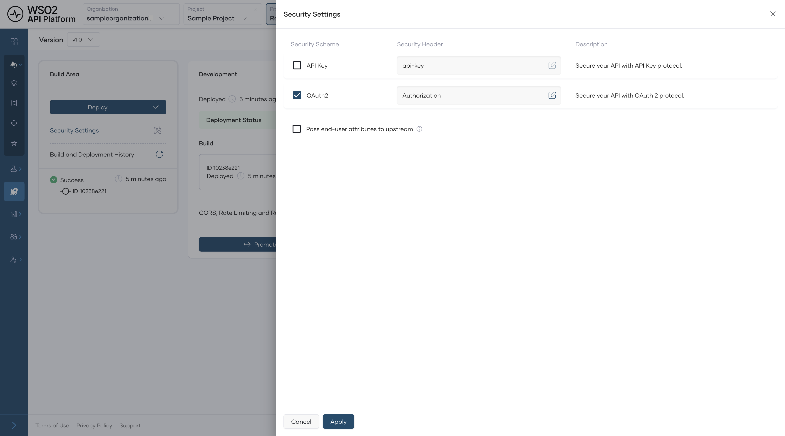
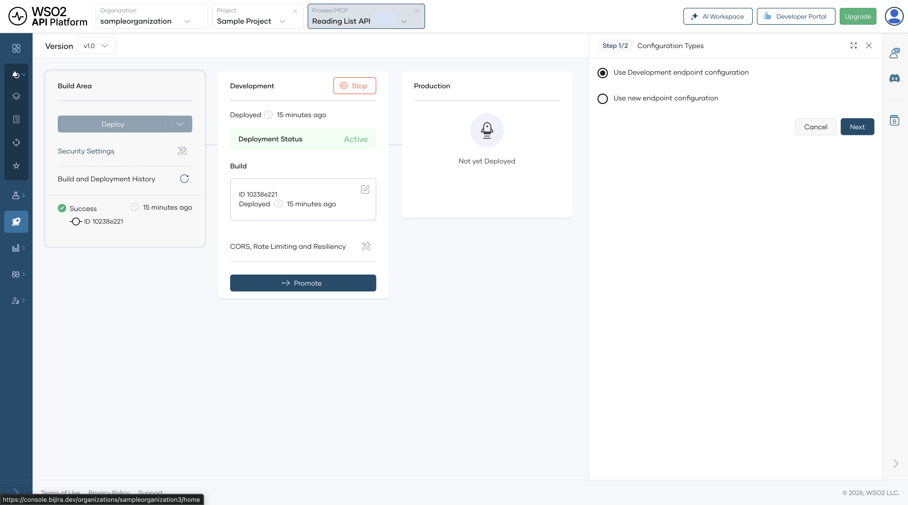
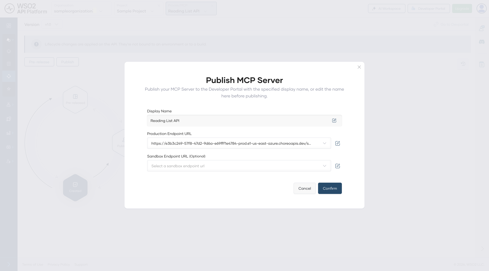
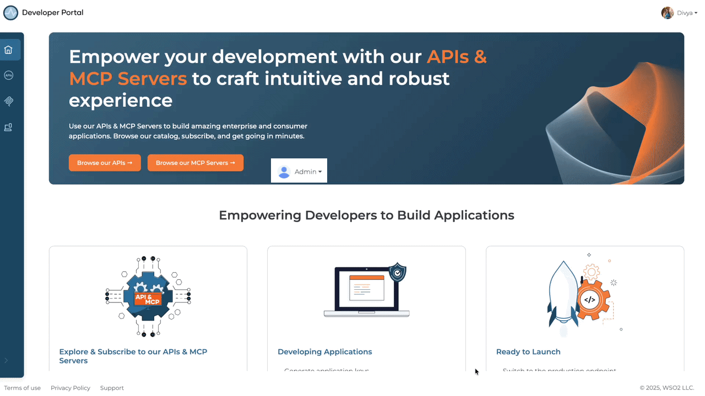
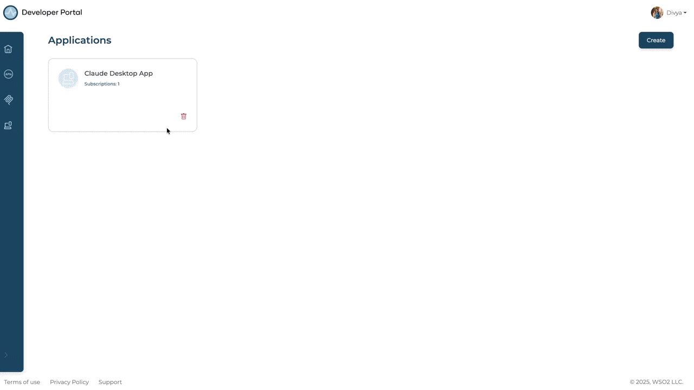
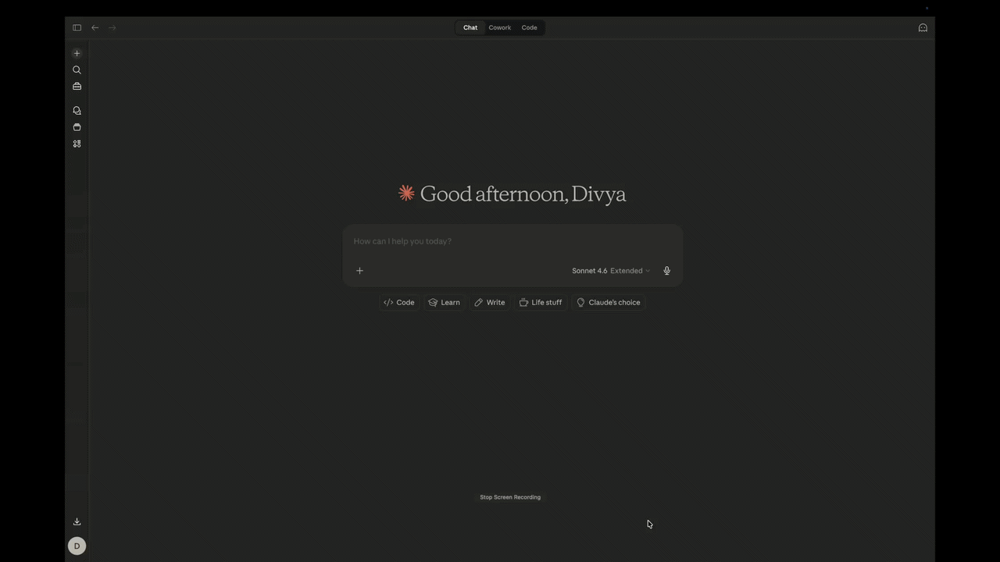

# Convert a REST API into an MCP Tool and Use It in Claude Desktop

## Overview

This guide shows you how to expose an existing REST API as a governed MCP server that AI clients can query in natural language. Without this, every AI client that needs your API requires custom integration code with no authentication or rate limiting. By the end, you'll have a deployed MCP server reachable from Claude Desktop, with OAuth2 enforced by WSO2 API Platform at every tool call.

!!! note
    Claude Desktop only supports local stdio servers natively. This guide uses mcp-remote, a community-maintained local bridge, to connect Claude Desktop to the remote WSO2 MCP Gateway. If Claude Desktop adds native remote server support in the future, Step 9 will become simpler.

---

## Key Concepts

Before you start, here are the WSO2 API Platform terms this guide uses:

**WSO2 API Platform** is the platform you'll use to create and manage your MCP server. The API Platform Console at [console.bijira.dev](https://console.bijira.dev) is the web interface where you do this work.

**MCP server** is the logical API resource you create in WSO2 API Platform. It wraps your REST API and exposes it as a set of tools that AI clients can call.

**WSO2 MCP Gateway** is the infrastructure component that hosts and governs your MCP server — enforcing authentication, rate limits, and audit logging on every tool call.

**Application** is a client identity in the WSO2 API Platform. You create an application to represent Claude Desktop, subscribe it to your MCP server, and generate the OAuth2 credentials it uses to authenticate.

**Subscription** links an application to a specific MCP server, giving that application permission to call the server's tools.

**Developer Portal** provides a self-service hub where consumers discover published MCP servers, create applications, and manage subscriptions.

**Lifecycle** is the set of states an MCP server moves through — Created, Deployed, Published — before it's reachable by consumers.

---

## Prerequisites

- A WSO2 API Platform account. Sign up for free.
- Claude Desktop installed. Download from [claude.ai/download](https://claude.ai/download).
- Node.js 18 or later installed. mcp-remote, the local bridge between Claude Desktop and your remote MCP server, requires it. Download from [nodejs.org/download](https://nodejs.org/download).
- curl or Postman for testing.

---

## Architecture

```
Claude Desktop

    |  stdio
    v

+---------------------------+
|  mcp-remote (local proxy) |
|  translates stdio → HTTPS |
+---------------------------+

    |  HTTPS + OAuth2 bearer token
    v

+---------------------------+
|     WSO2 MCP Gateway      |
|  auth · rate limit · audit|
+---------------------------+

    |  HTTP
    v

Reading List API backend
```

Claude Desktop only supports local stdio servers. mcp-remote runs locally and bridges this gap: it receives stdio calls from Claude Desktop and forwards them to the WSO2 MCP Gateway over HTTPS with your OAuth2 bearer token attached. The gateway validates the token, applies rate limits, and logs every tool invocation before forwarding the request to your backend.

---

## Step 1: Create an Organization and Project

Go to the [API Platform Console](https://console.bijira.dev) and sign in with your Google, GitHub, or Microsoft account.

If this is your first time signing in, you'll be prompted to create an organization. Enter `sampleorganization` as the name, accept the privacy policy and terms of use, and click **Create**.

Once you're on the organization home page, create a project:

1. Click **+ Create Project**.
2. Enter the following details:

    | Field | Value |
    |---|---|
    | **Display Name** | Sample Project |
    | **Identifier** | sample-project |
    | **Description** | My sample project |

3. Click **Create**.

**Expected result:** The project home page opens.

---

## Step 2: Create the MCP Server

In this guide, you'll use the Reading List API — a sample REST API that manages a list of books — to create your MCP server. WSO2 API Platform reads the API's OpenAPI spec and generates one tool per operation. No custom server code is required.

When you complete this step, WSO2 API Platform automatically deploys the MCP server to a development environment so you can test it before promoting it to production.

1. On the project home page, select **MCP Server**.
2. Under **Expose APIs as MCP Servers**, click **Import API Contract**.
3. Click **URL for API Contract**, paste the following URL, and click **Next**:

    ```
    https://raw.githubusercontent.com/wso2/bijira-samples/refs/heads/main/reading-list-api/openapi.yaml
    ```

4. On the **Create MCP Server from Contract** page, click **Create**.

**Expected result:** The MCP server is created with tools auto-generated from the Reading List API spec — one tool per operation, such as listing books, adding a book, and deleting a book. You can see them in **Develop > Policies**.

{.cInlineImage-full}

!!! note
    If you have an existing REST API, select **Start from Existing Proxy** instead. Enter a name and description and select an API proxy already deployed in WSO2 API Platform. See the MCP Servers for existing API Proxies for that path.

---

## Step 3: Configure Tool Descriptions

Tool descriptions tell Claude what each tool does and when to use it. The auto-generated descriptions come from the OpenAPI spec's `operationId`, `summary`, and `description` fields — update any that are too technical or too brief.

In the **Develop** menu, click **Routing**. Each tool has an edit option on the right — click it to open the description editor. For the Reading List API, update the descriptions as follows:

| Tool | Description to use |
|---|---|
| List books | Get all books currently on the reading list. |
| Add a book | Add a new book to the reading list by providing the title, author, and status. |
| Delete a book | Remove a book from the reading list by its ID. |

Click **Save**. Then click **Deploy** from the navigation menu and select **Deploy** for the changes to take effect on the gateway.

**Expected result:** Each tool shows your updated description, and the MCP server status returns to **Deployed**.

{.cInlineImage-full}

!!! tip
    Write descriptions as if you're telling a colleague what the tool does. Claude uses these descriptions to decide which tool to call, so natural language outperforms technical API names.

---

## Step 4: Enable OAuth2 Authentication

Enabling OAuth2 tells the WSO2 MCP Gateway to reject any tool call that doesn't include a valid bearer token. Unauthenticated requests never reach your backend.

In the side menu, scroll to **Deploy** and select **Security Settings**. Toggle **OAuth2** on and click **Apply**.

**Expected result:** The toggle shows as enabled.

{.cInlineImage-full}

!!! warning
    Don't disable OAuth2 in production. Without it, any client that knows your MCP server URL can call your backend directly.

---

## Step 5: Deploy the MCP Server

Deploying promotes your MCP server from the development environment to the production gateway.

1. In the left navigation menu, click **Deploy**.
2. In the **Development** card, click **Promote**.
3. In the **Configuration Types** pane, select **Use Development endpoint configuration** and click **Next**.

**Expected result:** The **Production** card shows **Deployment Status** as **Active**.

{.cInlineImage-full}

---

## Step 6: Add the MCP Server to the Developer Portal

Publishing makes your MCP server discoverable to consumers in the Developer Portal so they can subscribe and generate credentials.

1. In the left navigation menu, click **Manage**, then click **Lifecycle**.
2. Click **Publish**.
3. In the **Publish MCP Server** dialog, confirm the Display Name and Production Endpoint URL, then click **Confirm**.

**Expected result:** The lifecycle state changes to **Published**.

{.cInlineImage-full}

!!! note
    The Production Endpoint URL in the dialog is unique to your organization.

---

## Step 7: Add a Subscription in the Developer Portal

An application in WSO2 API Platform represents a client — in this case, Claude Desktop. You'll create one and subscribe it to the Reading List MCP server so it can make authenticated tool calls.

1. In the Lifecycle pane, click **Go to Developer Portal**.
2. In the Developer Portal left navigation menu, click **Applications**, then click **Create**.
3. Enter an application name, such as `Claude Desktop App`, and click **Create**.
4. Select **Claude Desktop App** and click **Explore More** under the **Subscribed MCP Servers** section. This opens the MCP Server listing page.
5. Find your Reading List MCP server, click **Subscribe**, choose **Claude Desktop App** from the dropdown, and click **Subscribe**.

**Expected result:** Claude Desktop App appears in the application's Subscriptions list with an active subscription to the Reading List MCP server.

{.cInlineImage-full}

---

## Step 8: Create an Access Token

Generate the OAuth2 bearer token that Claude Desktop will use to authenticate every tool call.

1. In the Developer Portal, click **Applications** in the left navigation menu and open **Claude Desktop App**.
2. In the application banner, click **Manage Keys**.
3. On the **Manage Keys** page, select the **Production** tab.
4. Click **Generate Key** and wait for the Consumer Key and Consumer Secret to be populated.
5. Click **Generate** and copy the token.

**Expected result:** You have a bearer token to paste into the config file in the next step.

{.cInlineImage-full}

!!! warning
    Bearer tokens expire after 3600 seconds (one hour) by default. WSO2 API Platform doesn't automatically refresh them. When your token expires, Claude Desktop will silently stop invoking tools. Generate a new token in the Developer Portal, update the `Authorization` value in `claude_desktop_config.json`, and restart Claude Desktop. To extend the token lifetime, click **Modify** on the Manage Keys page and increase the **Application Access Token Expiry Time** before generating.

---

## Step 9: Paste the MCP Server Configuration into Claude Desktop

Claude Desktop only supports local stdio servers via its config file, so you can't point it directly at the WSO2 MCP Gateway URL. mcp-remote solves this — it runs locally as a subprocess, receives calls from Claude Desktop over stdio, and forwards them to the gateway over HTTPS with your bearer token attached.

Open `claude_desktop_config.json` via **Settings > Developer > Edit Config** in Claude Desktop, or navigate to it directly:

- **macOS:** `~/Library/Application Support/Claude/claude_desktop_config.json`
- **Windows:** `%APPDATA%\Claude\claude_desktop_config.json`

If the file doesn't exist yet, create it with the content below. If it already exists with other keys, add `mcpServers` alongside them at the top level.

```json
{
  "mcpServers": {
    "reading-list": {
      "command": "npx",
      "args": [
        "mcp-remote@latest",
        "https://<YOUR-GATEWAY-URL>",
        "--header",
        "Authorization: Bearer <YOUR-TOKEN>"
      ]
    }
  }
}
```

Replace `<YOUR-GATEWAY-URL>` with the MCP server URL from the Developer Portal and `<YOUR-TOKEN>` with the access token you copied in Step 8.

**Expected result:** The file is saved with the `reading-list` entry inside `mcpServers`.

{.cInlineImage-full}

!!! warning
    Don't commit `claude_desktop_config.json` to version control. It contains your bearer token in plain text. Add it to `.gitignore` if your home directory is under source control.

---

## Step 10: Run Claude Desktop

Claude Desktop loads `claude_desktop_config.json` only on startup. Restart it fully for your MCP server configuration to take effect.

**Expected result:** Your Reading List MCP server appears as an available connector in the **+** menu of the chat input. Click **+ > Connectors > Manage Connectors** to confirm the tools it exposes.

---

## Verify

1. In Claude Desktop, start a new conversation and type: `"What books are on my reading list?"` Confirm Claude invokes the correct tool and returns a real response from the backend. You'll see a tool-use indicator in the chat showing which tool was called. If Claude doesn't invoke the tool automatically, try: `"Use the reading list tool to show me all books."`

    {.cInlineImage-full}

2. Confirm that unauthenticated requests are rejected. In your terminal, call the MCP server endpoint without an `Authorization` header and confirm you receive `HTTP 401 Unauthorized`.

    ```bash
    curl -v -X POST https://<YOUR-GATEWAY-URL>/mcp \
      -H "Content-Type: application/json" \
      -d '{"jsonrpc":"2.0","method":"tools/list","id":1}'
    ```

    **Expected response:** `401 Unauthorized`.

3. Confirm that authenticated requests succeed. Call the same endpoint with your bearer token and confirm you receive `HTTP 200 OK`.

    ```bash
    curl -v -X POST https://<YOUR-GATEWAY-URL>/mcp \
      -H "Content-Type: application/json" \
      -H "Authorization: Bearer <YOUR-TOKEN>" \
      -d '{"jsonrpc":"2.0","method":"tools/list","id":1}'
    ```

    **Expected response:** `HTTP 200` with a list of your Reading List tools.

4. In WSO2 API Platform, navigate to **Insights > API Insights**. Confirm your Claude Desktop request appears in the traffic view with a `200` response code.

!!! note
    Allow a few minutes for traffic to appear in API Insights after the first request.

---

## Troubleshooting

| Symptom | Resolution |
|---|---|
| `The following entries in claude_desktop_config.json are not valid MCP server configurations and were skipped` | Confirm you're using the `mcpServers` key (not `servers`) and that the entry uses `command` and `args`, not `url`. The URL-only format is for VS Code, not Claude Desktop. |
| MCP server doesn't appear under **+ > Connectors** after restart | Confirm Node.js 18+ is installed and the `npx` command is available in your terminal. Run `npx mcp-remote@latest --help` to verify. Also confirm you fully restarted Claude Desktop after saving the config file. |
| mcp-remote starts, but tools don't respond | Confirm `<YOUR-GATEWAY-URL>` is correct and the token is valid. Run `npx mcp-remote@latest https://<YOUR-GATEWAY-URL> --header "Authorization: Bearer <YOUR-TOKEN>"` directly in your terminal and check the error output. |
| Claude searches memory or connected tools instead of invoking an MCP tool | Confirm your MCP server appears under **+ > Connectors > Manage Connectors**. If it does, rephrase the query explicitly, for example: `"Use the reading list tool to show me all books."` |
| `HTTP 401 Unauthorized` on every tool call | Your bearer token has expired. Generate a new token in the Developer Portal, update `claude_desktop_config.json`, and restart Claude Desktop. |
| `HTTP 404` on tool calls | Confirm the MCP server status is **Deployed** in WSO2 API Platform, and the gateway URL in your config matches the URL shown in the Developer Portal. |
| The OAuth browser window opens and fails | This happens when adding the server via **Settings > Connectors** instead of the config file. The Connectors flow requires a full OAuth authorization server; use the mcp-remote config file approach in Step 9 instead. |

---

## What You Learned

- Created a governed MCP server from a REST API without writing any custom server code
- Configured natural-language tool descriptions so Claude understands when to invoke each tool
- Enforced OAuth2 authentication on every MCP tool call at the gateway level, with unauthenticated requests rejected before reaching the backend
- Connected Claude Desktop to a remote HTTP MCP server using mcp-remote as a local stdio bridge, working around Claude Desktop's stdio-only config file limitation

---

## Next Steps

- **Aggregate MCP tools from multiple APIs** — combine this MCP server with others into a single endpoint so AI agents can query across systems in one call
- **Connect your MCP server to VS Code Copilot** — use the same deployed MCP server with VS Code Copilot using the Developer Portal's native configuration snippet
- **Monitor MCP tool usage with runtime logs** — track which tools are being called, by which clients, and where errors occur
